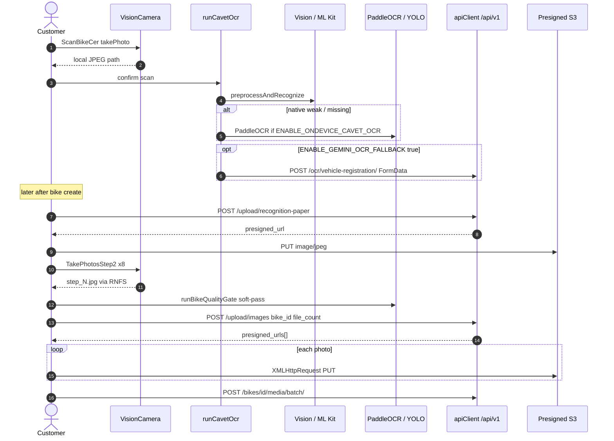
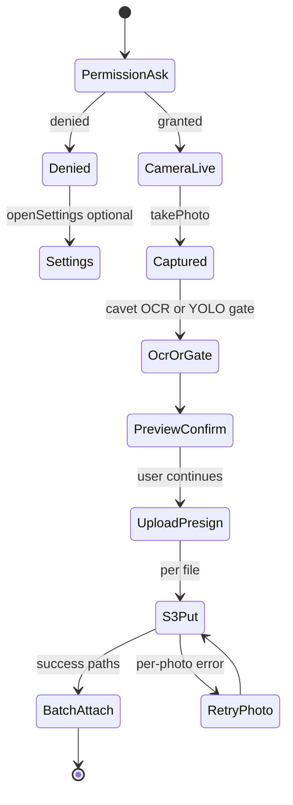

## 1. Overview & Business Intent

Customer sell flow in `timoto-mobile/apps/` captures registration-paper (cavet) photos and eight bike angles on device, then uploads them to TiMoto staging/production APIs. Capture is **camera-only** via `react-native-vision-camera` (^4.7.3) on bare React Native 0.78 — not Expo. There is no in-app gallery/image-picker path in shipped source under `apps/`.

**Business goals**

1. Scan cavet → fill OCR fields → keep local JPEG until bike create → upload recognition paper.
2. Capture eight exterior angles → optional YOLO quality soft-gate → presign → S3 PUT → attach via batch media.
3. Keep OCR and quality work on-device when possible; cloud Gemini OCR is coded but gated off by default.

**Primary source paths**

| Area | Path |
| --- | --- |
| Cavet camera | `apps/src/pages/ScanBikeCer.tsx` |
| Bike photos | `apps/src/pages/Step02/TakePhotosStep2.tsx`, `PreviewPhotoDetail.tsx`, `PreviewPhotosStep2.tsx` |
| Video / mic hooks | `apps/src/pages/Step03/TakeVideoBike.tsx`, `TakeAudioBike.tsx` |
| Native OCR JS | `apps/src/ml/ocr/NativeTextRecognizer.ts`, `runCavetOcr.ts` |
| iOS Vision | `apps/ios/TiMotoAI/VisionTextRecognizerModule.swift` |
| Android ML Kit | `apps/android/app/src/main/java/com/timotoai/VisionTextRecognizerModule.kt` |
| Upload | `apps/src/pages/Step02/Register2ndStep.tsx`, `RecognitionPaperContext.tsx` |
| Flags | `apps/src/configs/app.config.ts` |
| Endpoints | `apps/src/api/endpoints.ts` |

**Absences (searched under `apps/`)**

- `ImagePicker`, `launchImageLibrary`, `expo-image-picker`, `react-native-image-picker`, `MediaLibrary` → **0 matches**. Docs under `docs/setup/FRONTEND_UPLOAD_INTEGRATION_GUIDE.md` mention Expo picker; that guide does not match the shipped app.
- No `NSPhotoLibrary*` in `Info.plist`; Android camera/mic only for this path.
- No barcode / `useCodeScanner` usage in apps TypeScript, Swift, or Kotlin sources.
- WebSocket exists for evaluation/operator review (`REALTIME_WS_URL`), **not** for camera capture or S3 upload.

---

## 2. End-to-End Flow & Sequence Diagram

**Cavet path:** permission → `takePhoto` → store path in `RecognitionPaperContext` → `runCavetOcr` (native → ONNX → optional Gemini) → confirm form → create bike → `POST /upload/recognition-paper` → S3 PUT.

**Bike photos path:** eight captures → RNFS under Documents/valuation/bike\_id/photos/ → preview → `runBikeQualityGate` (YOLO ONNX, soft-pass) → `Register2ndStep` → `POST /upload/images` → parallel S3 PUT → `POST /bikes/bikeId/media/batch/`.





Resolutions in code: cavet ~1280×960; bike photos ~1600×1200 for decode speed. Flash off; shutter sound disabled.

---

## 3. Detailed API Contracts

Base URL from `AppConfig.API_BASE_URL`: staging `https://api-staging.timoto.ai/api/v1`, production `https://api.timoto.ai/api/v1`.

| Method | Path | When | Request | Success highlights |
| --- | --- | --- | --- | --- |
| POST | `/upload/images` | Step02 after 8 photos | JSON `bike_id`, `file_count` | `presigned_urls[]` |
| PUT | presigned URL | Each JPEG | Binary `image/jpeg` via XHR | HTTP 2xx from S3 |
| POST | `/bikes/bikeId/media/batch/?device_id=` | After S3 success | public URLs for images | Attaches media to bike |
| POST | `/upload/recognition-paper` | After bike create | `bike_id`, `file_extension` | Single `presigned_url` |
| POST | `/ocr/vehicle-registration/` | Gemini fallback only | multipart `image` FormData | OCR JSON shape in `endpoints.ts` |

Related non-photo (same VisionCamera family): `/upload/videos`, `/upload/audios`, then batch media from preview screens.

**Error / resilience matrix (client behavior)**

| Failure | HTTP / local | App behavior |
| --- | --- | --- |
| Camera permission denied | n/a | Alert; optional Settings; UI denied state |
| `takePhoto` throw | n/a | Alert via `Messages.camera.capture.*`; `logVisionCameraError` |
| Native OCR unavailable | n/a | Fall through to ONNX if flag on |
| Local OCR weak \+ Gemini off | n/a | Empty-ish `toApiShape` so user edits form; image still kept |
| `UPLOAD_IMAGES` fail | non-2xx | Often logged; UI may continue with per-photo error states |
| S3 PUT fail | non-2xx | Photo status `error` \+ retry |
| `BATCH_MEDIA` fail | non-2xx | Alert blocks continue |
| Recognition paper upload fail | catch | `console.warn`; does **not** block create-bike success |

Feature flags (`AppConfig.FEATURES`): `ENABLE_ONDEVICE_BIKE_QUALITY_GATE: true`, `ENABLE_ONDEVICE_CAVET_OCR: true`, `ENABLE_GEMINI_OCR_FALLBACK: false`.

---

## 4. Database Schema & State Transitions

Mobile does not own a local SQL schema for camera. Persistence is:

1. **Filesystem:** `react-native-fs` Documents tree for valuation photos.
2. **React context:** `RecognitionPaperContext` holds cavet path until upload.
3. **Resume helper:** `register2ndUploadProgressStorage.ts` tracks per-photo upload status `idle` | `uploading` | `success` | `error`.
4. **Backend:** bike media rows / S3 objects created by upload APIs (server-side; not defined in the mobile ML modules).

Logical client upload state (Register2ndStep):

```text
idle → uploading → success
idle → uploading → error → uploading (retry)
```

OCR cascade state (conceptual, `runCavetOcr.ts`):

```text
try native Vision/ML Kit
  → if missing/weak and ENABLE_ONDEVICE_CAVET_OCR → PaddleOCR ONNX
  → if still weak and ENABLE_GEMINI_OCR_FALLBACK → cloud FormData OCR
```

Permissions manifests:

- iOS `Info.plist`: `NSCameraUsageDescription`, `NSMicrophoneUsageDescription`.
- Android `AndroidManifest.xml`: `CAMERA`, `RECORD_AUDIO`.

Native modules registered via `AppDistributionPackage` / RCT exports: `VisionTextRecognizerModule`, `ImageBgDecodeModule` (JPEG → RGBA for ML).

---

## 5. Frontend & UI Logic (if applicable)

| Screen | Role |
| --- | --- |
| `ScanBikeCer` | Back camera, cavet frame, confirm → OCR → navigate confirm result |
| `TakePhotosStep2` | Guided eight angles; permission Alert; no YOLO while camera `isActive` |
| `PreviewPhotosStep2` / `PreviewPhotoDetail` | Quality UI; retake or “use anyway”; remount camera for single-angle retake |
| `Register2ndStep` | Upload progress UI; continue to Step03 audio after batch |
| `RegisterConfirm` / `ExpectedPrice` | Trigger recognition-paper upload after create |
| `TakeVideoBike` | Same VisionCamera; iOS remount/retry on some native errors |
| `TakeAudioBike` | Uses VisionCamera mic permission hook; recorder is separate package |

UI copy lives in `apps/src/constants/messages.ts` (permission \+ capture \+ quality gate). Quality gate never hard-blocks the sell flow: soft-pass if model missing, ORT fail, or flag semantics allow continue.

Packages that **are** used: `react-native-vision-camera`, `react-native-fs`, `onnxruntime-react-native`, `jpeg-js`, `react-native-nitro-modules` (VisionCamera peer). Packages that are **not** used for this feature: Expo camera/picker, `@react-native-ml-kit/*` npm (ML Kit is custom Kotlin imports only).

---

## 6. Edge Cases & Resilience

1. **OCR fails but photo kept** — user can still edit fields; recognition paper uploads later from context path.
2. **Gemini off** — incomplete local OCR still navigates with editable empty/partial fields rather than inventing values.
3. **YOLO soft-pass** — missing model or ORT error does not freeze Step02.
4. **Parallel S3** — individual photo failures do not necessarily cancel siblings; retry is per photo.
5. **VisionCamera native stack crashes** — `logVisionCameraError` avoids unsafe `.stack` access.
6. **No gallery fallback** — if camera hardware missing (`noDevice` UI), there is no coded album picker alternative in `apps/`.
7. **Android ML Kit linking** — Kotlin module imports ML Kit text recognition; verify `build.gradle` includes the dependency in a real Android build (VisionCamera barcode ML Kit in `node_modules` is unrelated — app does not call barcode APIs).
8. **WebSocket confusion** — do not document camera upload as realtime; evaluation WS is a separate subsystem.
9. **Stale docs** — ignore Expo image-picker samples in setup guides when implementing against `apps/`.
10. **Video/audio** — share VisionCamera permissions but use distinct upload endpoints; out of scope for photo bridging except permission coupling.

**Word-count target:** this page documents only what exists in `timoto-mobile/apps/` camera, native OCR, ONNX gates, and upload bridging — no proxy pools, no invented OTP for capture, and no SELECT FOR UPDATE (N/A on client).