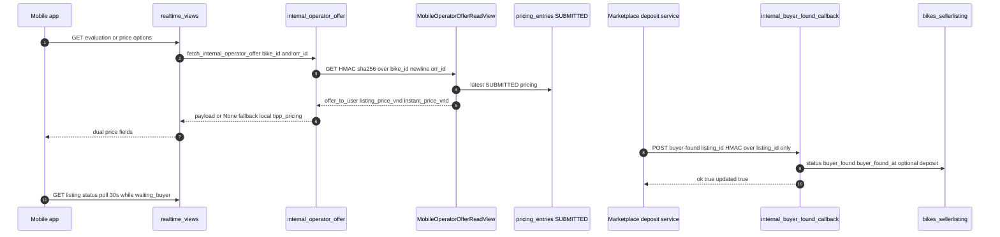
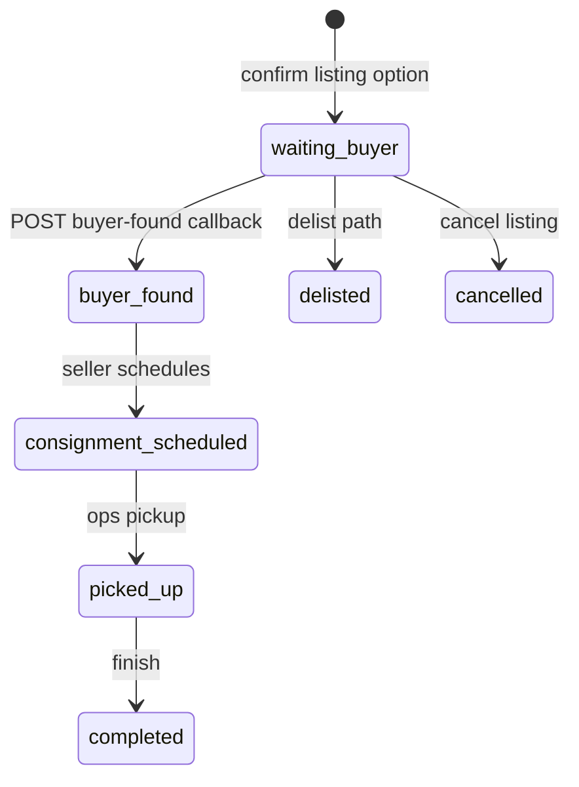

# 1. Overview & Business Intent

Two separate server-to-server seams connect dealer/internal systems to **timoto-mobile**:

1. **Operator offer read** — Mobile Django GETs OPS-submitted FMP plus listing and TIPP snapshots from internal `GET /api/v1/mobile/operator-offer/`. The mobile app binary never holds the secret; only `internal_operator_offer.py` signs requests.
2. **Buyer-found callback** — Trusted callers POST `/api/v1/internal/listings/:listing_id/buyer-found/` so a marketplace deposit can flip `SellerListing` from waiting to `buyer_found`, unlocking consignment scheduling in the seller UI.

These are **not** WebSocket channels and **not** Postgres `NOTIFY` consumers. Realtime seller price screens poll listing status (`poll_after_seconds` equals 30 while waiting) and evaluation endpoints that optionally call `fetch_internal_operator_offer`.

**Actors:** Internal OPS pricing service, mobile API workers, marketplace/deposit service, seller RN (`OrderSaleDetail.tsx` phase `buyer_found`).

**Target files:**

- `timoto-mobile/backend/apps/evaluation/internal_operator_offer.py`
- `timoto-mobile/backend/apps/evaluation/listing_views.py` — `internal_buyer_found_callback`, `_serialize_listing`
- `timoto-mobile/backend/apps/evaluation/realtime_views.py` — uses `fetch_internal_operator_offer`
- `timoto-mobile/backend/apps/bikes/models.py` — `SellerListing`
- `timoto-mobile/backend/config/urls.py` — buyer-found route
- `timoto-internal-app/backend/bikes/mobile_operator_offer_views.py` — matching HMAC verify

HMAC message formats **differ** between the two endpoints — do not reuse one signing helper blindly.

---

# 2. End-to-End Flow & Sequence Diagram



Operator-offer URL resolution on mobile: absolute `INTERNAL_OPERATOR_OFFER_URL`, else `INTERNAL_OPERATOR_OFFER_BASE_URL` with path heuristics ending in `/api/v1/mobile/operator-offer/`. Secret: `OPERATOR_OFFER_INTERNAL_HMAC_SECRET` or `TMA_WEBHOOK_SECRET`. Timeout default 8 seconds. Non-200, bad JSON, or body without `ok`/`success` → return `None` (caller uses local fallback).

Buyer-found signs **only** the lowercase listing UUID bytes. Optional body fields `buyer_reference` and `deposit_amount_vnd` (int coerce; invalid deposit silently ignored).

---

# 3. Detailed API Contracts

### A. Internal operator-offer (served by internal-app, called by mobile)

| Method | Path | Auth |
| --- | --- | --- |
| GET | `/api/v1/mobile/operator-offer/` | Header `X-Timoto-Signature`; `AllowAny` \+ csrf\_exempt |

Query params required: `bike_id`, `operator_review_request_id`. Signature material: UTF-8 `lowercase_bike_uuid` \+ newline \+ `lowercase_orr_uuid`. Header prefix must be `sha256=` then hex; compare via `hmac.compare_digest`.

| HTTP | Body detail |
| --- | --- |
| 503 | Secret unset |
| 400 | Missing params or invalid UUID |
| 401 | Invalid signature |
| 404 | Unknown mirror pair or no SUBMITTED pricing |
| 200 | `ok` and `success` true plus price fields |

Mobile builder: `build_operator_offer_signature` returns the full `sha256=` string. Parsers `offer_to_user_vnd`, `listing_price_vnd_from_payload`, `instant_price_vnd_from_payload` walk top-level keys and nested `pricing` up to depth 4; rates must be greater than 0 and less than or equal to 1 to format as two-decimal strings.

### B. Buyer-found callback (mobile)

| Method | Path | Auth | | --- | --- | | POST | `/api/v1/internal/listings/:listing_id/buyer-found/` | HMAC; `AllowAny` |

| HTTP | Error |
| --- | --- |
| 401 | `Invalid HMAC signature` |
| 400 | `Invalid listing_id UUID` |
| 404 | `Listing not found` |
| 200 | `ok` true, `status` `buyer_found`, `buyer_found_at` Zulu ISO, `updated` true |

**Dev caveat:** `_verify_internal_hmac_signature` returns **true** when no secret is configured (test/dev open). Production must set `OPERATOR_OFFER_INTERNAL_HMAC_SECRET` or `TMA_WEBHOOK_SECRET`. Signature compare lowercases both header and expected digest strings.

Serialized listing flags after buyer found:

- `buyer_found` true (also true for consignment\_scheduled, picked\_up, completed)
- `can_schedule_consignment` true only when status equals `buyer_found`
- `can_cancel_listing` / `can_switch_to_instant_purchase` true only while `waiting_buyer`
- `poll_after_seconds` null once not waiting

Seller-facing GET status copy switches to success type when `buyer_found` is true (see `get_seller_listing_status` in the same module).

---

# 4. Database Schema & State Transitions

```sql
CREATE TABLE bikes_sellerlisting (
    listing_id UUID PRIMARY KEY,
    bike_id UUID NOT NULL,
    user_id UUID NOT NULL,
    operator_review_request_id UUID NOT NULL UNIQUE,
    selection_id UUID NOT NULL,
    status VARCHAR(32) NOT NULL DEFAULT 'waiting_buyer',
    listing_price_vnd BIGINT NOT NULL,
    fair_market_price_vnd BIGINT NOT NULL,
    market_multiplier_rate NUMERIC(4,2) NOT NULL,
    timoto_fee_rate NUMERIC(4,2) NOT NULL,
    marketplace_synced_at TIMESTAMPTZ NULL,
    external_listing_id VARCHAR(120) NULL,
    buyer_found_at TIMESTAMPTZ NULL,
    buyer_reference VARCHAR(120) NULL,
    deposit_amount_vnd BIGINT NULL,
    cancelled_at TIMESTAMPTZ NULL,
    delisted_at TIMESTAMPTZ NULL,
    completed_at TIMESTAMPTZ NULL,
    created_at TIMESTAMPTZ NOT NULL,
    updated_at TIMESTAMPTZ NOT NULL
);
```



Callback **always** sets status to `buyer_found` even if the listing was already further along — there is no guard rejecting non-waiting statuses in `internal_buyer_found_callback`. Callers should treat the endpoint as deposit-time only.

Pricing snapshots on the listing row (`listing_price_vnd`, `fair_market_price_vnd`, rates) are written when the seller confirms listing; operator-offer read is a separate live pull from internal `PricingEntry` for choose-price / evaluation UIs.

---

# 5. Frontend & UI Logic

Seller RN `OrderSaleDetail.tsx` phases include `confirm_list` → `waiting_buyer` → `buyer_found` → `scheduled`. When phase equals `buyer_found`, UI shows buyer-found notes and scheduling CTAs driven by API flags `can_schedule_consignment` and `buyer_found`.

Evaluation / choose-price flows hit authenticated realtime endpoints that call `fetch_internal_operator_offer`. If config missing, mobile logs a one-shot warning and falls back to `tipp_pricing.resolve_tipp_fields` using local rates and OPS-facing valuation — Phase-1 TIPP docs state primary path is operator-offer GET, not NOTIFY.

Internal OPS FE never calls buyer-found; marketplace automation does. Mobile Postman marketplace folder includes the buyer-found request under `internal/listings/:listing_id/buyer-found/`.

SSL verify for operator-offer GET defaults true via `INTERNAL_OPERATOR_OFFER_VERIFY_SSL`.

---

# 6. Edge Cases & Resilience

1. **Different HMAC messages.** Offer uses two UUIDs joined by newline; buyer-found uses listing\_id alone. Mixing them causes 401.
2. **Empty secret asymmetry.** Internal operator-offer returns 503 if unset; mobile buyer-found **allows** all requests if unset.
3. **fetch returns None** on network error, non-200, or `ok`/`success` both false — never raises to the mobile client; UI must tolerate fallback prices.
4. **No idempotency key** on buyer-found — repeated POSTs refresh `buyer_found_at` and may overwrite `buyer_reference` / deposit.
5. **Invalid deposit ignored** — bad int does not fail the request; status still becomes buyer\_found.
6. **No FOR UPDATE** on listing row; concurrent cancel vs buyer-found can race at the application level.
7. **UserWebSocketConnection** exists in the mobile models module for API Gateway sockets generally; buyer-found callback itself does not push over WebSocket.
8. **Case folding.** Offer signing lowercases UUIDs; buyer-found lowercases listing\_id and the signature header comparison.
9. **Do not invent INSTANT\_PURCHASE\_MAX\_DAYS** in this seam — neither file defines that constant; instant-switch lives in separate listing endpoints (`switch_seller_listing_to_instant`).