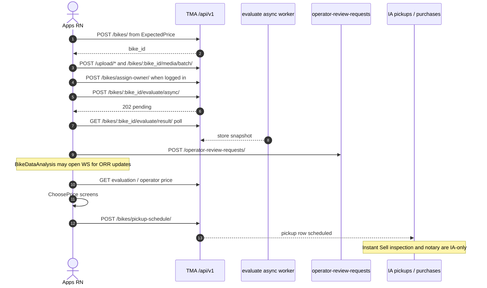
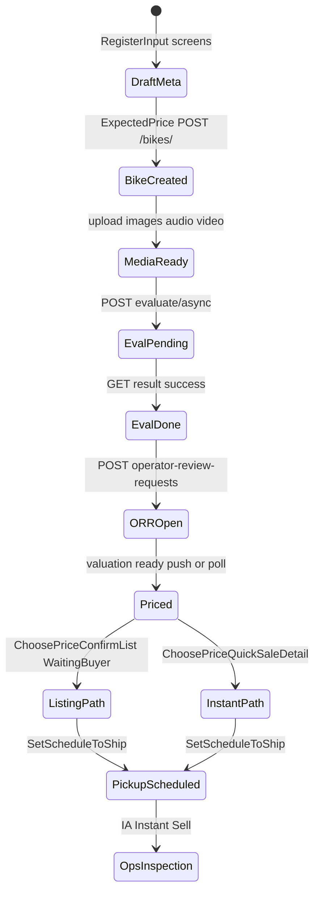

# 1. Overview and Business Intent

The rider sell journey is a linear root-stack flow, not a nested navigator. After policy and bike metadata, `ExpectedPrice` creates the bike row. Media upload and AI evaluate run around `BikeDataAnalysis`. Operator review request (ORR) and push unlock pricing screens. The seller then picks listing vs instant purchase in ChoosePrice, then books pickup via `SetScheduleToShip`. OPS Instant Sell and notary live in `timoto-internal-app`; this page only documents the customer TMA path and the handoff points.

**Actors:** Rider RN, TMA API (`api.timoto.ai` / staging), Cognito JWT (required for assign-owner, ORR, pickup), in-process evaluate worker on TMA backend, OPS via pickup schedule \+ later Instant Sell.

**Target files (apps):**

- Entry CTA: `apps/src/navigation/runValuationEntryFlow.ts`, `pages/Home.tsx`, `pages/RegisterBikeHistory.tsx`
- Step 01: `pages/RegisterSellBike.tsx`, `RegisterPolicy.tsx`, `Step01/LocationSelect.tsx`, `RegisterInput.tsx`, `RegisterInputSecond.tsx`, `OcrConfirmResult.tsx`, `ExpectedPrice.tsx`, `PreValuation.tsx`
- Media: `Step02/TakePhotosStep2.tsx`, `Register2ndStep.tsx`, `Step03/*` audio/video
- Evaluate / ORR: `pages/BikeDataAnalysis.tsx`, `BikeValuationResult.tsx`
- Price / sale: `pages/ChoosePrice/*`, `SetScheduleToShip.tsx`, `SetScheduleConfirmation.tsx`, `SaleConfirmationPopup.tsx`
- API: `apps/src/api/endpoints.ts`, `apiClient.ts`, `sellerDualPrice.ts`

**Target files (backend):** `backend/apps/bikes/urls.py`, `views.py` (BikeViewSet create, media batch, pickup, evaluate async), `realtime_views.py` (assign-owner, ORR), `bike_evaluate_flow.py`. Cross-repo: IA `instant_sell.py` / `purchases_api.py` after pickup; dealer inventory when a Hub combo shares the bike id.

---

# 2. End-to-End Flow and Sequence Diagram





WebSocket for ORR is used inside `BikeDataAnalysis` when the user is logged in (see realtime docs). Root navigator no longer mounts a global WS toast.

---

# 3. Detailed API Contracts

Base path `/api/v1`. Auth notes from existing bikes docs: create/list views are permissive; assign-owner, ORR, and pickup require Bearer.

| Step | Method | Path | FE caller | | --- | --- | --- | | Create bike | POST | `/bikes/` | `ExpectedPrice.createBikeAndNavigate` via `API_ENDPOINTS.BIKES.CREATE` | | Detail / update | GET/PATCH | `/bikes/:bike_id/` | resume and history | | Media batch | POST | `/bikes/:bike_id/media/batch/` | Step02 / Step03 upload helpers | | Upload binaries | POST | `/upload/images`, `/upload/audios`, `/upload/videos`, `/upload/recognition-paper` | camera/recorder screens | | Assign owner | POST | `/bikes/assign-owner/` | `BikeDataAnalysis` before evaluate | | Evaluate async | POST | `/bikes/:bike_id/evaluate/async/` | `BikeDataAnalysis` | | Evaluate poll | GET | `/bikes/:bike_id/evaluate/result/` | same; treats pending as keep polling | | ORR create | POST | `/operator-review-requests/` | `BikeDataAnalysis` / login modal | | ORR cancel | POST | `/operator-review-requests/cancel/` | RegisterBikeHistory cancel | | Pickup create | POST | `/bikes/pickup-schedule/` | `SetScheduleToShip` | | Pickup detail | GET | `/bikes/pickup-schedule/:schedule_id/` | QuickSaleDetail resume | | Sale history | GET | `/bikes/sale-history/` | RegisterBikeHistory tabs | | Sale cancel | POST | `/bikes/sale-history/:bike_id/cancel/` | history cancel modes | | Dual price option | PATCH | seller price endpoint under bikes (see `endpoints.ts` seller dual-price comment) | ChoosePrice persistence |

### HTTP error matrix (customer sell)

| Code / signal | Meaning | FE behavior in code |
| --- | --- | --- |
| 202 on evaluate async | job accepted | start poll loop |
| 200 \+ `EVALUATION_PENDING` | still running | continue poll until deadline |
| evaluate poll deadline | client `408`-shaped throw | show error; ORR may still proceed if already created |
| 403 assign-owner / evaluate | ownership | skip evaluate or show warning |
| 401 mid-flow | token | refresh or push Authen/OTP with `returnToName` |
| 409 pickup cancel terminal | schedule closed | block cancel |
| 422 pickup validation | bad date/slot/phone | form errors on SetScheduleToShip |

Cross-backend after pickup: OPS uses IA `POST /api/purchases/:bike_id/inspection/pass/` onward — not called from customer apps. Dealer `POST /api/v1/internal/inventory/bike-unavailable/` may fire when mobile deposit marks a shared bike sold (dealer side); **receiver `bike-sold` is configured on dealer settings toward TMA staging URL but no matching view was found under `timoto-mobile/backend` in this scan**.

---

# 4. Data Model and State Machine

Customer bike and pickup live on TMA Aurora (see bikes-pickup-evaluate doc for raw SQL pickup columns). Logical entities:

```sql
-- TMA bikes (Django BikeViewSet) — conceptual
CREATE TABLE bikes (
  bike_id UUID PRIMARY KEY,
  user_id UUID NULL,
  brand TEXT,
  model TEXT,
  year INT,
  -- media via related bike_media; evaluate snapshot separate
  created_at TIMESTAMPTZ
);

-- Pickup schedules (raw SQL insert in views) — conceptual
CREATE TABLE bike_pickup_schedules (
  schedule_id UUID PRIMARY KEY,
  bike_id UUID NOT NULL,
  status TEXT NOT NULL, -- scheduled | cancelled | completed | rejected
  scheduled_date DATE,
  scheduled_time_slot TEXT,
  valuation_price NUMERIC,
  phone_number TEXT,
  province TEXT,
  ward TEXT,
  address TEXT
);
```

Local RN state: `valuationResume` checkpoint JSON on route params; `activeSellBikeStorage`; ChoosePrice params carry `fmp_vnd`, `listing_price_vnd`, `instant_price_vnd`, `selected_option` (`listing` | `instant_purchase`).

Seller path fork:

1. **Listing:** `ChoosePriceConfirmList` → `ChoosePriceWaitingBuyer` → later `ChoosePriceBuyerFound` / order detail when buyer exists.
2. **Instant / quick sale:** `ChoosePriceQuickSaleDetail` phases `pending_schedule` | `scheduled` | `scheduled_locked` → pickup.

Both forks use `SetScheduleToShip` with optional `returnToQuickSaleDetail` and `replace_schedule_id` for reschedule-without-cancel-on-navigate.

---

# 5. Frontend Integration Guide

**Happy path screen order (route names):**

`RegisterSellBike` → `RegisterPolicy` → `LocationSelect` → `SelectRegisterOption` / `ScanBikeCer` → `OcrConfirmResult` → `RegisterInput` → `RegisterInputSecond` → `ExpectedPrice` → `PreValuation` → `TakePhotosStep2` → `Register2ndStep` → audio/video steps → `BikeDataAnalysis` → `BikeValuationResult` → ChoosePrice screens → `SetScheduleToShip` → `SetScheduleConfirmation`.

**Login gate:** evaluate and ORR require auth. Unauthenticated users see login suggestion; after OTP, return to `BikeDataAnalysis` with `showLoginedBackModal`. Assign-owner runs before async evaluate.

**Resume:** `runValuationEntryFlow` and `buildValuationResumeStackRoutes` rebuild the stack from checkpoint \+ sale-history guard routes (`BikeDataAnalysis`, `BikeValuationResult`, `SetScheduleToShip`). Outside 06:00–23:00, entry may open `SuggestTimeValuation` modal first.

**Cross-links:** [App navigation](./app-architecture-navigation), [Evaluation upload](./evaluation-upload), [Bikes pickup evaluate](./bikes-pickup-evaluate-marketplace), [Realtime ORR](./realtime-orr-assign-owner), [S2S operator offer](./s2s-operator-offer-buyer-found), IA [Instant Sell engine](../internal-app/instant-sell-engine), [Notary](../internal-app/notary-contract-signing).

---

# 6. Edge Cases and Known Pitfalls

- **Create bike happens at ExpectedPrice**, not at first RegisterInput screen — abandoning before confirm leaves no bike\_id.
- **Evaluate retries** in `BikeDataAnalysis` are bounded client attempts; do not invent server Celery queues — worker is an in-process daemon per bikes docs.
- **ORR must not be POSTed twice** on resume when `operator_review_request_id` already exists.
- **Media gate:** async evaluate rejects when `bike.media.count() == 0` (error\_code 3); video-only still counts as media.
- **Pickup POST does not auto-cancel** prior schedules; reschedule flows cancel explicitly then create, or pass `replace_schedule_id` from QuickSaleDetail.
- **Dual price** listing vs instant is FE math plus API snapshot fields; OPS Instant Sell purchase price resolves from IA pricing entry after pickup.
- **No customer notary UI** — notary confirm is OPS-only on IA.
- **Inventory Hub sync** is dealer-side; customer app does not call inventory S2S endpoints.

**Not found in code:** customer endpoint named `payout-account` under `timoto-mobile/backend` (IA calls `TMA_API_URL/users/:user_id/payout-account/` fail-open); mobile `bike-sold` inventory webhook handler.