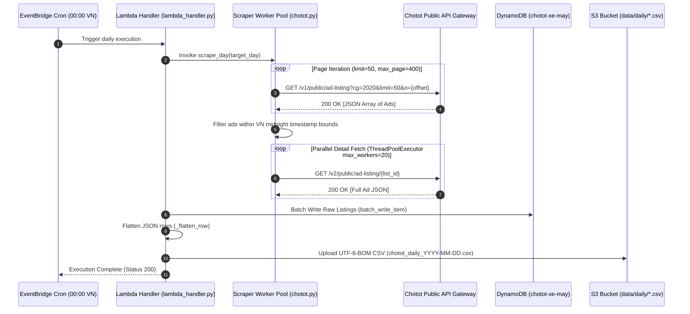

## 1. Overview & Business Intent

- **Business Role**: The **Chotot Data Scraping Pipeline** (`chototcaodulieu`) automatically ingests daily used motorcycle listings from Chotot (`cg=2020`), flattens nested metadata, stores raw payloads in AWS DynamoDB, and streams UTF-8-BOM CSV exports to AWS S3. This provides the primary raw dataset used by TiMoto's Fair Market Price (FMP) valuation engine.
- **Actors**: AWS EventBridge Cron (`00:00 VN` / `17:00 UTC`), AWS Lambda Execution Handler, Concurrent Python Scraper Workers (`ThreadPoolExecutor`).
- **Target Repos**: `chototcaodulieu` (`chotot.py`, `lambda_handler.py`, `refresh_handler.py`, `export_quality_bikes.py`).

---

## 2. End-to-End Flow & Sequence Diagram



---

## 3. Detailed API & Function Contracts

### A. Chotot Gateway Public API

#### 1. Listing Endpoint

- **HTTP Method & Route**: `GET https://gateway.chotot.com/v1/public/ad-listing`
- **Query Parameters**:
  - `cg`: `2020` (Motorcycles category ID)
  - `limit`: `50` (Items per page)
  - `o`: `0`, `50`, `100`... (Offset counter)
  - `page`: `1`, `2`...
  - `st`: `s,k` (Active & accepted listing status)
- **Response Structure (200 OK)**:
  ```json
  {
    "total": 1450,
    "ads": [
      {
        "list_id": 11223344,
        "list_time": 1723996800000,
        "subject": "Honda Air Blade 2021 màu đen",
        "price": 32500000,
        "region_name": "TP Hồ Chí Minh"
      }
    ]
  }
  ```

#### 2. Detail Endpoint

- **HTTP Method & Route**: `GET https://gateway.chotot.com/v2/public/ad-listing/{list_id}`
- **Response Structure (200 OK)**: Full ad JSON containing `ad_params`, `images`, `account_name`, `body`, `motorbikebrand`, `motorbikemodel`, `regdate`, `mileage_v2`.

---

## 4. Database Schema & Export Pipeline

### DynamoDB Table Schema (`chotot-xe-may`)

- **Region**: `ap-southeast-1`
- **Partition Key**: `list_id` (Number)
- **Attributes**: Dynamically serialized raw attributes from Chotot payload. Keys containing dots (`.`) are sanitized to underscores (`_`).

### CSV Export Fields (`_flatten_row`)

| Field Name | Source Key | Description |
| --- | --- | --- |
| `list_id` | `ad.list_id` | Unique listing ID |
| `subject` | `ad.subject` | Ad title |
| `price` | `ad.price` | Price in VND |
| `motorbikebrand` | `params.motorbikebrand` | Brand (e.g. Honda) |
| `motorbikemodel` | `params.motorbikemodel` | Model (e.g. Air Blade) |
| `regdate` | `params.regdate` | Registration year |
| `mileage_v2` | `params.mileage_v2` | Odometer reading |
| `images` | `ad.images` | Joined S3 image URL list (`\|`) |

---

## 5. Script & Handler Architecture

- **`chotot.py`**:
  - `ThreadPoolExecutor(max_workers=20)` concurrently executes `fetch_detail(list_id)`.
  - `urllib3.util.Retry(total=3, backoff_factor=0.5, status_forcelist=[429, 500, 502, 503])`.
- **`refresh_handler.py`**:
  - Weekly batch scan over `chotot-xe-may` in chunks of `2,500`.
  - Time budget guard (`TIME_BUDGET_SEC = 780s`). If scanning reaches time budget limit, saves checkpoint to S3 (`data/refresh_checkpoint.json`) and triggers async self-invocation (`boto3.client('lambda').invoke(InvocationType='Event')`).

---

## 6. Resilience & Anti-Bot Mitigations

1. **429 Rate Limit Handling**: Automatic exponential backoff \+ 30s sleep on HTTP 429 response.
2. **Page Ceiling Guard**: Hard stop at page 400 (`19,900` ads) to prevent infinite loops.
3. **Fail-Safe S3 Export**: UTF-8 BOM encoding ensures CSV files open natively in Microsoft Excel without character corruption.