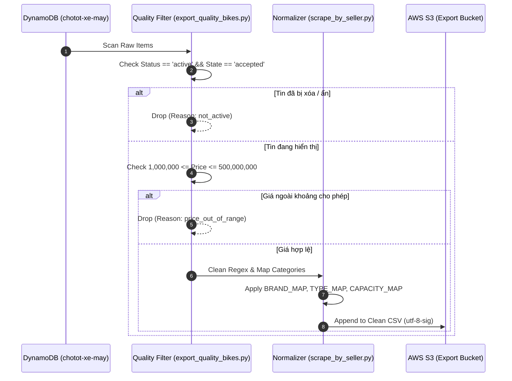

# 1. Tổng Quan Nghiệp Vụ & Phạm Vi (Context & Architecture)

Hệ thống **Data Normalization & Deduplication** trong repo `chototcaodulieu` chịu trách nhiệm lọc bỏ rác dữ liệu, loại bỏ tin đăng hết hạn hoặc bị gỡ, và chuẩn hóa các thông số kỹ thuật (Hãng, Dòng xe, Dung tích động cơ, Năm đăng ký) về chuẩn TiMoto Schema trước khi nạp vào AI Model.

### Repositories Liên Quan

- **Scraper & Export Scripts**: `chototcaodulieu/export_quality_bikes.py`, `scrape_by_seller.py`, `lambda_handler.py`
- **Data Processing Rules**: `chototcaodulieu/chotot.py`

---

# 2. Sequence Diagram Chi Tiết (Pipeline & Filtering Bounds)



---

# 3. Code Implementation & Mapping Dictionaries

### Mapping Catalogs (`scrape_by_seller.py`)

```python
ILLEGAL_RE = re.compile(r"[\x00-\x08\x0b\x0c\x0e-\x1f]")
BRAND_MAP = {
    1:"Honda", 2:"Yamaha", 3:"Vespa / Piaggio", 4:"SYM",
    5:"Suzuki", 6:"Kawasaki", 7:"Ducati", 8:"BMW",
    9:"Harley-Davidson", 10:"KTM", 11:"Triumph", 12:"Royal Enfield",
    13:"Benelli", 14:"Kymco", 15:"Peugeot", 99:"Khác",
}
TYPE_MAP     = {1:"Tay ga", 2:"Xe số", 3:"Xe côn tay", 4:"Xe phân khối lớn", 5:"Xe điện", 6:"Xe 3 bánh"}
CAPACITY_MAP = {1:"Dưới 50cc", 2:"50-100cc", 3:"100-175cc", 4:"175-300cc", 5:"300-500cc", 6:"Trên 500cc"}

def clean(v):
    return ILLEGAL_RE.sub("", v) if isinstance(v, str) else v
```

### Quality & Validity Rules (`export_quality_bikes.py`)

```python
MIN_PRICE = 1_000_000
MAX_PRICE = 500_000_000
MIN_SUBJECT_LEN = 8

def is_quality(record: dict) -> tuple[bool, str]:
    ad = _ad(record)
    if not (ad.get("status") == "active" and ad.get("state") == "accepted"):
        return False, "not_active"

    price = int(ad.get("price") or 0)
    if price < MIN_PRICE or price > MAX_PRICE:
        return False, "price_out_of_range"

    if len((ad.get("subject") or "").strip()) < MIN_SUBJECT_LEN:
        return False, "short_subject"

    imgs = ad.get("images") if isinstance(ad.get("images"), list) else []
    if not imgs and not (ad.get("thumbnail_image") or ad.get("image")):
        return False, "no_image"

    return True, "ok"
```

---

# 4. Error & Rejection Catalog

| Reject Code | Trigger Condition | Business Action |
| --- | --- | --- |
| `not_active` | `status != 'active'` OR `state != 'accepted'` | Bỏ qua tin không còn bán |
| `price_out_of_range` | `price < 1,000,000` OR `price > 500,000,000` | Loại bỏ giá ảo / nhập sai |
| `short_subject` | `length(subject) < 8` | Loại bỏ tin đăng rác thiếu tiêu đề |
| `no_image` | Không có `images` list lẫn thumbnail URL | Loại bỏ tin không ảnh minh họa |