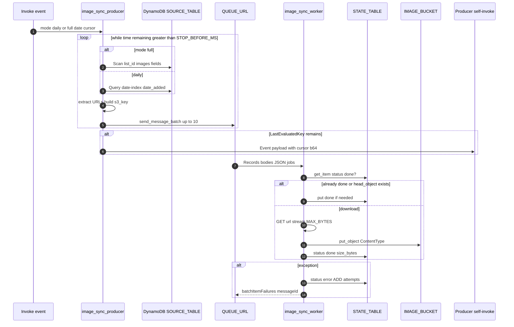
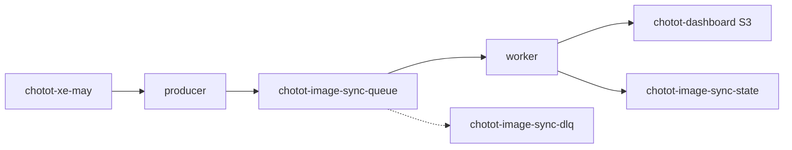

# 1. Overview and Business Intent

After Chotot listings land in DynamoDB, a separate pipeline copies remote images into TiMoto’s S3 dashboard bucket so analytics and downstream tools do not hot-link Chotot CDNs forever. The producer Lambda pages source items, builds deterministic S3 keys, and batch-sends SQS jobs. The worker Lambda consumes those jobs, skips work already marked done, downloads with a size cap, uploads `STANDARD` objects, and writes per-key state rows.

This pipeline is independent of the scrape Lambda and of TiMoto Aurora. It does not invent realtime WebSocket progress into product apps; operators use `monitor_image_sync.py` CLI for queue depth and state counts.

**Actors:** EventBridge or manual invoke → `image_sync_producer.py` → SQS → `image_sync_worker.py` → S3 \+ DynamoDB state; optional `monitor_image_sync.py`.

**Target files:** `/Users/toannguyen/chototcaodulieu/image_sync_producer.py`, `image_sync_worker.py`, `monitor_image_sync.py`, `deploy_image_sync_lambda.py`.

---

# 2. End-to-End Flow and Sequence Diagram





Default daily date is yesterday Vietnam time (`UTC+7`). Full mode scans the whole table with the same projection.

---

# 3. Detailed API / Interface Contracts

There is no public HTTP API. Contracts are Lambda event JSON, SQS message bodies, and DynamoDB/S3 shapes.

### Producer event

| Field | Default | Meaning |
| --- | --- | --- |
| `mode` | `daily` | `daily` queries GSI; `full` scans; other values coerced to daily |
| `date` | VN yesterday `YYYY-MM-DD` | Partition value for `date_added` |
| `page_limit` | env `PAGE_LIMIT` default 200 | DynamoDB Limit per page |
| `stop_after` | 0 | If greater than 0, stop after that many queued jobs (continuation cleared) |
| `dry_run` | false | Count jobs without SQS send |
| `cursor` | none | Base64 urlsafe typed DynamoDB ExclusiveStartKey |

### Environment

| Name | Default | Role |
| --- | --- | --- |
| `SOURCE_TABLE` | `chotot-xe-may` | Listing source |
| `SOURCE_INDEX` | `date-index` | GSI for daily |
| `QUEUE_URL` | required | SQS destination |
| `S3_PREFIX` | `images` | Key prefix |
| `STOP_BEFORE_MS` | 45000 | Leave Lambda early for self-invoke |
| `IMAGE_BUCKET` | `chotot-dashboard-404850807717` | Worker upload bucket |
| `STATE_TABLE` | `chotot-image-sync-state` | Worker state |
| `MAX_BYTES` | 26214400 (25 MiB) | Download cap |

### SQS job body

Each message is compact JSON with keys: `list_id`, `media_type`, `url`, `s3_key`.

Media types extracted per item:

| Source attribute | `media_type` |
| --- | --- |
| `images` list of http strings | `images` |
| `image` string | `image` |
| `thumbnail_image` | `thumbnail` |
| `webp_image` | `webp` |

S3 key formula: `S3_PREFIX/list_id/media_type/sha1(url)+ext` where extension comes from URL path suffix (max length 8) else `.jpg`. Per-page URL dedupe and cross-page `unique_keys` on `s3_key` reduce duplicate enqueues within one producer run.

Producer return body: `mode`, `date`, `pages`, `records_seen`, `queued_jobs`, `continuation`, `dry_run`.

Worker return: SQS partial-batch failure object with `batchItemFailures` listing failed `itemIdentifier` message ids. Success reasons logged include `already_done`, `already_in_s3`, `uploaded`, or `skip_missing_*`.

### Monitor CLI

`monitor_image_sync.py` (profile default `harry`, region default `ap-southeast-1`) polls queue `chotot-image-sync-queue` and DLQ `chotot-image-sync-dlq`, optionally scans state status counts and lists S3 common prefixes under `images/`.

---

# 4. Database Schema and Locks

Source table is the Chotot listing store; producer only projects `list_id, images, image, thumbnail_image, webp_image`. State table is keyed by `s3_key`.

```sql
-- Logical shape of STATE_TABLE items (DynamoDB, not Postgres)
-- PK: s3_key (S)
-- Attributes used by worker:
--   status (S)          -- done | error
--   list_id (S)
--   media_type (S)
--   url (S)
--   size_bytes (N)      -- on done
--   content_type (S)    -- on done
--   updated_at (S)      -- UTC ISO
--   attempts (N)        -- ADD 1 on error
--   last_error (S)      -- truncated to 400 chars
```

```sql
-- Source listing projection (DynamoDB)
-- Table: chotot-xe-may
-- GSI date-index: date_added (S) + keys supporting ExclusiveStartKey pagination
-- Attributes read: list_id, images (L), image, thumbnail_image, webp_image (S)
```

No distributed lock beyond SQS visibility and idempotent state/`head_object` checks. Cursor continuation re-encodes DynamoDB typed keys via TypeSerializer then base64 urlsafe JSON so Event payloads stay JSON-safe.

---

# 5. Operational UI and Tooling

There is no product SPA for this sync. Operators:

1. Invoke producer with `mode` / `date` / `dry_run` as needed.
2. Watch CloudWatch logs for `producer_done` and `worker_done` JSON events.
3. Run `AWS_PROFILE=harry python3 monitor_image_sync.py` (or `--once`, `--interval`) to see wait/running depth, DLQ size, done/error counts, and bike-folder counts under the bucket prefix.

Worker User-Agent is fixed `chotot-image-worker/1.0`. Download timeouts are connect 8s / read 35s streaming in 64 KiB chunks.

`head_object` treating `404`, `NoSuchKey`, `NotFound`, `403`, `AccessDenied` as “missing” means those codes cause a re-download attempt rather than crash; other ClientErrors propagate.

---

# 6. Edge Cases and Resilience

1. Producer stops when remaining millis ≤ `STOP_BEFORE_MS` even mid-table, then async-invokes itself with encoded cursor so long full scans finish without timing out a single invocation.
2. `dry_run` still walks pages and counts jobs but does not call SQS; continuation still carries `dry_run` flag.
3. `stop_after` forces `next_cursor` cleared so a capped test run does not chain.
4. Worker treats missing required job fields as success skip (message deleted) with reason `skip_missing_*` — poison incomplete messages do not infinite-retry.
5. Objects already in S3 but missing state rows get state marked done without re-upload (`already_in_s3`).
6. Download HTTP non-200 raises `HTTP_status`; oversize raises `FILE_TOO_LARGE`; failures increment `attempts` and return partial batch failure for SQS retry / DLQ policy.
7. SQS send\_message\_batch failures are logged with failed entry count; successful subset still counts toward `queued_jobs`.
8. `list_id` normalization prefers integer string form; non-numeric strings are stripped and kept if non-empty.
9. Monitor state scan can be expensive on large tables — script refreshes state/S3 slower than queue polls by design.

---

# Appendix: Operational commands

| Method | Surface | Notes |
| --- | --- | --- |
| CLI | image sync producer | Enqueues DynamoDB items needing image copy onto SQS |
| CLI | image sync worker | Downloads source URL, puts S3 object, updates DDB state |
| CLI | monitor | Queue depth and DLQ inspection |
| Lambda/invoke | producer self-invoke | Cursor checkpoint for long scans |

No public HTTP API for dealers or riders — this pipeline is ops/infra only.