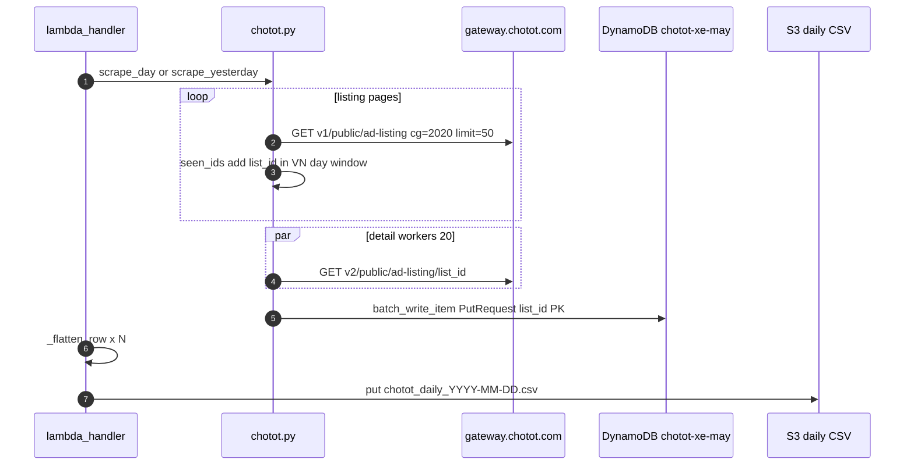
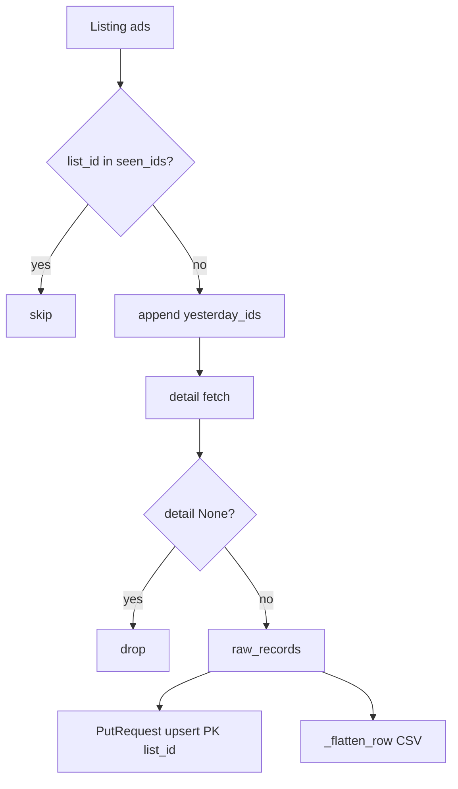

# 1. Overview & Business Intent

The Chotot motorcycle scraper (`chototcaodulieu`) treats **deduplication as identity on `list_id`**, not fuzzy title matching. Listing pagination builds a unique ID set; detail fetch writes one DynamoDB item per ID; CSV export flattens for humans; a separate quality CLI re-fetches live ads and filters for research samples.

**Actors:** EventBridge → `lambda_handler.py` (daily), `chotot.py` (HTTP \+ DynamoDB upsert), optional `export_quality_bikes.py` (local/CLI quality pack), DynamoDB table default `chotot-xe-may`, S3 daily CSV when `CHOTOT_EXPORT_S3_BUCKET` is set.

**Non-goals encoded in code:** no Postgres upsert, no Aurora write, no content-hash dedup across sellers, no merge of near-duplicate listings. Re-scraping the same `list_id` **overwrites** the DynamoDB item via `PutRequest`.

---

# 2. End-to-End Flow & Sequence Diagram

Daily path:

1. Resolve target Vietnam calendar day (event `scrape_date` or yesterday).
2. Page listing API until time window exits or hard cap `page * 50 >= 19900`.
3. Dedup listing IDs with an in-memory `seen_ids` set while collecting yesterday’s IDs.
4. Parallel detail GET (`WORKERS = 20`); drop None (404/errors).
5. `upsert_to_dynamodb` batches of 25 PutRequests keyed by `list_id`.
6. Flatten each raw record to 24 CSV columns; upload `utf-8-sig` CSV if bucket configured.





Quality CLI path is independent: collect more IDs than needed (`buffer` default 2.5), filter with `is_quality`, optionally second-pass excluding already accepted IDs.

---

# 3. Detailed API Contracts

| Call | URL / params | Timeout | Dedup relevance |
| --- | --- | --- | --- |
| Listing | `GET https://gateway.chotot.com/v1/public/ad-listing` `cg=2020` `limit=50` `o=(page-1)*50` `page` `st=s,k` | 20s | Source of candidate `list_id` |
| Detail | `GET https://gateway.chotot.com/v2/public/ad-listing/:list_id` | 15s | Canonical payload stored |

Headers (`chotot.py`): User-Agent Mozilla Mac, Accept JSON, Origin `https://xe.chotot.com`, Referer motorcycle browse path.

**Listing-window dedup (`scrape_day`):**

| Check | Behavior |
| --- | --- |
| `ts = list_time_ms // 1000` | Compare to VN day `[since_ts, until_ts)` |
| `ts >= until_ts` | Skip (newer than window) |
| `since_ts <= ts < until_ts` | Keep if `list_id` not in `seen_ids` |
| `ts < since_ts` | Set stop flag — older than window |
| empty ads page | Break |
| `page * LIMIT >= 19900` | Warn and stop (API offset ceiling) |

**HTTP resilience (not dedup):** 429 → sleep 30s; other HTTPError → break; generic Exception → sleep 3s; detail 404/exception → `(list_id, None)` omitted from raw\_records.

Quality listing collector (`collect_ids`) uses the same page fetch and a separate `seen` set so the same ID is not appended twice while filling the buffer.

---

# 4. Database Schema & Ingestion

Partition key is **`list_id` as integer**. Upsert implementation: DynamoDB `batch_write_item` with `PutRequest` — same key replaces the previous item entirely (full ad attributes \+ `_raw_json`).

```sql
-- Logical DynamoDB item (not Postgres). PK = list_id.
CREATE TABLE chotot_xe_may (
    list_id INTEGER PRIMARY KEY,
    date_added VARCHAR(32),
    _raw_json TEXT,
    subject TEXT,
    price BIGINT,
    motorbikebrand VARCHAR(128),
    motorbikemodel VARCHAR(128),
    region_name VARCHAR(128),
    list_time BIGINT,
    account_name VARCHAR(256),
    thumbnail_image TEXT
);
```

`_make_item` rules (`upsert_to_dynamodb`):

| Rule | Code behavior |
| --- | --- |
| Source object | `record["ad"]` if present else whole record |
| Missing id | Skip item if neither `list_id` nor `ad_id` |
| PK write | Always `list_id = int(list_id)` after serialize |
| Empty skip | Drop attributes that are None, `""`, `[]`, or empty object |
| Key sanitize | Replace `.` with `_` in attribute names |
| Serialize fail | Fall back to `str(v)` |
| `date_added` | VN `YYYY-MM-DD` from `list_time` ms when present |
| `_raw_json` | Full original record JSON string |
| Batch size | 25 PutRequests; failed batch logged and dropped (no retry queue) |

Env defaults: table `CHOTOT_DDB_TABLE` → `chotot-xe-may`; region `AWS_DEFAULT_REGION` → `ap-southeast-1`.

**Flatten for CSV only** (`lambda_handler._flatten_row`) — DynamoDB keeps raw fields; CSV gets 24 columns in this order: `list_id`, `ad_id`, `subject`, `price`, `price_string`, `motorbikebrand`, `motorbikemodel`, `motorbiketype`, `regdate`, `mileage_v2`, `condition_ad_name`, `region_name` (prefers `region_name_v3`), `area_name`, `ward_name`, `list_time`, `date`, `account_name`, `account_oid`, `thumbnail_image`, `webp_image`, `image`, `images_count`, `images` (pipe-joined strings), `url` (`https://xe.chotot.com/mua-ban-xe-may/` \+ list\_id). Encoding `utf-8-sig`. Object key `:prefix/chotot_daily_:day.csv`.

Quality export explicitly does **not** flatten: meta `format` string states raw Chotot API response per bike.

---

# 5. Frontend & Hook Integration

No product frontend. Consumers:

| Consumer | Dedup / filter role |
| --- | --- |
| Dashboard / FMP research | S3 daily CSV rows keyed by `list_id` |
| Weekly refresh handler | Scan projection `list_id`, re-detail, Put overwrite |
| `export_quality_bikes.py` | Live\+quality sample JSON under `reports/` |

Quality gate constants: `MIN_PRICE = 1_000_000`, `MAX_PRICE = 500_000_000`, `MIN_SUBJECT_LEN = 8`, `WORKERS = 25`, `PAGE_DELAY = 0.12`. CLI: `--limit` default 500, `--buffer` default 2.5, output default `reports/chotot_quality_<limit>_<YYYY-MM-DD>.json`.

Second pass when first pass under-delivers: collect more IDs with buffer `3.0`, exclude `list_id` already in accepted bikes, merge, sort by `list_time` descending, truncate to `--limit`.

Alive predicate: `status == "active"` AND `state == "accepted"`. Missing detail increments `detail_404` and never calls `is_quality`.

---

# 6. Edge Cases & Resilience

| Reject reason | Condition |
| --- | --- |
| `not_active` | Fail alive check |
| `bad_price` | `int(price)` raises; note `price = ad.get("price") or 0` first |
| `price_out_of_range` | Outside 1e6–5e8 VND |
| `short_subject` | Stripped subject length less than 8 |
| `no_image` | Empty `images` list and no thumbnail/image/webp |
| `no_region` | Neither `region_name_v3` nor `region_name` |
| `no_seller` | Missing `account_name` |
| `no_list_time` | Missing `list_time` |
| `no_list_id` | Missing `list_id` |
| `ok` | Passes all gates |

Additional resilience notes:

1. **Upsert is replace, not merge.** A later scrape for the same `list_id` replaces attributes; there is no version column or SCD in `chotot.py`.
2. **Listing dedup ≠ quality uniqueness across days.** Daily job only unique within one scrape run’s `seen_ids`; cross-day identity is solely DynamoDB PK.
3. **Failed DDB batch is lost for that batch.** Exception is logged; `written` counter does not include failed items; no DLQ in this module.
4. **Detail None silent drop.** Listing may have collected an ID that 404s later; counts diverge (`Detail OK: n/m`).
5. **Quality buffer waste.** Buffer multiplies listing IDs because many fail alive/quality; under-collection triggers second pass with exclusion set.
6. **CSV vs raw.** Flattening collapses images to a pipe string and synthesizes `url`; Dynamo `_raw_json` remains the forensic source.

**Success criteria:** for a given VN day, each `list_id` appears once in the listing collector, at most once per successful detail in `raw_records`, and once as DynamoDB PK after upsert; quality JSON contains at most `--limit` alive ads each passing the nine reject reasons above.