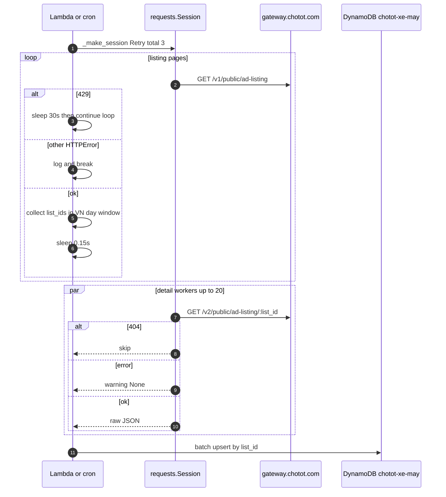
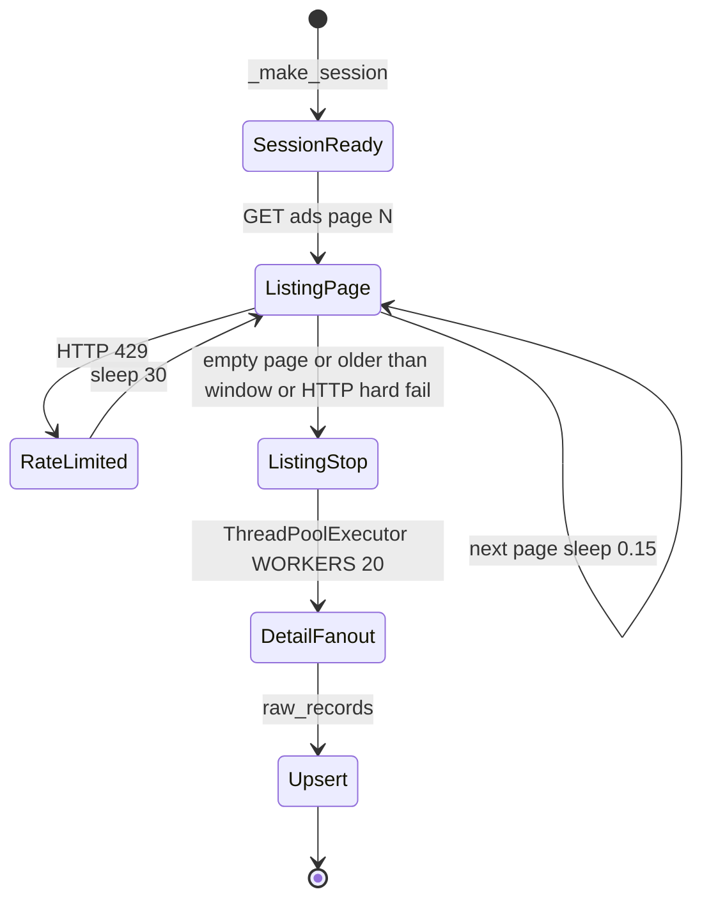

# 1. Overview and Business Intent

The daily Chợ Tốt motorcycle scraper (`chotot.py`) talks to public gateway URLs with a shared `requests.Session`. Anti-bot posture in code is limited to browser-like headers, connection pooling, urllib3 automatic retries, a short sleep between listing pages, and a hard sleep when HTTP 429 is raised. There is **no** proxy configuration, **no** rotating egress IP, **no** CAPTCHA solver, and **no** cookie jar warmup beyond what `requests.Session` keeps by default.

**Actors:** Lambda / cron invoking scrape functions, Chợ Tốt public gateway, DynamoDB upsert for raw ads.

**Target files:**

- `chotot.py` — `HEADERS`, `_make_session`, `_fetch_listing_page`, `_fetch_detail_one`, `scrape_day`, `upsert_to_dynamodb`
- Related orchestrators may import scrape helpers (`lambda_handler.py`, `refresh_handler.py`, `deep_doc_orchestrator.py`) but proxy search across the repo returned **zero** matches for `proxy`, `PROXY`, `http_proxy`, or `socks`.

**Business intent of this page:** document what exists so operators do not assume a proxy fleet. Rate-limit mitigation is local backoff only.

---

# 2. End-to-End Flow and Sequence Diagram





---

# 3. Detailed API Contracts

### Upstream endpoints (constants)

| Constant | Value |
| --- | --- |
| `BASE_URL` | `https://gateway.chotot.com/v1/public/ad-listing` |
| `DETAIL_URL` | `https://gateway.chotot.com/v2/public/ad-listing` |
| `CATEGORY` | `2020` |
| `LIMIT` | `50` |
| `WORKERS` | `20` |

Listing query params: `cg`, `limit`, `o` offset, `page`, `st=s,k`.

### Session headers (`HEADERS`)

```text
User-Agent: Mozilla/5.0 (Macintosh; Intel Mac OS X 10_15_7) AppleWebKit/537.36
Accept: application/json, text/plain, */*
Origin: https://xe.chotot.com
Referer: https://xe.chotot.com/mua-ban-xe-may
```

Applied via `s.headers.update(HEADERS)` in `_make_session`.

### Retry adapter

```python
Retry(total=3, backoff_factor=0.5, status_forcelist=[429, 500, 502, 503])
HTTPAdapter(max_retries=retry, pool_connections=30, pool_maxsize=30)
```

Mounted on `https://` only. Timeouts: listing GET 20s, detail GET 15s.

### Manual 429 handling (listing loop)

Beyond urllib3 retries, the listing `while True` catches `requests.exceptions.HTTPError`:

- status **429** → log, `time.sleep(30)`, continue
- other HTTP → log error, **break**
- generic Exception → log, `time.sleep(3)` then continue loop

Page spacing: `time.sleep(0.15)` after a successful page. Hard stop if `page * LIMIT >= 19_900` (Chợ Tốt offset ceiling).

### Detail fetch errors

`_fetch_detail_one` returns `(list_id, None)` on 404 or any exception (warning log). Does not raise into the executor consumer.

### HTTP error matrix (as coded)

| Status / error | Layer | Behavior |
| --- | --- | --- |
| 429 | urllib3 Retry | up to 3 retries with backoff |
| 429 | listing loop | extra sleep 30s, continue |
| 500/502/503 | urllib3 Retry | up to 3 retries |
| other HTTP on listing | loop | break scrape of listing |
| 404 detail | detail | treat as missing ad |
| detail transport error | detail | None, continue others |
| DynamoDB write errors | upsert | per implementation logging in `upsert_to_dynamodb` |

There is **no** authenticated Chợ Tốt API key header in this file.

---

# 4. Data Model and State Machine

Scraper persistence target:

```sql
-- DynamoDB table name from env CHOTOT_DDB_TABLE default chotot-xe-may
-- Partition key conceptual:
-- list_id (N or S from ad payload) → full raw ad attribute map
```

`upsert_to_dynamodb` serializes non-empty ad fields with boto3 TypeSerializer; dots in keys become underscores. Region default `ap-southeast-1` via `AWS_DEFAULT_REGION`.

In-memory scrape state only:

- `yesterday_ids` list \+ `seen_ids` set
- `page` integer
- `raw_records` list of detail JSON

No Redis proxy lease table. No rotating credential store.

---

# 5. Frontend Integration Guide

None. This module is backend/Lambda data acquisition. Consumers are analytics / pricing pipelines reading DynamoDB, not a React UI.

Operators integrating monitoring should alert on:

- sudden drop in `Detail OK` ratio
- repeated 429 sleeps (latency blowups)
- listing break on non-429 HTTP

Do not configure `HTTP_PROXY` expecting `chotot.py` to honor a custom rotator — the code never reads proxy env vars.

Cross-links: [Chotot pipeline constants](./chotot-pipeline-constants), [Image sync S3](./image-sync-s3).

---

# 6. Edge Cases and Known Pitfalls

- **Proxy rotation: ABSENT.** Repo-wide grep for proxy-related tokens in `chototcaodulieu` returned no matches. Document absence explicitly for compliance and capacity planning.
- **User-Agent is incomplete** compared to a full Chrome UA string (ends after `AppleWebKit/537.36`) — may be fingerprinted more easily than a full browser.
- **Shared session across 20 workers** means one TCP pool and one cookie jar; it is not process-isolated egress.
- **429 double handling:** urllib3 may retry first; the outer loop also sleeps 30s when an HTTPError with 429 still surfaces.
- **Offset ceiling 19\_900** can truncate extremely large days without proxy fan-out alternatives.
- **Detail failures are silent skips** — undercounts vs listing IDs are expected under partial outages.
- **No CAPTCHA / JS challenge path** — if the gateway starts requiring browser challenges, this client will not recover without new code.
- Sleep `0.15` is politeness only; it is not adaptive concurrency control.

**Not found in code:** Bright Data / Oxylabs / residential proxy SDKs; header rotation lists; TLS fingerprint tools; Playwright/Chromium fallback for anti-bot.