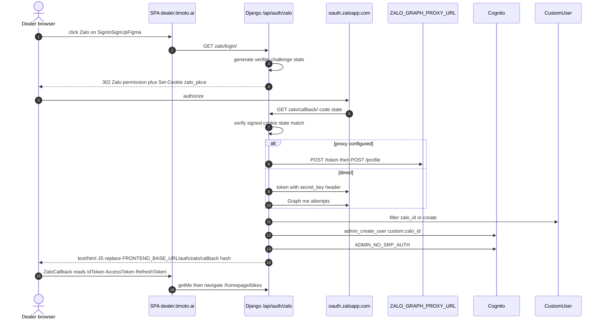
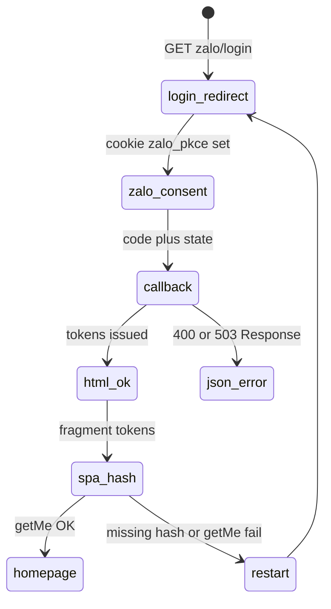

# 1. Overview and Business Intent

Dealer Portal Zalo login is a browser OAuth V4 Social API flow with PKCE. Unlike TMA mobile native SDK, the dealer backend itself generates `code_verifier`, stores it in a signed HttpOnly cookie `zalo_pkce` (15 minutes), and redirects the browser to Zalo. After consent, Zalo hits Django callback; backend exchanges the code, loads profile, upserts `CustomUser` by `zalo_id`, ensures Cognito, then returns an HTML page that `window.location.replace`s the SPA callback with Cognito tokens in the URL fragment.

SPA route is public: `timoto_dealer_portal_v2` `App.tsx` mounts `ZaloCallback` at `/auth/zalo/callback`. Sign-in entry points set `window.location.href` to `:apiBaseUrl/auth/zalo/login/` (`SignInSignUpFigma.tsx`).

**Actors:** Dealer SPA, Django `users/zalo_views.py`, `zalo_config.py`, Cognito, optional Vietnam graph proxy (`ZALO_GRAPH_PROXY_URL`).

**Target files:** `timoto-dealer-portal/backend/users/zalo_views.py`, `zalo_config.py`, `zalo_crypto.py`, `users/urls.py`, `timoto/urls.py` (both `/api/auth/` and `/api/v1/auth/`); FE `frontend/src/pages/ZaloCallback.tsx`, `docs/CONTRACT.md`.

This is **not** mobile Zalo native and is **not** dealer phone OTP SMS. Cognito password for Zalo users comes from settings `ZALO_COGNITO_PASSWORD` (default string `DevOTP654321!@#Aa`) used only for `AdminInitiateAuth`, not for sending SMS.

---

# 2. End-to-End Flow and Sequence Diagram





`FRONTEND_BASE_URL` defaults to `https://dealer.timoto.ai`. Fragment keys are PascalCase: `IdToken`, `AccessToken`, `RefreshToken`, `ExpiresIn` — matching SPA `saveAuthTokens`.

---

# 3. Detailed API Contracts

URL include: `path('api/auth/', include('users.urls'))` and duplicate under `api/v1/auth/`. CONTRACT.md documents the `/api/auth/` forms.

| Method | Path | Auth | Behavior | | --- | --- | --- | | GET | `/api/auth/zalo/login/` | AllowAny | Requires `ZALO_APP_ID` and `ZALO_REDIRECT_URI`. 302 to Zalo permission URL. Sets cookie. | | GET | `/api/auth/zalo/callback/` | AllowAny | Requires `ZALO_SECRET_KEY`. Exchanges code, profile, Cognito; HTML redirect or JSON error. | | GET | `/api/auth/zalo/proxy-status/` | AllowAny | Debug: `check_zalo_proxy_health` reachability. |

**Initiate query params to Zalo:** `app_id`, `redirect_uri` (`ZALO_REDIRECT_URI` must match Zalo portal exactly including trailing slash), `code_challenge`, `state`. Endpoints from `zalo_config.ZALO_ENDPOINTS`: permission `https://oauth.zaloapp.com/v4/permission`, token `.../v4/access_token`, graph `https://graph.zalo.me/v2.0/me`.

**Cookie `zalo_pkce`:** Django `signing.dumps` of verifier\+state; `max_age` 900; `httponly=True`; `secure=True`; `samesite=Lax`. Cleared on successful HTML response.

**Profile fields used:** `id` / `user_id` / `userId` / `uid`, `name`, `picture` (nested `data.url` or string). Phone is optional; `_pick_zalo_phone_candidate` tries several keys. Without phone, `_make_phone_placeholder_from_zalo_id` builds `+84` \+ VN-like 9 digits from SHA-256 of zalo\_id for Cognito username only. Real `phone_number` column is not filled with placeholders; stale placeholder phones are cleared on login refresh.

| HTTP | Body shape | Trigger |
| --- | --- | --- |
| 503 | missing ZALO\_APP\_ID / ZALO\_REDIRECT\_URI | login |
| 503 | missing ZALO\_SECRET\_KEY plus how\_to\_fix secrets\_manager name | callback |
| 400 | Thiếu code hoặc state | callback query |
| 400 | Phiên hết hạn (PKCE cookie) | cookie missing/expired |
| 400 | CSRF: state không khớp | state mismatch |
| 400 | proxy/token/profile/IP -501 messaging | Zalo/proxy failures |
| 401 | Đăng nhập thất bại | AdminInitiateAuth ClientError |
| 500 | Cognito create failures with detail/code | ClientError other than UsernameExists |

Success is **not** JSON tokens to the browser. It is `text/html` with inline script `window.location.replace` to avoid nginx `proxy_buffer_size` overflow on large `Location` headers carrying three JWTs.

---

# 4. Database Schema and Locks

Dealer Zalo does **not** use `ZaloAuthState` table; PKCE lives in the signed cookie. User lookup: `CustomUser.objects.filter(zalo_id=zalo_id).order_by("-event_timestamp").first()`. Type-2 SCD composite identity remains `user_id` \+ `event_timestamp`.

```sql
CREATE TABLE users_customuser (
    user_id UUID PRIMARY KEY,
    event_timestamp BIGINT NOT NULL,
    username VARCHAR(150),
    email VARCHAR(254),
    phone_number VARCHAR(20),
    full_name VARCHAR(200),
    avatar_url VARCHAR(500),
    user_type VARCHAR(20),
    status VARCHAR(20),
    zalo_id VARCHAR(32) UNIQUE,
    date DATE,
    UNIQUE (user_id, event_timestamp)
);
```

On existing user login, backend always refreshes `full_name` and `avatar_url` from Zalo, aligns `username` with Cognito username, and may null out phone if it matches generated placeholder patterns (new SHA-based or old `+84` \+ last 9 of zalo\_id).

Post-auth: IdToken claims decoded without verify; if authentication resolution would load a different Django row (placeholder phone collision with an OTP account), that token-user gets `full_name`/`avatar_url` updated without stealing `zalo_id`. Cognito always stamped with `custom:zalo_id` when possible.

---

# 5. Frontend and UI Logic

`ZaloCallback.tsx` is a public route (must not auth-guard redirect away before reading the hash).

1. If query has `error` or `error_description`, `location.replace` back to login URL (Zalo codes are single-use; retrying callback URL cannot work).
2. If hash empty or missing any of IdToken / AccessToken / RefreshToken, restart login.
3. `saveAuthTokens` then `authApi.getMe()`; on success `navigate('/homepage/bikes', replace)`; on failure restart.

CONTRACT fragment example: `/auth/zalo/callback#IdToken=...&AccessToken=...&RefreshToken=...`. Staging handoff notes the same path on staging host.

Login button: full navigation to backend login, not an XHR, so the Set-Cookie on 302 is stored for the top-level Zalo redirect return.

---

# 6. Edge Cases and Resilience

1. Without `ZALO_GRAPH_PROXY_URL`, Graph may return error `-501` (IP not inside Vietnam); callback returns Vietnamese user-facing error with debug keys.
2. With proxy, token and profile go through proxy only — no silent fallback to direct Graph after proxy `-501` (avoids false hope).
3. Proxy timeout message mentions VNG VM host diagnostics and points to `GET /api/auth/zalo/proxy-status/`.
4. Direct profile tries four header/param combinations for access\_token delivery before failing.
5. HTML body redirect exists specifically because JWT Location headers broke nginx buffering; do not “simplify” back to bare 302 with tokens in Location.
6. Cookie `SameSite=Lax` is required so the top-level GET callback includes `zalo_pkce`.
7. `UsernameExistsException` on Cognito create is treated as OK with attribute stamp; other Cognito errors return 500 with code/detail.
8. SPA restart on any hash failure prevents showing a stuck “Đang đăng nhập với Zalo...” screen without a way forward.