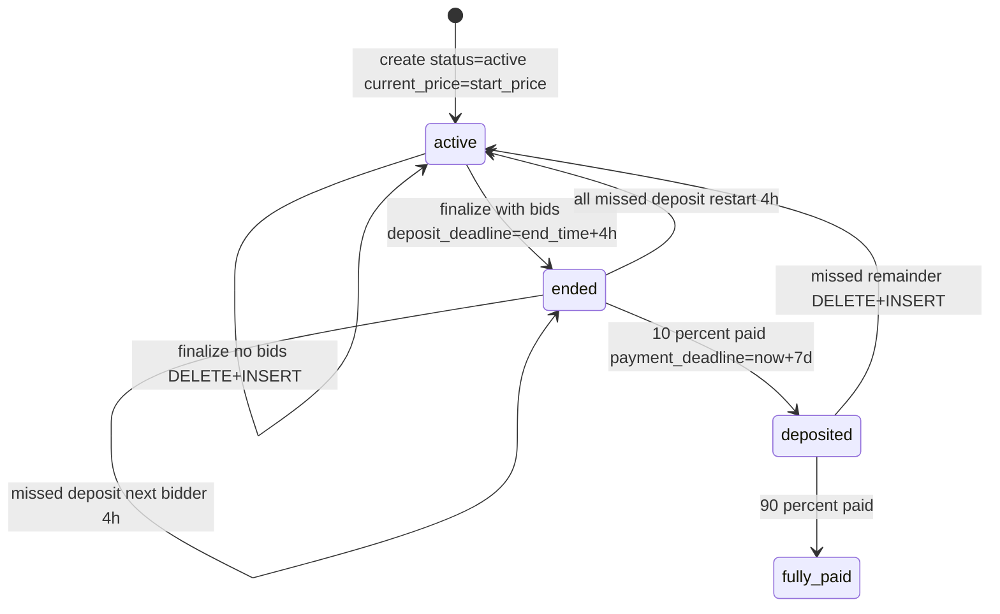

# 1. Overview & Business Intent

Dealer Hub (`dealer.timoto.ai`) lets authenticated dealers browse combos, place orders (VietQR or COD), and bid on used-bike auctions. Money is integer VND on dealer orders and auctions. Legacy `orders.Order` and evaluation prices still use `numeric(12,2)`.

**Actors:** Dealer SPA (`timoto_dealer_portal_v2`), Cognito-backed `CustomUser`, VietQR/VNPay IPN, auction finalize job / GET-side deadline checks.

**Target files:**

- `timoto-dealer-portal/backend/users/models.py`
- `timoto-dealer-portal/backend/orders/models.py`
- `timoto-dealer-portal/backend/auctions/models.py`
- `timoto-dealer-portal/backend/evaluations/models.py`
- Inventory hold: `backend/orders/combo_inventory.py`
- Migrations through `users.0008`, `orders.0007`, `auctions.0013`, `evaluations.0005`

`AUTH_USER_MODEL = 'users.CustomUser'`. `USERNAME_FIELD = 'email'`. Production is PostgreSQL, `USE_TZ=True`, DateTime = `timestamptz`, JSON = `jsonb`. Django does **not** emit `DEFAULT gen_random_uuid()`; UUID defaults are Python `uuid.uuid4`.

**Type-2 SCD is only real on `BikeEvaluation`.** `CustomUser.user_id` is the PK so a second event row with the same id is impossible. `Order.order_id` is UNIQUE so SCD is also blocked. `Auction.auction_id` is UNIQUE. `BikeEvaluation.eval_id` is **not** unique; composite unique is `(eval_id, event_timestamp)`.

Dealer AI report `GET /api/v1/bikes/:bike_id/ai-report/` reads unmanaged `bikes_bikeevaluationresult`, **not** `evaluations_bikeevaluation`.

---

# 2. End-to-End Flow & Sequence / State

### DealerOrder: two independent status axes

Default insert from `DealerOrderViewSet.create`: `delivery_status='delivering'`, `payment_status='pending'`, `payment_method` from payload (default `vietqr`). Cancel is blocked if `payment_status == 'paid'`. VietQR receive requires paid. COD receive does **not** flip `payment_status`. Invoice requires `delivered` **and** `paid`. Reorder only from `cancelled`.

Inventory (`combo_inventory.py`): a combo is held when an item’s parent has `delivery_status IN ('delivering','delivered')` **and** `payment_status='paid'`. Cancel calls `release_combos_for_order`.

```mermaid
stateDiagram-v2
  [*] --> delivering: POST /api/v1/orders/ payment_status=pending
  delivering --> cancelled: POST cancel/ iff payment_status != paid
  delivering --> delivered: POST receive/ VietQR requires paid; COD always allowed
  cancelled --> delivering: POST reorder/ new DealerOrder row
  pending --> paid: VietQR callback POST pay/ then IPN
```



Mismatch: serializer `get_can_cancel()` is true even when paid; `cancel()` then returns 400 `"Cannot cancel an order that has already been paid."`

### Auction: random duration, 10% deposit, 7-day remainder

Live bidding duration is one of `[4.0, 3.0, 2.0, 1.0, 0.5]` hours (`get_random_auction_duration()`). Minimum increment **100000 VND**. Fast bid = `max(current_price, start_price) + 100000`. Winner: `order_by('-bid_amount', 'created_at').first()`. Deposit window **4 hours** after `end_time`. Remainder **7 days** after `deposited_at` (`int(round(winning_price * 0.1))` deposit). Missed deposit → next-highest **other** user gets a fresh 4h window; if none, `_restart_new_cycle()` **DELETE\+INSERT** (CASCADE drops bids and watches). Missed full payment → same restart. `status='cancelled'` exists in choices; no production writer in these model files sets it. `delivery_waiting` / `delivered` exist; no writer in this repo sets them except resets to `pending`.

`AuctionListSerializer` **mutates** on GET: `check_deposit_deadline()` / `check_payment_deadline()` may delete the row.

```mermaid
sequenceDiagram
  autonumber
  actor Dealer
  participant API as AuctionViewSet
  participant DB as auctions_auction / auctions_bid
  participant Pay as payments views VietQR

  Dealer->>API: POST /api/v1/auctions/{id}/place_bid/ {bid_amount}
  API->>DB: SELECT auction FOR business checks
  alt not active or now >= end_time
    API-->>Dealer: 400 Phiên đấu giá không còn hoạt động
  else bid_amount < current+100000
    API-->>Dealer: 400 increment message
  else
    API->>DB: INSERT auctions_bid; UPDATE current_price
    API-->>Dealer: 201 BidSummary is_leading
  end

  Note over API: finalize_auction when now >= end_time
  API->>DB: winning_bid, deposit_deadline = end_time+4h, deposit_status=pending
  Dealer->>Pay: POST /api/v1/payments/deposit/create/
  Pay-->>Dealer: VietQR 10 percent
  Pay->>DB: deposit_status=deposited, payment_deadline=now+7d
  Dealer->>Pay: POST full-payment/create/ 90 percent
  Pay->>DB: payment_status=fully_paid, paid_at=now
```



---

# 3. Detailed API Contracts

Mounted at `/api/v1/` (legacy `/api/`). Dealer order \+ auction require `IsAuthenticated`. Lookup keys: `dealer_order_id`, `auction_id` (not surrogate `Auction.id`).

### POST `/api/v1/orders/`

```json
{
  "items": [{"combo_id": "9b1deb4d-3b7d-4bad-9bdd-2b0d7b3dcb6d"}],
  "delivery_location": "123 Nguyen Hue, Q1, TP.HCM",
  "payment_method": "vietqr"
}
```

`payment_method` optional, default `vietqr`, choices `vietqr|cod`. Each item is qty=1 regardless of any client `quantity` (`CHECK quantity = 1`). Combos must exist and `is_active=True`. `masked_order_code`: `T` \+ 5 random digits, 10 collision retries, fallback `T` \+ first 8 hex chars of UUID uppercased.

List query: `delivery_status=delivering|delivered|cancelled`, `page`, `page_size` (default 20, max 100). Scoped to JWT user. Ordered `-created_at`.

Serializer action flags (computed, not stored):

| Flag | True iff |
| --- | --- |
| `can_cancel` | `delivery_status == 'delivering'` (serializer does **not** check paid; view does) |
| `can_receive` | `delivering` and (`cod` or `payment_status == 'paid'`) |
| `can_pay` | `payment_status == 'pending'` and (VietQR\+`delivering` or COD\+\`delivering | delivered\`) |
| `can_get_invoice` | `delivered` and `paid` |
| `can_reorder` | `cancelled` |

`order_date` in JSON is **date-only string** despite column `timestamptz`. Line `quantity` is omitted. Combo nested `quantity` is catalog stock, not line qty.

### Auctions

| Method | Path | Body | Success |
| --- | --- | --- | --- |
| GET | `/api/v1/auctions/` | `price_min`, `price_max`, `brand`, `model`, `location`, `status`, `ordering` | paginated list |
| POST | `/api/v1/auctions/:id/place_bid/` | `( "bid_amount"  12500000 )` | 201 BidSummary |
| POST | `/api/v1/auctions/:id/place_fast_bid/` | none | 201 increment \+100000 |
| POST | `/api/v1/payments/deposit/create/` | winner only | 10% of `winning_price` |
| POST | `/api/v1/payments/full-payment/create/` | after deposit | remainder |

User-relative list `status` (serializer overlay, **not** DB enum): `leading` | `outbidded` | `winning` | `lost_bid` | `deposited` | `no_deposit` | `fully_paid` | `no_payment` | `delivery_waiting` | `delivered` | `''`.

### Auth `/api/v1/auth/me/`

`build_user_profile_response` (not `UserSerializer`). Zalo users: `phone_number` forced `null` in API even if a placeholder is stored. PUT/PATCH writable: `store_name`, `address`, `commune`, `city`, `province`, `store_scale` or `storesize` (`small|medium|large`), `full_name`. `STORE_SCALE_CHOICES`: `small` = tối đa 5 xe/tháng, `medium` = 5-20, `large` = trên 20.

| HTTP Code | Error / Reason | Trigger |
| --- | --- | --- |
| 400 | `Cannot cancel an order that has already been paid.` | cancel when `payment_status=paid` |
| 400 | `Order must be paid (VietQR) before marking as received.` | VietQR receive unpaid |
| 400 | `Combo :uuid not found or inactive.` | create items |
| 400 | `Giá đấu giá phải cao hơn giá hiện tại ít nhất 100.000 VNĐ...` | increment fail |
| 400 | `Bạn không phải người thắng đấu giá` | deposit create not winner |
| 400 | `Hết hạn thanh toán đặt cọc` | deposit window closed |
| 400 | `Chưa thanh toán đặt cọc` | full pay too early |
| 404 | `Order not found.` | unknown id or not owner |
| 409 / 23505 | unique `email` or `zalo_id` | signup collision |
| 23514 | `dealerorderitem_quantity_must_be_one` | raw SQL qty ≠ 1 |

---

# 4. Database Schema & Data Dictionary

Django `CharField(choices=...)` does **not** emit SQL CHECK. Invalid strings can be written with `.save()` / raw SQL.

### `users_customuser` (excerpt)

| Column | Type | Nullable | Default | Notes |
| --- | --- | --- | --- | --- |
| `user_id` | UUID | No | Python uuid4 | PK — blocks SCD |
| `event_timestamp` | bigint | No | `int(time.time())` | UNIX seconds |
| `email` | varchar(254) | Yes | NULL | UNIQUE; multiple NULLs allowed |
| `zalo_id` | varchar(32) | Yes | NULL | UNIQUE \+ prod partial unique `WHERE zalo_id IS NOT NULL` |
| `phone_number` | varchar(20) | Yes | NULL | **not unique** |
| `user_type` | varchar(20) | No | `mobile_app_user` | `dealer` / `internal_user` / `mobile_app_user` |
| `store_scale` | varchar(20) | Yes | NULL | `small` / `medium` / `large` |
| `status` | varchar(20) | No | `created` | `created` / `updated` / `verified` / `inactive` / `canceled` |
| `cognito_password_encrypted` | varchar(500) | Yes | NULL | AdminInitiateAuth |
| `national_id` | bigint | Yes | NULL | CCCD, **not unique** |
| `preferences` | jsonb | No | `empty object` |  |

`PendingUser` (`users_pendinguser`): `phone_number` UNIQUE, `expires_at` 24h (app-level, not DB), `otp_attempts` default 0. Password field help: `"Deprecated: passwordless flow uses OTP only"`.

### Dealer order DDL

```sql
CREATE TABLE orders_dealerorder (
    dealer_order_id uuid NOT NULL,
    masked_order_code varchar(20) NOT NULL,
    total_price bigint NOT NULL,
    delivery_location varchar(255) NOT NULL,
    order_date timestamptz NOT NULL,
    delivery_status varchar(20) NOT NULL,
    payment_status varchar(20) NOT NULL,
    payment_method varchar(20) NOT NULL,
    created_at timestamptz NOT NULL,
    updated_at timestamptz NOT NULL,
    user_id uuid NOT NULL REFERENCES users_customuser (user_id) ON DELETE PROTECT,
    CONSTRAINT orders_dealerorder_pkey PRIMARY KEY (dealer_order_id),
    CONSTRAINT orders_dealerorder_masked_order_code_key UNIQUE (masked_order_code)
);

CREATE TABLE orders_dealerorderitem (
    id bigint GENERATED BY DEFAULT AS IDENTITY PRIMARY KEY,
    quantity integer NOT NULL,
    unit_price bigint NOT NULL,
    line_total bigint NOT NULL,
    sort_order integer NOT NULL CHECK (sort_order >= 0),
    combo_id uuid NOT NULL REFERENCES catalog_combo (combo_id) ON DELETE PROTECT,
    dealer_order_id uuid NOT NULL REFERENCES orders_dealerorder (dealer_order_id) ON DELETE CASCADE,
    CONSTRAINT dealerorderitem_quantity_must_be_one CHECK (quantity = 1)
);
```

No unique on `(dealer_order, combo)` — same combo can appear as two qty=1 lines.

### Auction DDL (business UUID, surrogate `id` still PK)

Bid and watch FKs target `auction_id`, not `id`. `_restart_new_cycle()` inserts a new `Auction` then `self.delete()` which CASCADE-deletes all `Bid` and `WatchedAuction` rows.

```sql
CREATE TABLE auctions_auction (
    id bigint GENERATED BY DEFAULT AS IDENTITY PRIMARY KEY,
    auction_id uuid NOT NULL UNIQUE,
    event_timestamp bigint NOT NULL,
    date date NOT NULL,
    start_price integer NOT NULL,
    current_price integer NOT NULL,
    start_time timestamptz NOT NULL,
    end_time timestamptz NOT NULL,
    status varchar(20) NOT NULL,
    winning_price integer NULL,
    winning_bid_id uuid NULL REFERENCES auctions_bid (bid_id) ON DELETE SET NULL,
    deposit_deadline timestamptz NULL,
    deposit_status varchar(20) NULL,
    deposited_at timestamptz NULL,
    payment_deadline timestamptz NULL,
    payment_status varchar(20) NULL,
    paid_at timestamptz NULL,
    delivery_status varchar(20) NULL,
    delivered_at timestamptz NULL,
    created_at timestamptz NOT NULL,
    updated_at timestamptz NOT NULL,
    bike_id uuid NOT NULL REFERENCES bikes_bike (bike_id) ON DELETE CASCADE
);

CREATE TABLE auctions_bid (
    bid_id uuid PRIMARY KEY,
    bid_amount integer NOT NULL,
    is_winner boolean NOT NULL DEFAULT false,
    deposit_failed boolean NOT NULL DEFAULT false,
    deposit_deadline timestamptz NULL,
    created_at timestamptz NOT NULL,
    date date NOT NULL,
    auction_id uuid NOT NULL REFERENCES auctions_auction (auction_id) ON DELETE CASCADE,
    user_id uuid NOT NULL REFERENCES users_customuser (user_id) ON DELETE CASCADE
);
```

`Bid.date` Django default is the **literal** `'2024-01-01'` if created outside `PlaceBidSerializer` (which sets `date.today()`). No unique on `(auction, user)` — a dealer may place multiple bids. `WatchedAuction` unique `(user_id, auction_id)`.

`deposit_status='no_deposit'` is a choice but `check_deposit_deadline` never writes it; losers use `Bid.deposit_failed`. Migration `0013` help\_text still says payment deadline is 4 hours; runtime code uses 7 days.

`evaluations_bikeevaluation.status` has **no default** and is NOT NULL — insert without status → IntegrityError. Choices: `price_offered` / `rejected_by_user` / `price_accepted`. `old_or_new` stored Vietnamese `'Xe cũ'` / `'Xe mới'`.

---

# 5. Frontend & UI Logic

SPA lives in `timoto_dealer_portal_v2/frontend/src/`: `YourOrder.tsx` filters by delivery/payment and calls cancel/receive/pay using server `can_*` flags from `docs/CONTRACT.md`. `ConfirmationPay.tsx` starts VietQR checkout. Auction list must treat GET as potentially **destructive** (deadline checks may delete\+respawn). Do not trust `can_cancel` alone when `payment_status=paid`.

---

# 6. Edge Cases & Resilience

1. **Auction restart is destructive.** `delete()` drops bids, watches, and SET NULL on `winning_bid_id` of the dying row. Payment rows that FK the auction are a separate cascade question in `payments`.
2. **GET mutates auctions.** Polling `/auctions/` can expire deposits and restart cycles as a side effect of serialization.
3. **Money types inconsistent:** `Order.final_price` and evaluation prices are `numeric(12,2)`; dealer orders and auctions are integer VND.
4. **SCD dead letter** on `CustomUser` and `Order` because identity columns are unique/PK.
5. **`can_cancel` vs cancel view** disagree on paid orders — UI can show a button that 400s.
6. Duplicate class attribute `cognito_password_encrypted` in `CustomUser` source (lines 109 and 144); Python keeps one field.
7. VNPay IPN `RspCode=04` / `Message=Invalid amount` when amount ≠ `transaction.amount * 100`.
8. `GET /api/v1/orders/:id/invoice/` returns placeholder message `"Invoice placeholder. Integrate with PDF generation."` plus full serializer payload.