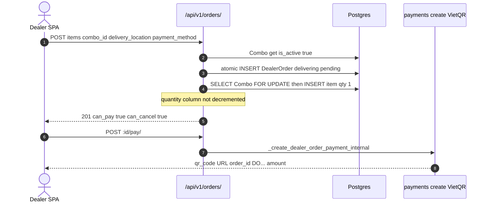
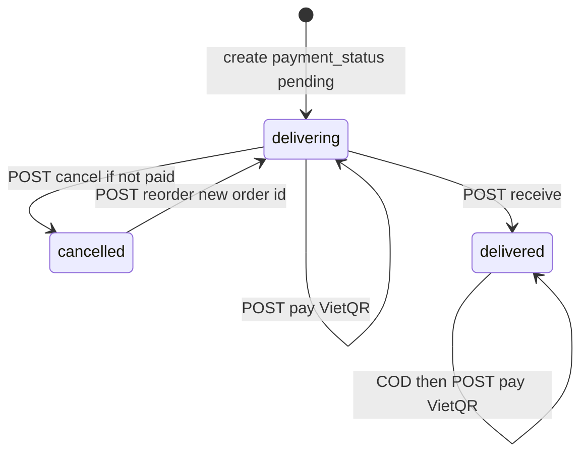

# 1. Overview and Business Intent

Dealers buy catalog combos. An order is `DealerOrder` plus `DealerOrderItem` rows. Quantity is **always 1 per combo** in create and reorder. Inventory hide happens after VietQR **paid** (`reserve_combos_for_order` in payments), not in this ViewSet. This page is the HTTP lifecycle only.

**Actors:** SPA orders pages using `can_*` flags; payments `_create_dealer_order_payment_internal` for pay.

**Target files:** `backend/orders/views.py`, `serializers.py`, `urls.py` (router register empty prefix under `/orders/`), `combo_inventory.py` (`release_combos_for_order`). Dual `/api/v1/orders/` and `/api/orders/`.

Auth: `IsAuthenticated`. Lookup `dealer_order_id`. List page\_size 20, max 100, query `page_size`. Filter `delivery_status` in delivering, delivered, cancelled.

CONTRACT create payload: `items` array of `combo_id` only (no quantity), `delivery_location`, `payment_method` vietqr or cod.

---

# 2. End-to-End Flow and Sequence Diagram





---

# 3. Detailed API Contracts

Queryset is **user-scoped** (`user=request.user`) with prefetch items, combo, media, bikes.

### POST create

`DealerOrderCreateSerializer`: items min\_length 1, each `combo_id` UUID; `delivery_location` max 255; `payment_method` default vietqr. Missing/inactive combo: ValidationError items Combo UUID not found or inactive. Inside atomic: create order `delivery_status=delivering`, `payment_status=pending`. Each item: `Combo.objects.select_for_update().get(pk=...)`; if `is_active` flipped, 400 `Combo ... is no longer available.` IntegrityError becomes 400 `Khong the tao don hang do loi du lieu.` Other exceptions 400 `Dat hang that bai.`

201 uses `DealerOrderSerializer`.

### POST `:id/cancel/`

404 `Order not found.` if not owner. 400 `Cannot cancel order in current status.` if not delivering. 400 `Cannot cancel an order that has already been paid.` if `payment_status == paid`. Else atomic: set cancelled, `release_combos_for_order`.

Serializer `can_cancel` is `delivery_status == delivering` **without** checking paid. SPA that trusts `can_cancel` on a paid delivering order will POST cancel and get 400.

### POST `:id/receive/`

Must be delivering. VietQR must already be paid else 400 `Order must be paid (VietQR) before marking as received.` COD may receive unpaid. Sets `delivered` only (does not set paid).

### POST `:id/pay/`

Already paid: 400 `Order is already paid.` VietQR must still be delivering. COD may pay while delivering or delivered. Delegates to payments helper; 200 VietQR payload (qr\_code URL, order\_id, amount, dealer\_order\_id, transaction\_id, masked\_order\_code per CONTRACT).

### GET `:id/invoice/`

Only delivered **and** paid else 400 `Invoice available only for delivered and paid orders.` Body is JSON `message` plus full order serializer. No PDF.

### POST `:id/reorder/`

Only cancelled else 400 `Chi co the dat lai don da huy.` Empty items 400. New order copies delivery\_location and payment\_method; each combo FOR UPDATE must still be `is_active`. qty forced to 1 at current `combo.price`. 201 new `dealer_order_id`. Does not copy old unit\_price if catalog price changed.

### GET `support/`

`SUPPORT_PHONE` default `+84935777249`, `SUPPORT_ZALO_URL` default `https://zalo.me/0935777249`.

| HTTP Code | Error | Trigger |
| --- | --- | --- |
| 404 | Order not found. | not owner or bad UUID |
| 400 | Cannot cancel an order that has already been paid. | cancel after VietQR success |
| 400 | Order must be paid (VietQR) before marking as received. | receive too early |
| 400 | VietQR order must be in delivering status to pay. | pay after cancel/deliver |
| 400 | Invoice available only for delivered and paid orders. | invoice gate |
| 201 | new order | create or reorder |

---

# 4. Database Schema and Locks

Locks: `Combo.select_for_update` on create and reorder item loops. Order row itself is **not** `select_for_update` on cancel/receive/pay. Two tabs can both pass cancel's paid check if they race before payment callback; payment path is in another app.

```sql
CREATE TABLE orders_dealerorder (
    dealer_order_id UUID PRIMARY KEY,
    user_id UUID NOT NULL,
    total_price NUMERIC,
    delivery_location VARCHAR(255),
    delivery_status VARCHAR(32) NOT NULL,
    payment_status VARCHAR(32) NOT NULL,
    payment_method VARCHAR(16) NOT NULL,
    masked_order_code VARCHAR(32) UNIQUE,
    created_at TIMESTAMPTZ,
    updated_at TIMESTAMPTZ
);

CREATE TABLE orders_dealerorderitem (
    id BIGSERIAL PRIMARY KEY,
    dealer_order_id UUID NOT NULL,
    combo_id UUID NOT NULL,
    quantity INTEGER NOT NULL DEFAULT 1,
    unit_price NUMERIC,
    line_total NUMERIC,
    sort_order INTEGER
);
```

`can_receive`: delivering and (COD or payment paid). `can_pay`: pending and (vietqr\+delivering or COD\+delivering/delivered). `can_get_invoice`: delivered and paid. `can_reorder`: cancelled.

---

# 5. Frontend and UI Logic

CONTRACT: use server `can_*` for buttons. SPA `YourOrder` follows that. ConfirmationPay must not send quantity.

Mismatch: `can_cancel` true while paid delivering. Backend cancel then 400. Catalog checkout page already notes reservation after pay; two dealers can still create orders on one combo until first paid.

Pay response `qr_code` is an image URL for `img src`.

---

# 6. Edge Cases and Resilience

1. Create FOR UPDATE only serializes combo row; it does not decrement `quantity` or set `is_active=False`.
2. Reorder uses **current** combo.price, not historical line unit\_price.
3. Invoice is not an accounting document.
4. Support defaults are in source if env is unset.
5. List 404 vs retrieve 404: retrieve raises NotFound `Order not found.` (DRF detail).
6. Dual `/api/` and `/api/v1/`.
7. COD receive without pay leaves payment\_status pending and delivery delivered, which `can_pay` still allows.