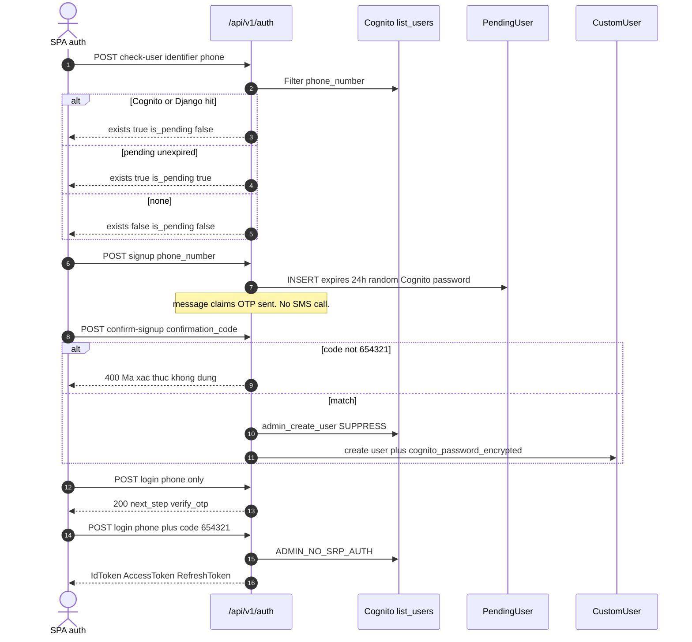
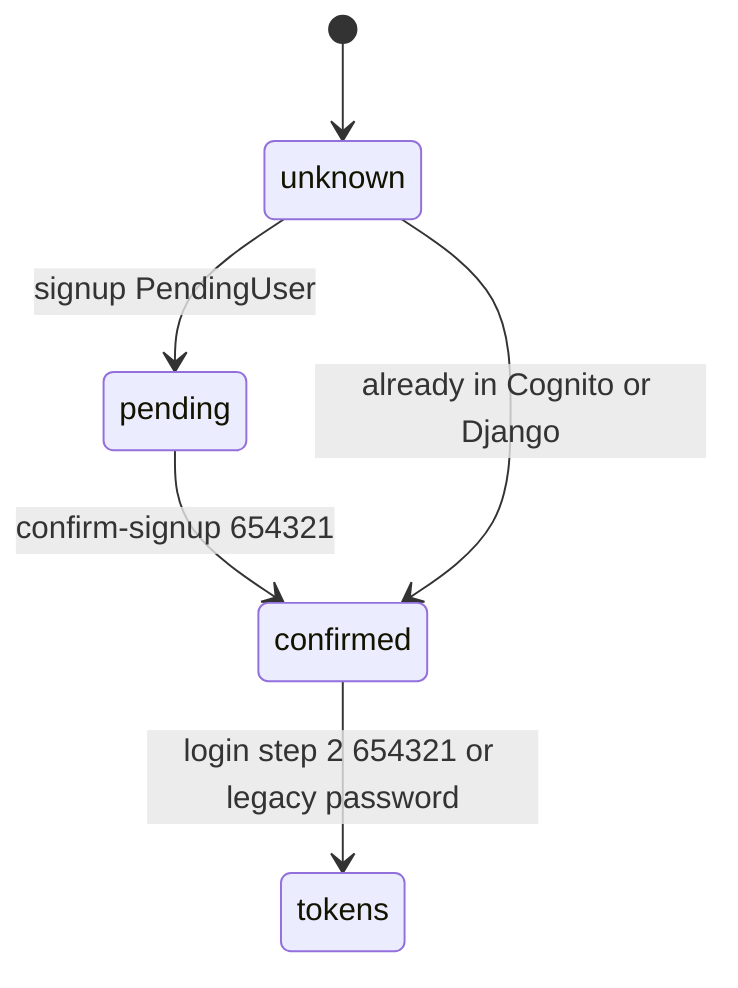

# 1. Overview and Business Intent

Dealer SPA auth is **AWS Cognito** plus a Django `CustomUser` row. The UI copy says OTP was sent to the phone. **No view in `users/views.py` calls Cognito SMS or SNS.** Signup confirm and login Step 2 compare the body field to the module constant `DEV_OTP_CODE` / `HARDCODED_CONFIRMATION_CODE` equal to `654321`.

**Actors:** SPA `SignInSignUpFigma.tsx` and `OtpVerifyFigma.tsx`; boto3 `cognito-idp`; `PendingUser` 24h staging table.

**Target files:** `backend/users/views.py`, `urls.py`, `models.py` (`PendingUser`, `CustomUser`), `authentication.py` (JWT, not this file). Zalo: `zalo_views.py` (out of this page except that login recreates Cognito with the same `DEV_OTP_PASSWORD` used for Zalo).

Mount: `/api/v1/auth/` and `/api/auth/`. CONTRACT table uses `/api/auth/`. Staging SPA `VITE_API_BASE_URL=/api/v1`.

Cognito client: connect timeout default 2s, read 5s, retries max\_attempts 1. Missing `REGION`, `USER_POOL_ID`, `APP_CLIENT_ID`, or `APP_CLIENT_SECRET` raises `ValueError` then 500.

SecretHash: Base64 HMAC-SHA256 of `username + APP_CLIENT_ID` with `APP_CLIENT_SECRET`.

---

# 2. End-to-End Flow and Sequence Diagram





---

# 3. Detailed API Contracts

Phone normalize: digits to `+84` plus 9 digits. Invalid format 400 `Dinh dang so dien thoai khong hop le.`

### POST `/api/v1/auth/check-user/` AllowAny

Body `identifier` required. Email if `@` else phone. Order: Cognito `list_users` Limit 1, then Django `CustomUser`, then unexpired `PendingUser`. Cognito or Django hit **deletes** orphan `PendingUser` for that phone. 200 shapes: `exists` and `is_pending` booleans. 500 returns `error` string of the exception.

SPA: exists false then signup; exists true is\_pending true then confirm\_signup flow; exists true is\_pending false then login OTP.

### POST `/api/v1/auth/signup/` AllowAny

Creates **only** `PendingUser`. Does **not** create Cognito or Django users. Password optional; if missing, random password is generated for later Cognito. Existing PendingUser for that phone is deleted (expired or not) then re-inserted. Success message tells the client an OTP was sent.

### POST `/api/v1/auth/confirm-signup/` AllowAny

Fields `phone_number`, `confirmation_code`. Code must equal `654321` **before** DB work. Then PendingUser must exist and `expires_at` still in the future. Creates Cognito user UUID username, `admin_set_user_password` Permanent, Django `CustomUser`, encrypts password with Fernet key `urlsafe_b64(sha256(SECRET_KEY))`. Already-confirmed Django user returns 200 `Nguoi dung da duoc xac thuc`.

### POST `/api/v1/auth/login/` AllowAny

Also implements **GET, PUT, PATCH, DELETE, HEAD**. GET/HEAD read `phone_number` / `password` / `code` from **query string**.

Step 1: phone only, no password, no code. 200 `message`, `next_step=verify_otp`, `phone_number` normalized. **Does not send OTP.**

Step 2: phone plus `code`, no password. Code must be `654321`. Decrypts `cognito_password_encrypted` if present; else sets Cognito password to `DEV_OTP_PASSWORD` (`DevOTP654321!@#Aa`) except demo phone `+84984550729` uses the same demo password. Then `admin_initiate_auth` `ADMIN_NO_SRP_AUTH`. Tokens: `AccessToken`, `ExpiresIn`, `TokenType`, `RefreshToken`, `IdToken`. SPA must send **IdToken** as Bearer.

If Cognito has no user but Django does: `admin_create_user` MessageAction SUPPRESS with `DEV_OTP_PASSWORD`, overwrite `CustomUser.username`.

Legacy: phone plus password uses `USER_PASSWORD_AUTH`. Demo phone accepts `password123` or the DevOTP string then `admin_set_user_password` to demo password.

Unknown phone: 401 `So dien thoai chua dang ky`.

### Profile

GET/PUT/PATCH `/api/v1/auth/me/` authenticated. `build_user_profile_response`: if `zalo_id` set, **phone\_number is null** (placeholder must not leak). `delivery_profile` mirrors store address; it does **not** read auction `DeliveryInformation`. PUT/PATCH only writes keys present in the body: store\_name, address, commune, city, province, store\_scale or storesize, full\_name. OPEN ISSUE in CONTRACT: Zalo existing account `full_name` and `avatar_url` stay null if backend never wrote them on link.

`/api/v1/auth/account/profile/` is the same view.

POST `update-store-info/`, GET `store-scale-choices/` and `store-size/` (alias).

Forgot-password: `ForgotPasswordView` avoids surfacing Cognito 4xx. Verify code stores cache 900s then `ResetPasswordView`. `confirm-forgot-password/` marked deprecated in urls.

| HTTP Code | Error | Trigger |
| --- | --- | --- |
| 400 | Dinh danh la bat buoc. | check-user missing identifier |
| 400 | Ma OTP khong dung. | login step 2 not 654321 |
| 400 | Ma xac thuc khong dung. | confirm-signup not 654321 |
| 401 | So dien thoai chua dang ky. | login unknown phone |
| 404 | Khong tim thay nguoi dung. | confirm without PendingUser |
| 500 | Cognito exception string | check-user / login list\_users |

---

# 4. Database Schema and Locks

No row locks in auth views. `CustomUser.user_id` is PK. Manager `.get()` on non-pk fields returns latest `-event_timestamp` to dodge MultipleObjectsReturned. Login Step 2 uses `.filter(username=).order_by('-event_timestamp').first()`.

```sql
CREATE TABLE users_pendinguser (
    pending_id UUID PRIMARY KEY,
    phone_number VARCHAR(20) NOT NULL UNIQUE,
    email VARCHAR(254),
    name VARCHAR(200),
    password VARCHAR(255),
    created_at TIMESTAMPTZ NOT NULL,
    expires_at TIMESTAMPTZ NOT NULL,
    otp_session VARCHAR(500),
    otp_sent_at TIMESTAMPTZ,
    otp_attempts INTEGER NOT NULL DEFAULT 0
);

-- CustomUser also has cognito_password_encrypted (Fernet of SECRET_KEY)
-- Login and confirm-signup write it. otp_session on PendingUser is unused by LoginView.
```

`PendingUser.password` help\_text says passwordless OTP only.

---

# 5. Frontend and UI Logic

`authApi.checkUser`, `signup` without client password, `confirm-signup`, `login` step 1 phone then step 2 phone plus code (`APIs.ts`). After confirm-signup, `OtpVerifyFigma` may call login again.

`userService.ts` singleton caches `GET /auth/me/` forever until `clearUserInfo`. Flattens `store_profile` / `registration` into `UserInfo`. Zalo null phone stays empty string via `?? ''`.

Zalo button: full navigation to apiBaseUrl plus `/auth/zalo/login/`. Callback fragment IdToken (not this file).

---

# 6. Edge Cases and Resilience

1. Universal OTP `654321` is compiled into the image. It is not DEBUG-gated.
2. Login GET/DELETE with password in the query string leaks secrets into access logs and referrers.
3. Recreating a Cognito user with a known `DEV_OTP_PASSWORD` means Fernet miss falls back to a shared password.
4. check-user 500 returns raw exception text to the client.
5. Signup success copy is false: no SMS is sent from this module.
6. `otp_attempts` / `otp_session` columns are unused by LoginView.
7. Type-2 SCD on CustomUser is incomplete: PK is `user_id`, so history rows are not a second PK dimension.