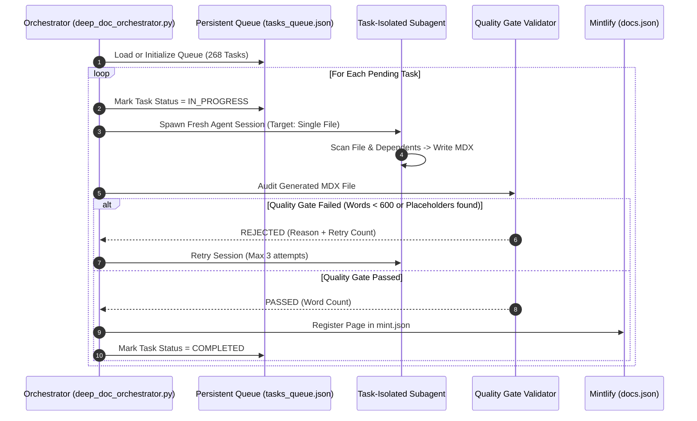

# 1. Overview & Architecture Intent

To solve the 3 core AI documentation bottlenecks (Max Step Limits, Context Degradation, and No Persistent Queue), the **Deterministic Orchestrator Engine** (`deep_doc_orchestrator.py`) introduces a task-queue-driven, isolated-context execution loop across all 6 repositories.

### Key Components

- **Task Queue Persistent File**: `tasks_queue.json` (Stores 268 deduplicated target module tasks).
- **Quality Gate Audit**: Rejects any generated page under 600 words, missing Mermaid sequence/state diagrams, missing DB schemas/tables, or containing lazy placeholders (`// ... rest of code`).
- **Subagent Runner Protocol**: Executes isolated, single-task subagent sessions per module, ensuring clean context memory.

---

# 2. Sequence & Execution Flow Diagram



---

# 3. Quality Gate Rule Matrix

| Gate Rule | Threshold / Requirement | Rejection Reason Output |
| --- | --- | --- |
| **Length Floor** | $$\ge 600$$ words | `"Content too short (N words, required > 600 words)"` |
| **Diagram Presence** | Must contain ````mermaid` | `"Missing Sequence or State Machine Mermaid Diagram"` |
| **Database Schema** | Must contain DDL / Table matrix | `"Missing DB Schema / DDL Table / Error Catalog Matrix"` |
| **Zero-Placeholder** | No `// ... rest of code` or `TODO` | `"Contains lazy placeholder (// ... rest of code or TODO)"` |

---

# 4. Usage Instructions

Run the orchestrator locally or inside any Agent CLI session:

```bash
# Initialize and audit queue state across 6 repos
python3 /Users/toannguyen/chototcaodulieu/deep_doc_orchestrator.py
```