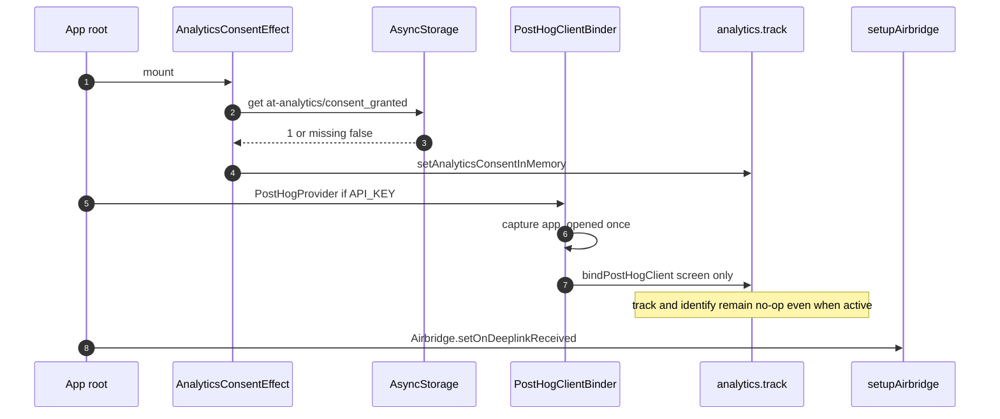
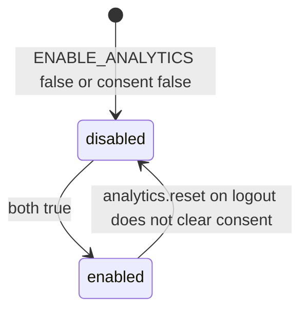

# 1. Overview and Business Intent

Product wants funnel events (`AnalyticsEvents` in `analyticsEvents.ts`) without shipping PII (no phone, email, name, plate; bike UUID allowed). Implementation is split: a **no-op facade** used by screens, and a **PostHog binder** that still captures some screens if API key and flag are on.

**Actors:** RN screens calling `analytics.track`; `AnalyticsBinder` near app root; Airbridge native SDK.

**Target files:** `apps/src/services/analytics/analytics.ts`, `AnalyticsBinder.tsx`, `analyticsEvents.ts`, `analyticsConsent.ts`, `analyticsPrivacy.ts`, `index.ts`, `apps/src/services/airbridge.ts`.

---

# 2. End-to-End Flow and Sequence Diagram





`active()` is `AppConfig.FEATURES.ENABLE_ANALYTICS && consentGranted`. `track` / `identify` / `screen` on the facade **return immediately after voiding args** even when active. Comment: PostHog removed from this app, keep API surface.

`AnalyticsBinder` still calls `posthog.screen(route.name)` via `navigationRef` and `posthog.capture('app_opened')`. Those bypass the facade.

---

# 3. Detailed API Contracts (client)

No Django routes. Consent persistence: AsyncStorage key `@analytics/consent_granted` values `'1'` or `'0'`. Read errors return false. Write errors ignored.

`AnalyticsEvents` names include auth\_started, otp\_requested, otp\_verified, login\_success, zalo\_auth\_started, apple\_auth\_started, registration\_started, ocr\_scan\_star, evaluation\_requested, bike\_full\_eval\_star. Screens must call `analytics.track(AnalyticsEvents.X)`. Those calls **do not reach PostHog** through the facade.

`reset()` is an empty function. `authService.logout` still calls it.

Airbridge: `setupAirbridge` registers `Airbridge.setOnDeeplinkReceived`. In `__DEV__` it `console.log`s the URL. No navigation, no auth, no query parse.

| HTTP Code | Error | Trigger |
| --- | --- | --- |
| n/a | consent false | missing AsyncStorage key |
| n/a | track no-op | facade always discards |
| n/a | screen skipped | ENABLE\_ANALYTICS false or empty API\_KEY |

`ANALYTICS_PRIVACY_CHECKLIST_VERSION` is the string `1.0` from `analyticsPrivacy.ts`. Comments there: no phone, email, full name, plate, or free-text PII in properties; prefer Cognito sub and bike UUID; iOS `NSPrivacyTracking` is false in PrivacyInfo.xcprivacy; enabling IDFA later needs ATT plus `NSUserTrackingUsageDescription`; Android Play Data safety must disclose analytics; EU consent gating is documented as **not implemented in this spike**.

`index.ts` re-exports `analytics`, `setAnalyticsConsentInMemory`, `AnalyticsEvents`, `AnalyticsBinder`, `AnalyticsConsentEffect`, `trackPostHogScreenFromNavigation`, consent getters/setters, and the privacy version. It does **not** re-export `setupAirbridge`.

Event name contract (string literals, not sent today via facade): `auth_started`, `otp_requested`, `otp_verified`, `login_success`, `zalo_auth_started`, `apple_auth_started`, `auth_onboarding_completed`, `registration_started`, `step1_completed`, `video_recorded`, `ocr_scan_attempted`, `ocr_scan_success`, `ocr_scan_failed`, `bike_quality_gate_passed`, `bike_quality_gate_failed`, `bike_quality_gate_skipped`, `evaluation_requested`, `schedule_set`, `home_viewed`, `ebike_section_viewed`, `news_article_opened`, `bike_exterior_eval_triggered`, `bike_exterior_eval_ok`, `bike_exterior_eval_error`, `bike_engine_stage1_triggered`, `bike_engine_stage1_ok`, `bike_engine_stage1_error`, `bike_full_eval_started`, `bike_full_eval_succeeded`, `bike_full_eval_failed`.

`bindPostHogClient` only stores an object that has a `screen` function. `track` never calls that client. `getBoundPostHogClient` is used only by `trackPostHogScreenFromNavigation`.

---

# 4. Database Schema and Locks

None. Logical consent row:

```sql
CREATE TABLE analytics_consent_asyncstorage (
    key TEXT PRIMARY KEY,
    value TEXT NOT NULL
);
-- key = at-analytics/consent_granted, value 1 or 0
```

---

# 5. Frontend and UI Logic

Binder must not use PostHogNavigationHook outside a navigator (comment in file). `trackPostHogScreenFromNavigation` dedupes `lastTrackedScreen`. `resetPostHogScreenTracking` on unmount.

`AnalyticsBinder` if `ENABLE_ANALYTICS` is false returns children with **no** PostHogProvider. If the flag is true it always mounts `PostHogProvider` with `autocapture.captureScreens` false and `options.disabled` true when API\_KEY is empty. Empty key still instantiates the provider. Screen helper returns early when flag is off **or** API\_KEY is blank.

`trackPostHogScreenFromNavigation` must be invoked from navigation listeners (not shown in this file). If nobody calls it, only `app_opened` fires from `PostHogClientBinder` (once per mount, `appOpenedCapturedRef`).

Airbridge native must call `AirbridgeReactNative.trackDeeplink`. JS `setupAirbridge` only registers `Airbridge.setOnDeeplinkReceived`. Production builds drop the URL on the floor. There is no mapping from Airbridge campaign params into Cognito or bike\_id.

---

# 6. Edge Cases and Resilience

1. Funnel event names exist but `analytics.track` is a no-op: dashboards stay empty unless someone wires track to PostHog again.
2. `app_opened` can fire without consent if PostHogProvider mounts before consent loads.
3. Logout does not clear AsyncStorage consent.
4. Airbridge callback ignores the URL in production (no log, no navigate).
5. `identify` comment says use Cognito sub, never email/phone, but identify is also a no-op.
6. Queue files `analytics.ts`, `AnalyticsBinder.tsx`, `analyticsEvents.ts`, `analyticsConsent.ts`, `analyticsPrivacy.ts`, `index.ts`, `airbridge.ts` are one product surface.