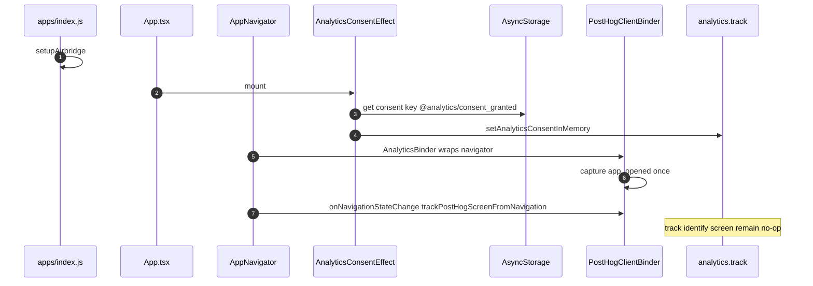

# 1. Overview and Business Intent

Product defined funnel event names in `analyticsEvents.ts` without shipping PII (no phone, email, name, plate; bike UUID allowed). Implementation split:

1. **Facade** `analytics.ts` — `track` / `identify` / `screen` are no-ops even when active (PostHog removed from this surface; API kept to avoid refactors).
2. **Binder** `AnalyticsBinder.tsx` — if `ENABLE_ANALYTICS`, mounts `PostHogProvider` and can capture `app_opened` plus screen names via `trackPostHogScreenFromNavigation`.

**Actors:** screens calling `analytics.track`, `App.tsx`, `AppNavigator.tsx`, `apps/index.js`, Airbridge SDK.

**Target files:** `apps/src/services/analytics/*`, `airbridge.ts`, `configs/app.config.ts`.

---

# 2. End-to-End Flow and Sequence Diagram

`active()` is `AppConfig.FEATURES.ENABLE_ANALYTICS && consentGranted`. Default ENABLE\_ANALYTICS is true. `reset()` is empty; logout still calls it and does **not** clear consent storage.

---

# 3. Detailed API Contracts (client)

No Django routes.

Consent key: **`@analytics/consent_granted`** values `1` or `0`. Docs that omit the leading at-sign are wrong.

| Behavior | Trigger |
| --- | --- |
| consent false | missing key or not 1 |
| track no-op | always discards even when active |
| screen skipped in helper | ENABLE\_ANALYTICS false OR empty trimmed API\_KEY |
| provider disabled option | raw API\_KEY falsy (no trim) |

`AnalyticsEvents` literals include auth\_started, otp\_requested, otp\_verified, login\_success, zalo\_auth\_started, apple\_auth\_started, auth\_onboarding\_completed, registration\_started, step1\_completed, video\_recorded, ocr\_scan\__, bike\_quality\_gate\__, evaluation\_requested, schedule\_set, home\_viewed, ebike\_section\_viewed, news\_article\_opened, bike\_exterior\_eval\__, bike\_engine\_stage1\__, bike\_full\_eval\_\*.

`bindPostHogClient` only stores an object with `screen()`. Facade `track` never calls it. `ANALYTICS_PRIVACY_CHECKLIST_VERSION` is `1.0`.

Airbridge: `Airbridge.setOnDeeplinkReceived` — `__DEV__` console.log only. No navigate, no campaign parse.

---

# 4. Database Schema and Locks

Consent lives in AsyncStorage only (not Postgres).

---

# 5. Frontend and UI Logic

Mount map:

- `setupAirbridge()` — `apps/index.js`
- `AnalyticsConsentEffect` — `App.tsx`
- `AnalyticsBinder` — wraps navigator in `AppNavigator.tsx`
- `trackPostHogScreenFromNavigation` — `onNavigationStateChange` and `onNavigationReady`

If ENABLE\_ANALYTICS is false, binder returns children with no PostHogProvider. If true, provider mounts even when API\_KEY empty (`options.disabled` true).

---

# 6. Edge Cases and Resilience

1. Funnel `analytics.track` calls never reach PostHog.
2. `app_opened` can fire before consent loads.
3. Logout does not clear AsyncStorage consent.
4. Production Airbridge callback ignores URL.
5. `index.ts` does not re-export setupAirbridge.
6. Privacy checklist: no phone/email/name/plate in properties; prefer Cognito sub and bike UUID.