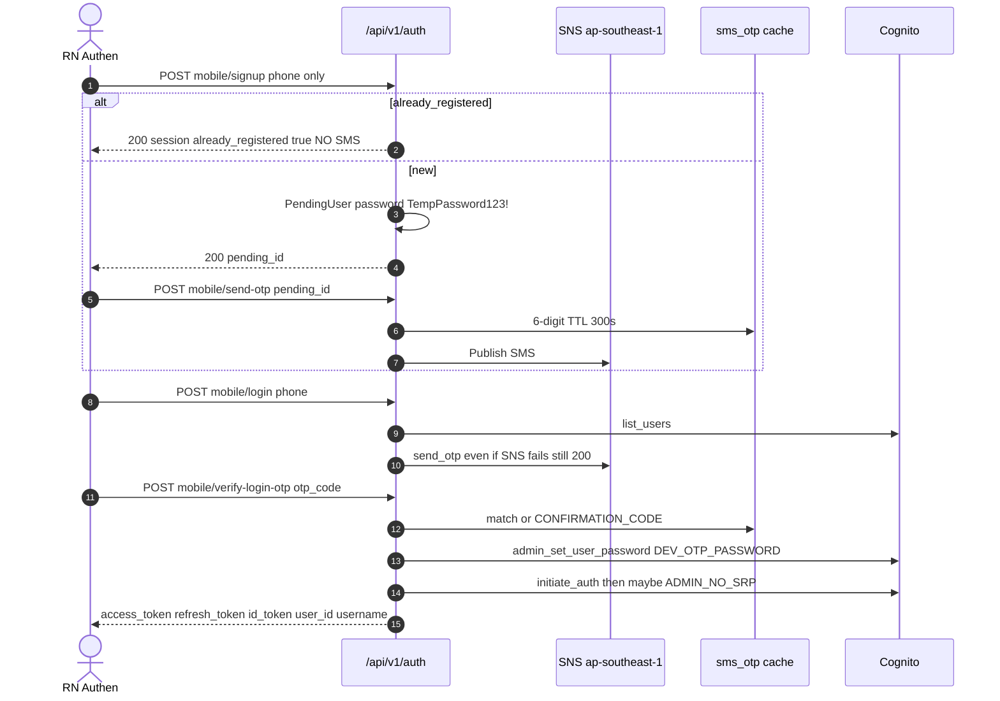
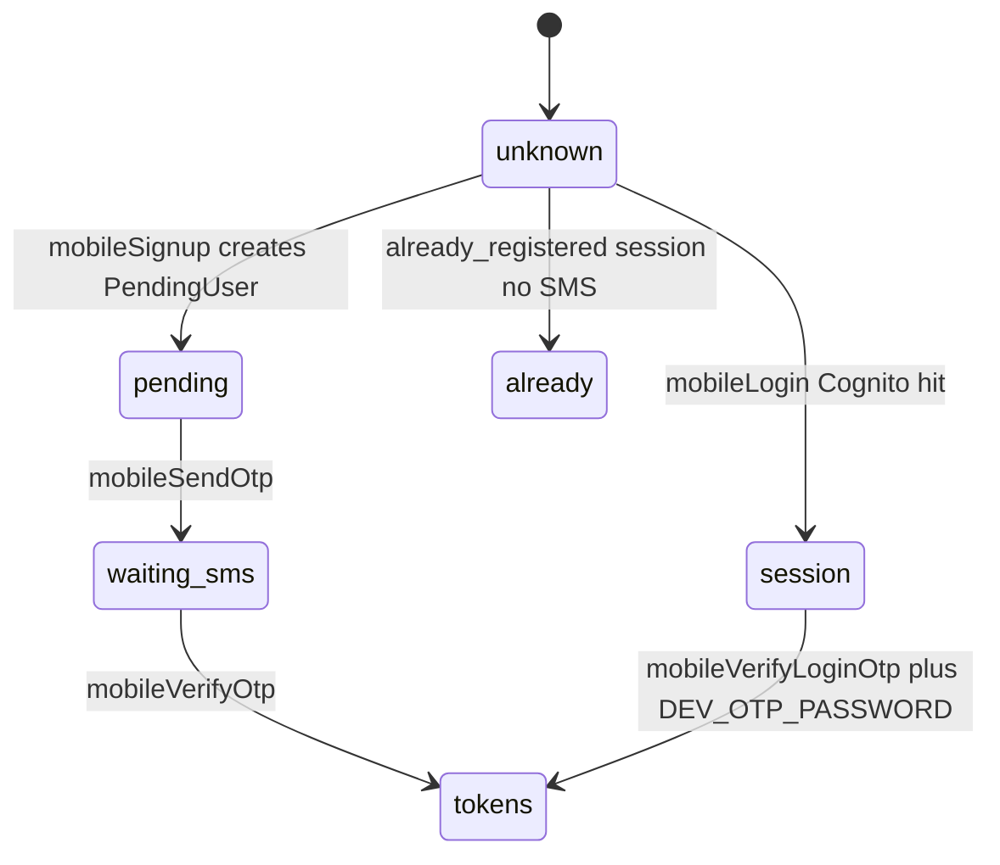

# 1. Overview and Business Intent

Rider auth hits `api.timoto.ai/api/v1/auth/`. Live RN paths: `mobileLogin`, `mobileVerifyLoginOtp`, `mobileSignup`, `mobileSendOtp`, `mobileVerifyOtp`, `mobileRefresh`.

This is **not** dealer portal login. Dealer OTP is documented on the dealer Cognito page. On TMA mobile:

1. OTP SMS is real via `sms_otp_service.py` (SNS region `ap-southeast-1`).
2. Cache TTL 300s, max 5 wrong attempts, then OTP deleted.
3. `CONFIRMATION_CODE` from settings **defaults to `654321`** (`backend/config/settings.py`). Empty string must be set explicitly to disable the backdoor. It is env-gated, not DEBUG-gated.
4. After OTP OK on login, backend always `admin_set_user_password` to `DEV_OTP_PASSWORD` (default `DevOTP123!@#`) then `USER_PASSWORD_AUTH` / `ADMIN_NO_SRP_AUTH`. If `DEV_OTP_PASSWORD` is empty → **503**.

**Actors:** `apps/src/services/auth.service.ts`, `Authen.tsx`, `OTPScreen.tsx`, Cognito, SNS, Django cache.

**Target files:** `auth.service.ts`, `users/views.py`, `sms_otp_service.py`, `users/models.py`, `users/urls.py`, `config/settings.py`.

---

# 2. End-to-End Flow and Sequence Diagram





Signup does **not** send SMS by itself. App must call `mobile/send-otp/` after `pending_id`. `already_registered` skips send; OTPScreen may skip resend when session exists.

---

# 3. Detailed API Contracts

Rate limits with `block=True`: mobile\_login 10/m, mobile\_verify\_login\_otp 10/m, mobile\_send\_otp 5/m, mobile\_verify\_otp 10/m, mobile\_refresh 30/m. Legacy `login_otp` is 5/m **without** `block=True`.

SNS: SenderID default `TiMotoAI`, but `SNS_SMS_SKIP_SENDER_ID_FOR_VN` default **True** so `+84` numbers do **not** attach SenderID.

### Live app paths

| Method | Path | Body | Notes |
| --- | --- | --- | --- |
| POST | `/auth/mobile/signup/` | phone\_number, optional email/name | Same view as `/auth/signup/`. No password from live app → server `TempPassword123!` |
| POST | `/auth/mobile/send-otp/` | pending\_id or phone\_number | SNS; missing pending still 200 with note |
| POST | `/auth/mobile/verify-otp/` | pending\_id or phone plus otp\_code | Cognito sign\_up with PendingUser.password, Django user, tokens |
| POST | `/auth/mobile/login/` | phone\_number | Cognito must exist; SNS; 200 even if SNS fails |
| POST | `/auth/mobile/verify-login-otp/` | phone\_number, otp\_code | Requires DEV\_OTP\_PASSWORD; snake\_case tokens plus user\_id |
| POST | `/auth/mobile/refresh/` | refresh\_token, username | skipAuth on client |

Login verify response keys: `access_token`, `refresh_token`, `id_token`, `username`, `user_id`, `phone_number`, `message`. No `expires_in` / `token_type` on this path (FE types may still claim them).

### Legacy

`POST /auth/login-otp/` and `POST /auth/confirm-signup/` compare only `CONFIRMATION_CODE` (default 654321). **No SMS cache.** Legacy `authService.signup` may send `Temp` plus Date.now(); that is **not** the live Authen path.

`POST /auth/logout/` is in FE endpoints. **No route in users/urls.py.** Client clears tokens anyway.

`forgotPassword` FE posts `email`; backend `forgot_password` requires **`phone_number`** — FE/BE mismatch.

Account delete soft-sets `deleted_at` **and** Cognito `admin_delete_user`.

| HTTP Code | Error | Trigger |
| --- | --- | --- |
| 404 | Số điện thoại chưa được đăng ký... | mobile\_login unknown phone |
| 400 | Mã OTP không hợp lệ hoặc đã hết hạn. | verify false |
| 400 | Phiên đăng ký đã hết hạn. | PendingUser expired |
| 503 | OTP login service không được cấu hình... | empty DEV\_OTP\_PASSWORD |
| 429 | ratelimit | mobile endpoints with block=True |

---

# 4. Database Schema and Locks

No `select_for_update` on auth. OTP in Django cache (`sms_otp:` / `sms_otp_attempts:`). Redis only if `REDIS_URL` is a non-local redis URL; else LocMemCache (multi-worker OTP miss).

```sql
CREATE TABLE users_pendinguser (
    pending_id UUID PRIMARY KEY,
    phone_number VARCHAR(20) NOT NULL UNIQUE,
    email VARCHAR(254),
    name VARCHAR(200),
    password VARCHAR(255) NOT NULL,
    created_at TIMESTAMPTZ NOT NULL,
    expires_at TIMESTAMPTZ NOT NULL
);

CREATE TABLE users_customuser (
    user_id UUID PRIMARY KEY,
    event_timestamp BIGINT NOT NULL,
    username VARCHAR(150),
    email VARCHAR(254) UNIQUE,
    phone_number VARCHAR(20),
    full_name VARCHAR(200),
    deleted_at TIMESTAMPTZ,
    zalo_id VARCHAR(64),
    apple_id VARCHAR(255),
    status VARCHAR(32),
    UNIQUE (user_id, event_timestamp)
);
```

`ZaloAuthState.state` is unique, **not** the Django PK (auto `id`).

---

# 5. Frontend and UI Logic

`Authen.tsx` calls `mobileSignup` without password. OTP UI timer is **120s**; cache TTL is **300s**. Tokens in `tokenStorage` (IdToken as Bearer). FCM register is fire-and-forget after verify.

---

# 6. Edge Cases and Resilience

1. SNS failure still returns 200 on login/send-otp — screen appears with no SMS unless CONFIRMATION\_CODE works.
2. `already_registered` returns session **without** calling `send_otp`.
3. Backdoor matches CONFIRMATION\_CODE without consuming the cached OTP.
4. LocMemCache per worker breaks OTP across ECS tasks without Redis.
5. logout HTTP fails silently.
6. Soft-deleted users can be reactivated on JWT auth elsewhere — see authentication middleware.