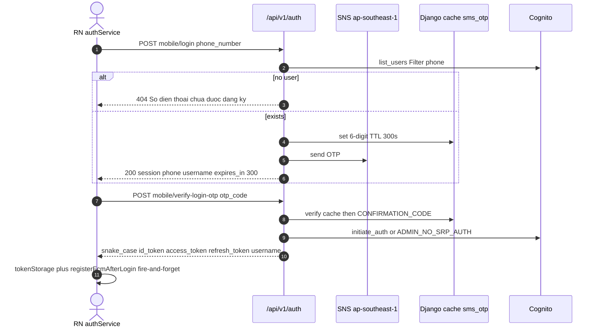
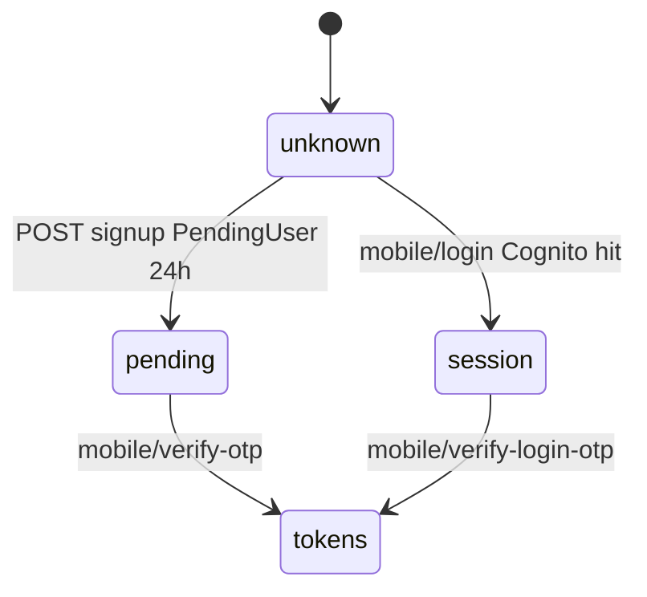

# 1. Overview and Business Intent

The rider app authenticates against `api.timoto.ai/api/v1/auth/`. Live app methods are `mobileLogin`, `mobileVerifyLoginOtp`, `mobileSignup` (same view as `signup`), `mobileSendOtp`, `mobileVerifyOtp`, and `refreshToken` to `POST /auth/mobile/refresh/`.

TMA mobile sends OTP via `sms_otp_service.py` using AWS SNS in region `ap-southeast-1` (SNS SMS is not available in `ap-southeast-7`). If SNS send fails, `mobile_login` still returns 200 so the OTP screen can render. Verify uses Django cache first, then `settings.CONFIRMATION_CODE` when that env var is set (staging/dev).

This is a different stack from dealer portal login. Dealer OTP is documented on the dealer Cognito page.

**Actors:** RN `apps/src/services/auth.service.ts`, Cognito USER\_PASSWORD / ADMIN\_NO\_SRP, Django `PendingUser` / `CustomUser`, AWS SNS.

**Target files:** `apps/src/services/auth.service.ts`, `apps/src/api/endpoints.ts` AUTH, `backend/apps/users/views.py`, `sms_otp_service.py`, `models.py`, `urls.py`.

---

# 2. End-to-End Flow and Sequence Diagram





Signup: `POST /auth/mobile/signup/` is the **same function** as `POST /auth/signup/`. Confirm for the app is `mobile/verify-otp`, not `confirm-signup`.

---

# 3. Detailed API Contracts

Base `/api/v1/auth/`. Rate limits: mobile\_login and verify-login-otp `10/m` IP `block=True`. mobile\_send\_otp `5/m`. login\_otp `5/m`.

OTP cache key prefix `sms_otp:`, attempts prefix `sms_otp_attempts:`, max 5 then OTP deleted. Sender id default `TiMotoAI`. TTL 300 seconds.

### App paths

| Method | Path | Body | Notes |
| --- | --- | --- | --- |
| POST | `/auth/mobile/login/` | phone\_number | Cognito must exist. SNS send. 200 even if SNS fails |
| POST | `/auth/mobile/verify-login-otp/` | phone\_number, otp\_code or confirmation\_code, session unused | snake\_case tokens |
| POST | `/auth/mobile/signup/` | alias of signup | PendingUser |
| POST | `/auth/mobile/send-otp/` | pending\_id or phone\_number | missing pending\_id still 200 with note |
| POST | `/auth/mobile/verify-otp/` | pending\_id or phone plus otp\_code | creates Cognito plus Django, returns tokens |
| POST | `/auth/mobile/refresh/` | refresh\_token, username | skipAuth on client |

FE `refreshToken` throws Vietnamese if refresh\_token or username missing in tokenStorage. Username is saved on mobileLogin (Cognito username) and overwritten on verify.

### Legacy still on the same urls.py

`POST /auth/login-otp/` and `POST /auth/confirm-signup/` compare `confirmation_code` to `CONFIRMATION_CODE` from settings only. They do not read the SMS cache. FE still has `loginOtp` and `confirmSignup` wrappers.

`POST /auth/logout/` is in `API_ENDPOINTS.AUTH.LOGOUT`. **No matching path in users/urls.py.** `authService.logout` catches the failure and still clears tokens plus `analytics.reset()`.

`PUT /auth/me/` for profile. `DELETE /auth/account/delete/` soft-sets `deleted_at`.

| HTTP Code | Error | Trigger |
| --- | --- | --- |
| 404 | So dien thoai chua duoc dang ky. | mobile\_login unknown phone. Cognito exception also 404 same copy |
| 400 | Ma OTP khong hop le hoac da het han. | verify\_otp false |
| 400 | Phien dang ky da het han. | PendingUser expired, row deleted |
| 404 | Khong tim thay phien dang ky. | verify-otp no PendingUser |
| 400 | Invalid confirmation code | legacy login-otp / confirm-signup |
| 429 | django-ratelimit | 5/m or 10/m |

PendingUser stores `password` as VARCHAR(255) NOT NULL and passes it to Cognito `sign_up`. If the user did not type a password, the client generates a `Temp` plus Date.now() string.

CustomUser: PK `user_id`, `unique_together` user\_id plus event\_timestamp (PK already unique so SCD is incomplete). `email` USERNAME\_FIELD. `phone_number` unique=False. Soft delete `deleted_at`. Zalo/Apple ids on the same table.

---

# 4. Database Schema and Locks

No `select_for_update` on auth. OTP lives in cache not SQL.

```sql
CREATE TABLE users_pendinguser (
    pending_id UUID PRIMARY KEY,
    phone_number VARCHAR(20) NOT NULL UNIQUE,
    email VARCHAR(254),
    name VARCHAR(200),
    password VARCHAR(255) NOT NULL,
    created_at TIMESTAMPTZ NOT NULL,
    expires_at TIMESTAMPTZ NOT NULL
);

CREATE TABLE users_customuser (
    user_id UUID PRIMARY KEY,
    event_timestamp BIGINT NOT NULL,
    username VARCHAR(150),
    email VARCHAR(254) UNIQUE,
    phone_number VARCHAR(20),
    full_name VARCHAR(200),
    deleted_at TIMESTAMPTZ,
    zalo_id VARCHAR(64),
    apple_id VARCHAR(255),
    UNIQUE (user_id, event_timestamp)
);

CREATE TABLE users_zaloauthstate (
    state VARCHAR(64) PRIMARY KEY,
    code_verifier VARCHAR(128) NOT NULL,
    created_at TIMESTAMPTZ NOT NULL
);
```

---

# 5. Frontend and UI Logic

Tokens stored via `tokenStorage` (IdToken used as Bearer). After verify, FCM register is fire-and-forget. `getProfile` logs full JSON to Metro. `forgotPassword` posts `email` only.

Check-user still exists for older screens. Mobile login does not call check-user; 404 means go to signup.

---

# 6. Edge Cases and Resilience

1. SNS failure is swallowed on send; the HTTP 200 OTP screen still appears.
2. `CONFIRMATION_CODE` is env-gated, not DEBUG-gated. Keep it unset in production.
3. LocMemCache per worker: OTP sent on worker A may not verify on worker B without Redis.
4. logout HTTP 404 is ignored by the client.
5. signup comment says backend does not accept name, then the client **sends name anyway**.
6. mobile\_login Cognito errors are mapped to the same 404 as unknown phone (cannot tell IAM failure from unregistered).
7. Matching the env CONFIRMATION\_CODE does not delete the cached OTP (a cache match does).