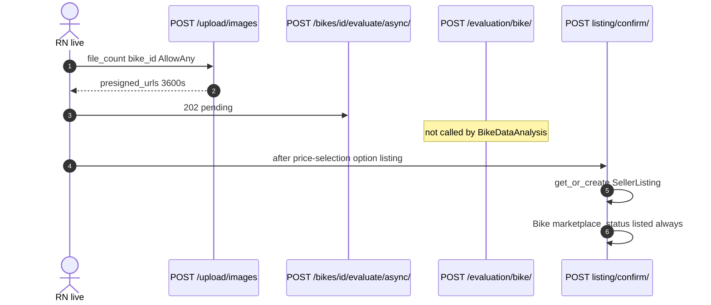
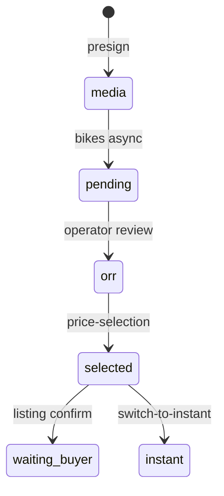

# 1. Overview and Business Intent

Two evaluation HTTP surfaces:

1. **Live path:** `POST /api/v1/bikes/:id/evaluate/async/` → 202 → poll `GET /bikes/:id/evaluate/result/`. BikeDataAnalysis only.
2. **Legacy sync:** `POST /api/v1/evaluation/bike/` AllowAny, raw SQL media, blocks HTTP until full\_evaluation returns.

After OPS dual price: authenticated price-selection, listing confirm/cancel/switch-to-instant, `GET /evaluation/result/` (different from bikes AI result).

Uploads: AllowAny presigned PUT. Prefix S3\_MEDIA\_PREFIX production or staging only.

**Target files:** evaluation/views.py, realtime\_views.py, listing\_views.py, upload/views.py.

---

# 2. End-to-End Flow and Sequence Diagram





Media gates differ:

- Async bikes: `media.count() == 0` fails — **video-only OK**
- Sync evaluation/bike: needs picture\_urls **or** audio\_urls — **video-only fails** error\_code 3

Sync hint text: `Use /api/v1/bikes/:bike_id/media/...` (does not say POST). Async no\_media body uses POST hint.

---

# 3. Detailed API Contracts

### AllowAny sync evaluation

| Method | Path | Auth |
| --- | --- | --- |
| POST | `/evaluation/bike/` | AllowAny |
| POST | `/evaluation/exterior/` `/engine/` `/pricing/` `/full/` | AllowAny |
| GET | `/evaluation/` health | AllowAny |

error\_code 1 missing bike\_id, 2 not found 404, 3 no media 400, -1 service 500.

### Authenticated post-ORR

| Method | Path | Notes |
| --- | --- | --- |
| GET | `/evaluation/result/` | IsAuthenticated ownership; after WS |
| GET | `/evaluation/operator-price/` | same |
| GET POST | `/evaluation/price-selection/:bike_id/` | option listing or instant\_purchase; responses use `success` |
| POST | `/evaluation/listing/:bike_id/confirm/` | needs selection option listing; response uses `ok` |
| POST | switch-to-instant-purchase / cancel |  |
| GET | listing status |  |

confirm: LISTING\_SELECTION\_REQUIRED / INVALID\_SELECTED\_OPTION. get\_or\_create on operator\_review\_request. **Always** updates Bike marketplace\_status listed even when listing row already existed. 201 if created else 200.

### Upload AllowAny

| Method | Path | Limits |
| --- | --- | --- |
| POST | `/upload/images` | file\_count 1-20 |
| POST | `/upload/videos` `/audios` | 1-10 |
| POST | `/upload/recognition-paper` | folder reconizationpaper |
| POST | `/upload/presigned-url` and batch |  |

Key: prefix / bike\_uuid / bike\_uuid _image_ index .jpg. If Bike DoesNotExist, index starts at 1 (presign does not create bike). Expires 3600s.

| HTTP Code | Error | Trigger |
| --- | --- | --- |
| 400 | serializer | file\_count out of range |
| 400 | error\_code 3 | sync evaluate no pictures/audio |
| 404 | PRICE\_SELECTION\_NOT\_FOUND | GET selection empty |
| 400 | LISTING\_SELECTION\_REQUIRED | confirm without selection |
| 201 | listing created | first confirm |

---

# 4. Database Schema and Locks

```sql
CREATE TABLE bikes_bikemedia (
    id BIGSERIAL PRIMARY KEY,
    bike_id UUID NOT NULL REFERENCES bikes_bike(bike_id),
    media_type VARCHAR(16) NOT NULL,
    media_url TEXT NOT NULL,
    position VARCHAR(32),
    created_at TIMESTAMPTZ NOT NULL
);
```

No FOR UPDATE on listing confirm Bike update. S3 object becomes a media row only after client POSTs bikes media endpoints with public\_url.

---

# 5. Frontend and UI Logic

Live evaluate = async bikes only. Calling `/evaluation/bike/` blocks the HTTP worker for the full AI run. Upload then register media — skipping register causes evaluate error\_code 3. Recognition paper path typo is load-bearing for CDN/IAM.

---

# 6. Edge Cases and Resilience

1. AllowAny evaluate-by-id burns Gemini/gRPC quota for any UUID.
2. AllowAny upload writes under any UUID prefix.
3. Listing confirm re-lists even if previously cancelled marketplace status.
4. Name collision: bikes AI result vs evaluation OPS result — different URLs.
5. Cross-link realtime-orr page for WS dual price; bikes pickup page for async evaluate.