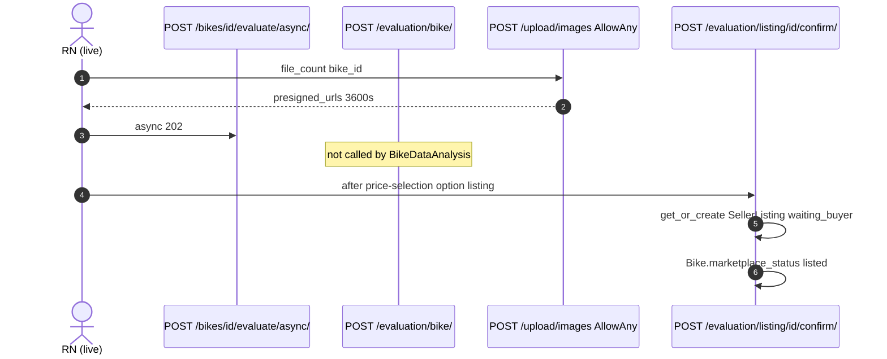
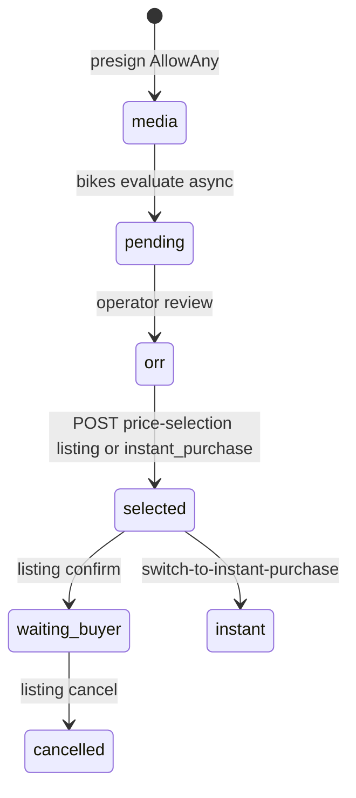

# 1. Overview and Business Intent

Two evaluation HTTP surfaces exist on the same Django project.

1. **Live rider path** (already documented on the pickup page): `POST /api/v1/bikes/:id/evaluate/async/` returns 202, daemon thread 300s, poll `GET .../evaluate/result/`. FE `BikeDataAnalysis.tsx` uses only this.
2. **Legacy/sync path** in `apps/evaluation/views.py`: `POST /api/v1/evaluation/bike/` AllowAny, fetches media with **raw SQL** `SELECT media_type, media_url FROM bikes_bikemedia`, then `service.full_evaluation` inline (HTTP waits for Gemini/gRPC). Also exterior/engine/pricing/full with uploaded files, health GET.

After OPS dual price, **authenticated** evaluation routes handle seller choice: GET/POST `/evaluation/price-selection/:bike_id/`, listing confirm/cancel/switch-to-instant, GET `/evaluation/result/`.

Uploads: presigned PUT to S3. **AllowAny**. Knowing a bike UUID is enough to mint keys. Prefix `S3_MEDIA_PREFIX` only `production` or `staging`; anything else becomes `production`.

**Target files:** `evaluation/views.py`, `realtime_views.py`, `listing_views.py`, `upload/views.py`, `bikes/models.py` media positions.

---

# 2. End-to-End Flow and Sequence Diagram





`evaluate_by_bike_id` error\_code 3 if no picture\_urls and no audio\_urls (video-only bike fails this check). Hint still says POST `/api/v1/bikes/:bike_id/media/`.

---

# 3. Detailed API Contracts

### AllowAny evaluation (sync)

| Method | Path | Body | Auth |
| --- | --- | --- | --- |
| POST | `/evaluation/bike/` | bike\_id | AllowAny |
| POST | `/evaluation/exterior/` | images | AllowAny |
| POST | `/evaluation/engine/` | audio | AllowAny |
| POST | `/evaluation/pricing/` | profile JSON | AllowAny |
| POST | `/evaluation/full/` | combined | AllowAny |
| GET | `/evaluation/` | health | AllowAny |

error\_code 1 missing bike\_id, 2 bike not found 404, 3 no media 400, -1 service error 500.

### Authenticated post-ORR

| Method | Path | Notes |
| --- | --- | --- |
| GET | `/evaluation/result/` | query bike\_id plus operator\_review\_request\_id; used after WS valuation\_ready |
| GET | `/evaluation/operator-price/` | same owner resolve |
| GET POST | `/evaluation/price-selection/:bike_id/` | POST option must be `listing` or `instant_purchase` |
| POST | `/evaluation/listing/:bike_id/confirm/` | requires prior selection option listing |
| POST | `/evaluation/listing/:bike_id/switch-to-instant-purchase/` |  |
| POST | `/evaluation/listing/:bike_id/cancel/` |  |
| GET | `/evaluation/listing/:bike_id/` | status |

price-selection POST needs `OperatorReviewResult` or returns result-not-ready. GET selection 404 `PRICE_SELECTION_NOT_FOUND`.

confirm listing: `LISTING_SELECTION_REQUIRED` if no selection; `INVALID_SELECTED_OPTION` if option is instant. `get_or_create` on `operator_review_request`. **Then always** updates Bike marketplace\_status listed even when the listing row already existed. HTTP 201 if created else 200. Response uses `ok` not `success`.

### Upload AllowAny

| Method | Path | Limits |
| --- | --- | --- |
| POST | `/upload/images` | file\_count 1-20, jpg keys |
| POST | `/upload/videos` | file\_count 1-10 |
| POST | `/upload/audios` | file\_count 1-10 |
| POST | `/upload/recognition-paper` | one object, folder `reconizationpaper` |
| POST | `/upload/presigned-url` | single |
| POST | `/upload/presigned-urls/batch` | batch |

Key pattern: prefix slash bike UUID slash bike UUID `_image_` index `.jpg`. Index from `get_next_media_index`: if Bike DoesNotExist, start at 1 (presign **does not create** the bike). Position stored as string on BikeMedia; empty/null excluded from max.

Expires 3600 seconds. `get_next_image_index` aliases the image type.

| HTTP Code | Error | Trigger |
| --- | --- | --- |
| 400 | serializer | file\_count 0 or greater than max |
| 400 | error\_code 3 | evaluation/bike no media |
| 404 | PRICE\_SELECTION\_NOT\_FOUND | GET selection empty |
| 400 | LISTING\_SELECTION\_REQUIRED | confirm without POST selection |
| 201 | listing created | confirm first time |

---

# 4. Database Schema and Locks

```sql
CREATE TABLE bikes_bikemedia (
    id BIGSERIAL PRIMARY KEY,
    bike_id UUID NOT NULL REFERENCES bikes_bike(bike_id),
    media_type VARCHAR(16) NOT NULL,
    media_url TEXT NOT NULL,
    position VARCHAR(32),
    created_at TIMESTAMPTZ NOT NULL
);

-- SellerListing unique per operator_review_request (get_or_create key).
-- Bike.marketplace_status listed on confirm even if listing row already existed.
```

evaluation/bike raw SQL does not lock BikeMedia. Concurrent upload can omit a just-written URL. No FOR UPDATE on listing confirm Bike update.

S3 object is not a SQL row until the client POSTs `/bikes/:id/media/` with the public\_url.

---

# 5. Frontend and UI Logic

Live evaluate = async bikes route only. Calling `/evaluation/bike/` from a debug client **blocks the HTTP worker** for the full AI run (unlike 202 async).

Upload clients must PUT to `presigned_url` then register media on the bike. Skipping media register makes evaluate error\_code 3.

Recognition paper path typo `reconizationpaper` is load-bearing: CDN and IAM prefixes must match that misspelling.

---

# 6. Edge Cases and Resilience

1. AllowAny evaluate-by-id: anyone with a UUID can burn Gemini/gRPC quota on that bike.
2. AllowAny upload: anyone can write S3 under prefix slash any UUID slash.
3. Video-only bikes fail `/evaluation/bike/` media check (needs pictures or audio).
4. Listing confirm re-lists a cancelled marketplace bike if called again (update always listed).
5. `bikes/views.py` evaluate async remains the Gold Standard live path; this page is the other controller.
6. Queue files: `evaluation/views.py`, `upload/views.py`, plus bikes models/views already covered for pickup/async.