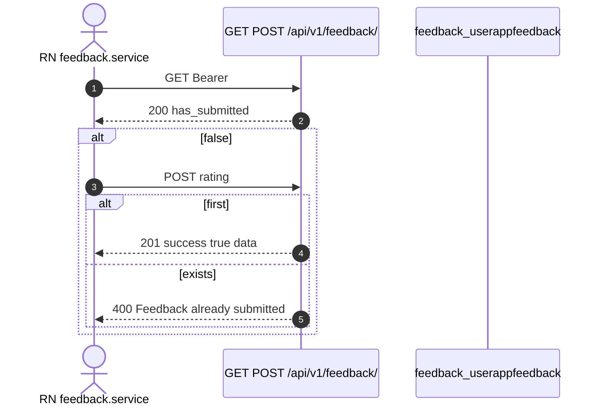

# 1. Overview and Business Intent

One survey per account: usage reason plus 1-5 stars. Table `feedback_userappfeedback` enforces UniqueConstraint on user named `feedback_unique_per_user`.

**Actors:** `feedback.service.ts`, `feedback/views.py`, `models.py`, `serializers.py`, `admin.py`.

No PATCH, no upsert. There **is** a Django admin list (`UserAppFeedbackAdmin`) — saying no admin is wrong.

---

# 2. End-to-End Flow and Sequence Diagram



GET does not return prior comment. Keep 201 payload client-side if needed.

---

# 3. Detailed API Contracts

Same path for GET and POST. FE STATUS and SUBMIT both `/feedback/`.

POST (`SubmitFeedbackSerializer`): rating 1-5 required; usage\_reason optional enum curious\_value, sell\_extra, upgrade\_gas, upgrade, other; usage\_reason\_other max 500 only when other; comment max 2000.

| HTTP Code | Error | Trigger |
| --- | --- | --- |
| 401 | Cognito | missing Bearer |
| 400 | serializer.errors | rating invalid |
| 400 | Feedback already submitted | second POST |
| 201 | success true | first POST |
| 200 | has\_submitted | GET |

Concurrent double POST can race past exists() → IntegrityError 500. Treat 400 already submitted as success-equivalent for double-tap UX.

Stored keys (not Vietnamese labels): curious\_value, sell\_extra, upgrade\_gas, upgrade, other. Constants live in `apps/src/constants/feedback.ts`.

---

# 4. Database Schema and Locks

```sql
CREATE TABLE feedback_userappfeedback (
    feedback_id UUID PRIMARY KEY,
    user_id UUID NOT NULL REFERENCES users_customuser(user_id) ON DELETE CASCADE,
    usage_reason VARCHAR(32),
    usage_reason_other TEXT,
    rating SMALLINT,
    comment TEXT,
    created_at TIMESTAMPTZ NOT NULL
);

CREATE UNIQUE INDEX feedback_unique_per_user ON feedback_userappfeedback (user_id);
-- migration index name: feedback_us_user_id_created_idx
```

No select\_for\_update.

---

# 5. Frontend and UI Logic

`getFeedbackStatus` / `submitFeedback`. No edit-after-submit UI. Ops can inspect rows via Django admin even though the mobile API has no list endpoint.

---

# 6. Edge Cases and Resilience

1. UniqueConstraint race → possible 500.
2. Soft-delete: Cognito auth may **reactivate** deleted\_at users, then feedback works.
3. Cascade delete of CustomUser removes feedback.
4. Model rating allows null historically; serializer requires rating on POST.
5. Future edit-after-submit needs a new endpoint plus UniqueConstraint decision.