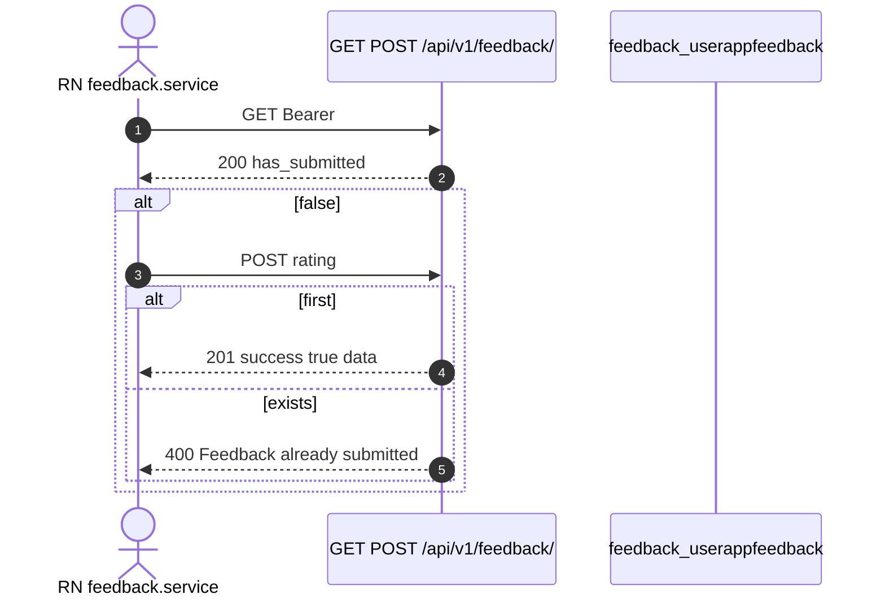

# 1. Overview and Business Intent

One survey per account: usage reason plus 1-5 stars. Table `feedback_userappfeedback` enforces `UniqueConstraint(fields=['user'], name='feedback_unique_per_user')`.

**Actors:** `feedback.service.ts`, `feedback/views.py`, `models.py`, `serializers.py`, `admin.py`.

No PATCH, no upsert. There **is** a Django admin list (`UserAppFeedbackAdmin`) — saying "no admin" is wrong.

---

# 2. End-to-End Flow and Sequence Diagram



GET does not return prior comment. Keep 201 payload client-side if needed.

---

# 3. Detailed API Contracts

Same path for GET and POST. FE STATUS and SUBMIT both `/feedback/`.

POST (`SubmitFeedbackSerializer`): rating 1-5 required; usage\_reason optional enum curious\_value, sell\_extra, upgrade\_gas, upgrade, other; usage\_reason\_other max 500 only when other; comment max 2000.

| HTTP Code | Error | Trigger |
| --- | --- | --- |
| 401 | Cognito | missing Bearer |
| 400 | serializer.errors | rating invalid |
| 400 | Feedback already submitted | second POST |
| 201 | success true | first POST |
| 200 | has\_submitted | GET |

Concurrent double POST can race past exists() → IntegrityError 500.

---

# 4. Database Schema and Locks

```sql
CREATE TABLE feedback_userappfeedback (
    feedback_id UUID PRIMARY KEY,
    user_id UUID NOT NULL REFERENCES users_customuser(user_id) ON DELETE CASCADE,
    usage_reason VARCHAR(32),
    usage_reason_other TEXT,
    rating SMALLINT,
    comment TEXT,
    created_at TIMESTAMPTZ NOT NULL
);

CREATE UNIQUE INDEX feedback_unique_per_user ON feedback_userappfeedback (user_id);
-- migration index name: feedback_us_user_id_created_idx
```

No select\_for\_update.

---

# 5. Frontend and UI Logic

`getFeedbackStatus` / `submitFeedback`. Constants in `apps/src/constants/feedback.ts`. No edit-after-submit UI.

---

# 6. Edge Cases and Resilience

1. UniqueConstraint race → possible 500.
2. Soft-delete: Cognito auth may **reactivate** deleted\_at users, then feedback works.
3. Cascade delete of CustomUser removes feedback.
4. Admin exists for ops inspection.

---

# Appendix: Usage reason keys vs Vietnamese labels

Stored keys (not labels): `curious_value` (To mo ve gia tri xe hien tai), `sell_extra`, `upgrade_gas`, `upgrade`, `other`. Serializer strips blank to null. Model rating column allows null but API requires rating on POST.

Serializer validate rejects usage\_reason\_other unless usage\_reason is exactly `other`. Rating validators MinValueValidator 1 MaxValueValidator 5 on the model field as well.

IntegrityError from UniqueConstraint is not specially mapped to 400 — only the pre-check `.exists()` returns the friendly string `Feedback already submitted`.

FE `API_ENDPOINTS.FEEDBACK` STATUS and SUBMIT both resolve to the same `/feedback/` path under the apiClient base that already includes `/api/v1`.

When documenting this page as Gold Standard, treat Django admin registration as part of the surface: ops can read rows even though the mobile API has no list endpoint.

Ops reading feedback through Django admin sees feedback\_id, user, usage\_reason, rating, comment, created\_at. There is no public list API for riders to browse other users feedback. Rating nullability on the model is historical; SubmitFeedbackSerializer makes rating required so production rows created via this API should always have 1-5.

If product later needs edit-after-submit, that requires a new endpoint and a decision on UniqueConstraint (update vs insert). Current contract is write-once.

Cross-links: auth page for Cognito JWT required on this endpoint; analytics page for any future feedback\_submitted event name (not present in AnalyticsEvents today).

Idempotency is therefore soft: clients should treat 400 Feedback already submitted as success-equivalent for UX after a double-tap.

When writing automated tests against this endpoint, assert both the friendly 400 string and the UniqueConstraint name feedback\_unique\_per\_user so a future soft-delete-or-upsert change is caught.