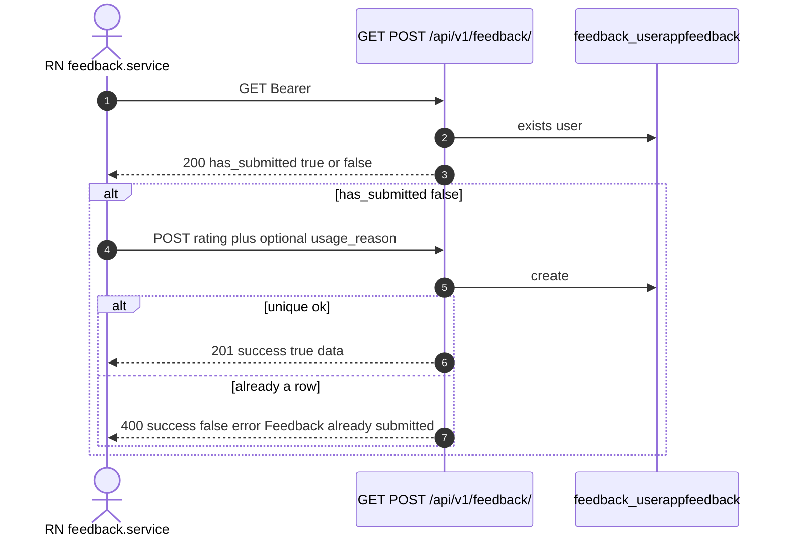
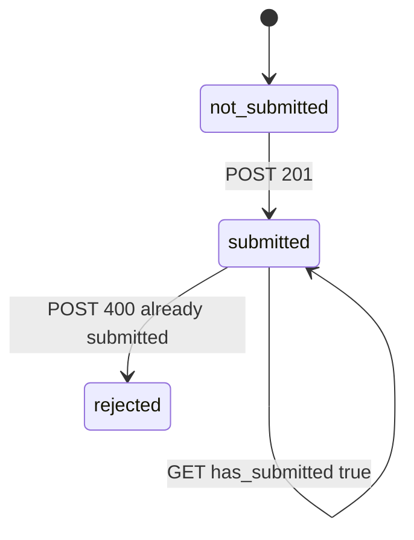

# 1. Overview and Business Intent

After onboarding, the rider app asks why they used TiMoto and a 1-5 star rating. Product wants **one survey per account**, not a history. The table `feedback_userappfeedback` enforces that with a unique constraint on user (`feedback_unique_per_user`).

**Actors:** `apps/src/services/feedback.service.ts`, `backend/apps/feedback/views.py`, `models.py`, `serializers.py`.

There is no PATCH, no admin list in this app, no anonymous device\_id path. Unauthenticated GET or POST is 401 from Cognito.

---

# 2. End-to-End Flow and Sequence Diagram





GET does not return the stored rating or comment. After submit, the client only knows `has_submitted` unless it kept the 201 payload in memory.

---

# 3. Detailed API Contracts

Same path for both verbs. FE `API_ENDPOINTS.FEEDBACK.STATUS` and `SUBMIT` are both `/feedback/`.

POST body (`SubmitFeedbackSerializer`):

- `rating` integer min 1 max 5 **required**.
- `usage_reason` optional one of: `curious_value`, `sell_extra`, `upgrade_gas`, `upgrade`, `other`.
- `usage_reason_other` max 500, **only** when usage\_reason is `other`; otherwise validation error.
- `comment` max 2000, optional, blank stripped to null.

201 body: `success` true, `data` with `feedback_id`, `usage_reason`, `usage_reason_other`, `rating`, `comment`, `created_at`.

400 validation: `success` false, `errors` serializer dict. Duplicate: `success` false, `error` exact string `Feedback already submitted`. IntegrityError from the unique constraint is **not** caught separately; the view checks `.exists()` first. Concurrent double POST can still 500 on the constraint.

| HTTP Code | Error | Trigger |
| --- | --- | --- |
| 401 | Cognito | missing Bearer |
| 400 | serializer.errors | rating missing or out of 1-5, other text without other |
| 400 | Feedback already submitted | second POST |
| 201 | success true | first POST |
| 200 | has\_submitted | GET |

USAGE\_REASON\_CHOICES Vietnamese labels are stored as **keys** in English, not the Vietnamese label.

---

# 4. Database Schema and Locks

No `select_for_update`. Unique on user\_id is the lock equivalent.

```sql
CREATE TABLE feedback_userappfeedback (
    feedback_id UUID PRIMARY KEY,
    user_id UUID NOT NULL REFERENCES users_customuser(user_id) ON DELETE CASCADE,
    usage_reason VARCHAR(32),
    usage_reason_other TEXT,
    rating SMALLINT,
    comment TEXT,
    created_at TIMESTAMPTZ NOT NULL
);

CREATE UNIQUE INDEX feedback_unique_per_user ON feedback_userappfeedback (user_id);
CREATE INDEX feedback_user_created ON feedback_userappfeedback (user_id, created_at DESC);
```

Model rating is blank/null with 1-5 validators, but the serializer **requires** rating on POST so null rows should not appear via this API.

---

# 5. Frontend and UI Logic

`getFeedbackStatus` types `has_submitted` boolean. `submitFeedback` expects 201 `success` plus `data`. The service does not map 400 `Feedback already submitted` to a typed union; screens must inspect axios error body.

There is no edit-after-submit UI because the API has no PUT.

---

# 6. Edge Cases and Resilience

1. UniqueConstraint race: two POSTs in flight both pass exists() then one 201 one 500 IntegrityError.
2. GET never returns previous comment; support cannot recover text from this endpoint.
3. `usage_reason` null is allowed; product can get a star with no reason.
4. Cascade delete of CustomUser removes feedback.
5. Soft-deleted users (`deleted_at`) can still POST if JWT is valid; no check on deleted\_at in this view.
6. Queue files covered: `feedback.service.ts`, `backend/apps/feedback/models.py`, `views.py`.