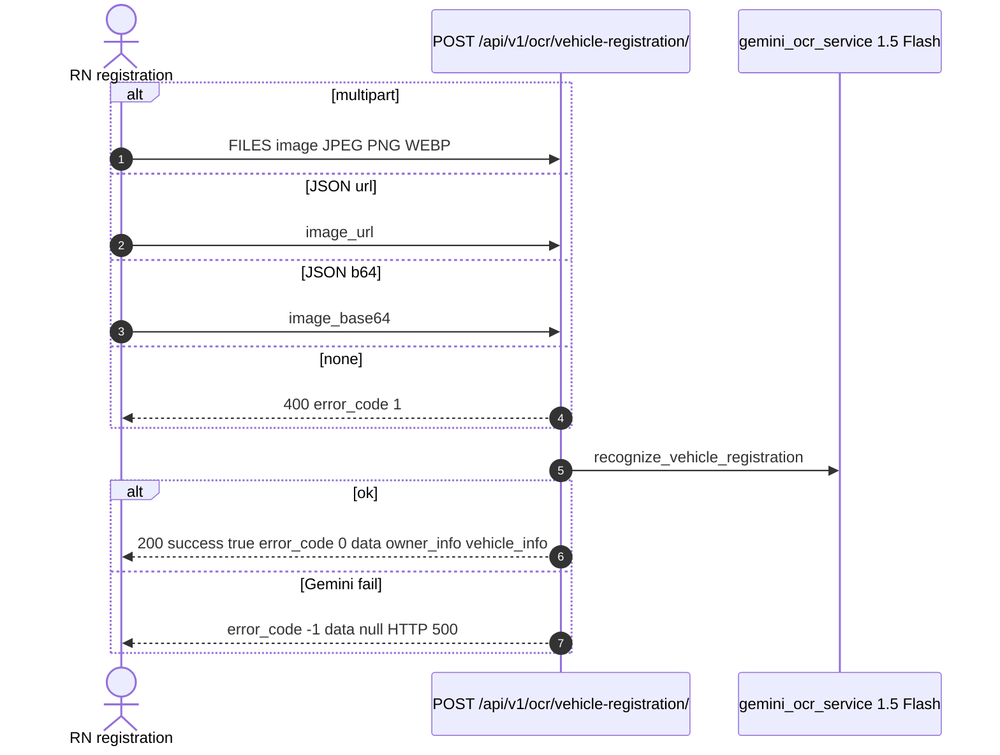
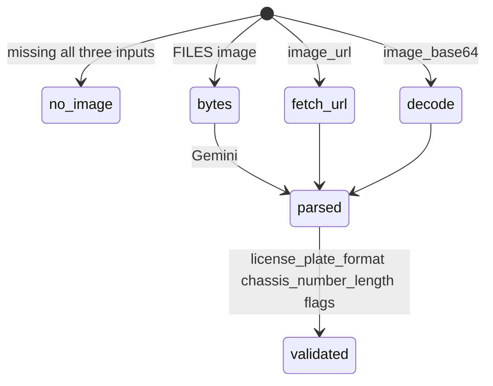

# 1. Overview and Business Intent

During registration the rider photographs Giay Chung Nhan Dang Ky Xe (cavet). The app should prefill plate, brand, chassis, engine, owner name. Backend calls Google Gemini 1.5 Flash via `gemini_ocr_service`. This is **not** dealer SCD evaluation and **not** OPS inspection OCR.

**Actors:** RN camera / `ocr_scan_*` analytics events, `backend/apps/ocr/views.py`, `services.py`.

**Anonymous:** permission AllowAny. Anyone who can hit `api.timoto.ai` can OCR an image. There is no `ratelimit` decorator on this view (unlike mobile\_login 10/m).

---

# 2. End-to-End Flow and Sequence Diagram





The view does not persist OCR to Postgres. Prefill is client-side until POST `/bikes/`.

---

# 3. Detailed API Contracts

Parsers: MultiPartParser, FormParser, JSONParser.

Priority if multiple fields present: **file first**, then `image_url`, then `image_base64`. Sending both file and URL uses the file.

Success `data` groups:

- `owner_info`: full\_name, birth\_year, address
- `vehicle_info`: license\_plate, brand, model\_code, engine\_number, chassis\_number, color
- `registration_info`: registration\_date, issue\_location, issuing\_authority, expiry\_date, activity\_scope
- `document_metadata`: has\_qr\_code, has\_watermark, document\_condition
- `validation`: license\_plate\_format, chassis\_number\_length, has\_owner\_name, has\_required\_fields booleans

Example plate in the docstring: `43C2-085.15`. Gemini may return other formats; the view does not re-validate plate regex.

| HTTP Code | Error | Trigger |
| --- | --- | --- |
| 400 | error\_code 1 No image provided. Send image file, image\_url, or image\_base64 | all missing |
| 200 | error\_code 0 | Gemini returned structured JSON |
| 500 | error\_code -1 Processing error | service exception |

View returns the service dict as JSON. If Gemini is down, riders see empty prefill and can type manually. Analytics events `ocr_scan_attempted` / success / failed are **no-ops** through the analytics facade (see analytics page).

---

# 4. Database Schema and Locks

No OCR table. Logical (not created in Aurora):

```sql
CREATE TABLE ocr_vehicle_registration_ephemeral (
    request_id UUID PRIMARY KEY,
    image_source VARCHAR(16),
    gemini_model VARCHAR(32) DEFAULT 'gemini-1.5-flash',
    error_code SMALLINT NOT NULL,
    payload JSONB
);
```

This table is **not** created. Do not look for it in Aurora.

---

# 5. Frontend and UI Logic

Camera capture is JPEG. Client should send multipart `image` rather than huge `image_base64` in JSON (memory). Failed OCR must not block bike create.

PII: cavet contains full name and address. AllowAny plus logs can leak that if the service logs the model output.

---

# 6. Edge Cases and Resilience

1. No bike\_id: OCR cannot be tied server-side to a listing; fraud can OCR someone else's cavet.
2. `image_url` fetch is SSRF-shaped if the service downloads arbitrary URLs (confirm in services.py before assuming blocklist).
3. error\_code 1 vs HTTP 400: clients must read both.
4. Gemini can hallucinate chassis numbers; `validation.chassis_number_length` is a flag not a VIN check digit.
5. Queue file: `backend/apps/ocr/views.py`.
6. Related: upload recognition-paper S3 folder is misspelled `reconizationpaper` and is a **file store**, not this OCR API.