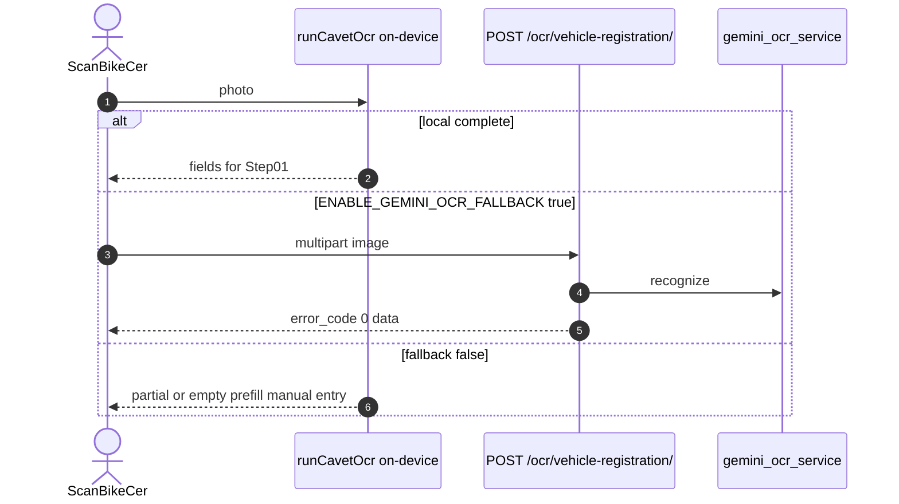
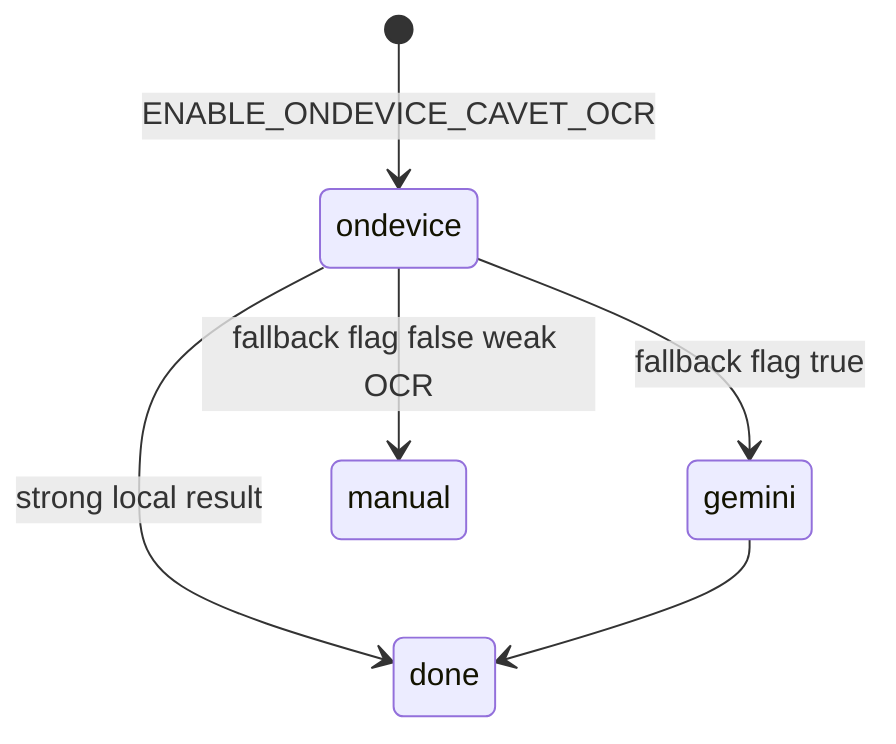

# 1. Overview and Business Intent

Rider photographs Giay Chung Nhan Dang Ky Xe (cavet) to prefill plate, brand, chassis, engine, owner.

**Product path (live app):** `runCavetOcr.ts` — on-device first (`ENABLE_ONDEVICE_CAVET_OCR: true`). Gemini cloud is only if `ENABLE_GEMINI_OCR_FALLBACK` is true; **default false** in `app.config.ts`.

**Backend path (still shipped):** `POST /api/v1/ocr/vehicle-registration/` AllowAny → `gemini_ocr_service`. Used when FE calls Gemini fallback or Postman. Model is chosen from an available flash list (not hard-pinned forever to 1.5-flash only).

**Not** dealer SCD evaluation and **not** OPS inspection OCR.

**Target files:** `apps/src/ml/ocr/runCavetOcr.ts`, `app.config.ts`, `backend/apps/ocr/views.py`, `services.py`.

---

# 2. End-to-End Flow and Sequence Diagram

Backend does **not** persist OCR to Postgres. Prefill is client-side until POST `/bikes/`.

---

# 3. Detailed API Contracts (backend)

Parsers: MultiPartParser, FormParser, JSONParser. Priority: **file** then `image_url` then `image_base64`.

No `ratelimit` decorator (unlike mobile\_login 10/m).

Success `data` groups: owner\_info, vehicle\_info, registration\_info, document\_metadata, validation booleans.

| HTTP Code | Error | Trigger |
| --- | --- | --- |
| 400 | error\_code 1 No image provided... | all inputs missing |
| 200 | error\_code 0 | Gemini structured JSON |
| 500 | error\_code -1 | processing failure (view maps non-1 to 500) |

**SSRF:** `services.py` does `requests.get(image_url, timeout=30)` with **no allowlist**. Anyone who can hit AllowAny can ask the server to fetch arbitrary URLs.

---

# 4. Database Schema and Locks

No OCR table. Do not invent ephemeral DDL as real Aurora objects.

---

# 5. Frontend and UI Logic

Camera JPEG. Prefer multipart when Gemini is enabled. Failed OCR must not block bike create. Analytics ocr\_scan\_\* events go through the no-op facade.

Upload recognition-paper S3 folder typo `reconizationpaper` is a **file store**, not this OCR API.

---

# 6. Edge Cases and Resilience

1. Documenting only Gemini as the registration path is **false** for current app flags.
2. No bike\_id on OCR API — cannot bind server-side to a listing.
3. Gemini may hallucinate chassis; validation flags are not VIN check digits.
4. Hardcoded API key fallback may exist in service init if settings missing — treat as a secret-hygiene bug, not a feature.

---

# Appendix: Backend response shape and FE flags

Backend success body includes nested `owner_info.full_name`, `birth_year`, `address`; `vehicle_info.license_plate`, `brand`, `model_code`, `engine_number`, `chassis_number`, `color`; `registration_info.registration_date`, `issue_location`, `issuing_authority`, `expiry_date`, `activity_scope`; `document_metadata.has_qr_code`, `has_watermark`, `document_condition`; `validation.license_plate_format`, `chassis_number_length`, `has_owner_name`, `has_required_fields`.

AppConfig flags that matter for the live path:

- `ENABLE_ONDEVICE_CAVET_OCR: true` — Vision/ML Kit \+ Paddle ONNX in `runCavetOcr.ts`
- `ENABLE_GEMINI_OCR_FALLBACK: false` — cloud path off unless flipped for hybrid testing
- Optional `TIMOTO_OCR_BUNDLE_BASE_URL` for ONNX assets if not bundled

When Gemini fallback is enabled, FE should send multipart `image` rather than huge `image_base64` JSON. Analytics events `ocr_scan_attempted`, `ocr_scan_success`, `ocr_scan_failed` are defined but currently no-op via the analytics facade.

Related upload path `POST /upload/recognition-paper` stores under S3 folder `reconizationpaper` (misspelled). That is independent of OCR recognition quality.

For Postman or backend-only testing of Gemini OCR, send multipart image to /api/v1/ocr/vehicle-registration/ without auth. For product QA of registration Step01, test with ENABLE\_GEMINI\_OCR\_FALLBACK left false and verify on-device models are bundled; flipping the flag exercises the hybrid path.