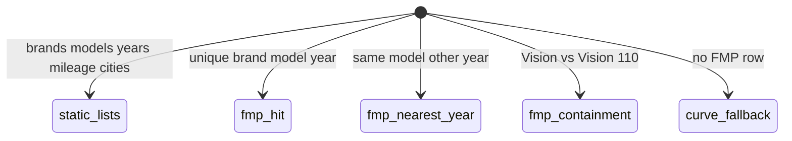

# 1. Overview and Business Intent

Registration step 1 needs dropdowns (brand, model, year, mileage buckets, cities) and a **preliminary price band** (gia so bo) before AI or OPS. Ops loads Fair Market Price from the sheet Consolidated Price - Official Models into `options_fairmarketprice`. Formula from July 2026: min = 0.7 times FMP, max = 1.1 times FMP, round to 100000 VND.

**Actors:** RN registration screens, `backend/apps/options/views.py`, `models.py`, `data.py` static lists.

**This is not dealer catalog.** Dealer portal has its own bike table. TMA options brands are **not** Bike DISTINCT; that query is commented out.

---

# 2. End-to-End Flow and Sequence Diagram

```mermaid
sequenceDiagram
  autonumber
  actor Rider as RN registration
  participant Opt as GET /api/v1/options
  participant FMP as options_fairmarketprice
  participant Curve as DEPRECIATION_CURVES

  Rider->>Opt: GET /options/brands no slash
  Opt-->>Rider: data from VIETNAMESE_BIKE_BRANDS plus CDN logos
  Rider->>Opt: GET /options/price-range brand model year
  Opt->>FMP: find_fmp_record iexact then space-insensitive then containment
  alt row found
    Opt-->>Rider: min 0.7 FMP max 1.1 FMP year_matched flag
  else miss
    Opt->>Curve: MOTORCYCLE_MODELS_DB depreciation
    Opt-->>Rider: min_price_vnd max_price_vnd depreciation_factor
  end
```



`price-range` is `get_motorcycle_price_range`. `price-range-simple` is a different helper that takes a target price, not FMP.

---

# 3. Detailed API Contracts

All GET, **AllowAny**. Paths **without** trailing slash (`path('brands')` not `brands/`). Django APPEND\_SLASH may 301; RN should use the exact path.

| Method | Path | Query | Source |
| --- | --- | --- | --- |
| GET | `/options/brands` | none | VIETNAMESE\_BIKE\_BRANDS, logo rewritten by to\_cdn\_url |
| GET | `/options/models` | brand | BIKE\_MODELS keyed by brand |
| GET | `/options/years` | none | YEARS list |
| GET | `/options/mileage-options` and `/options/mileage` | none | MILEAGE\_OPTIONS |
| GET | `/options/document-types` | none | DOCUMENT\_TYPE\_OPTIONS |
| GET | `/options/warranty-options` and `/options/warranty` | none | WARRANTY\_OPTIONS |
| GET | `/options/condition-options` and `/options/condition` | none | CONDITION\_OPTIONS |
| GET | `/options/cities` | none | VIETNAMESE\_CITIES |
| GET | `/options/provinces` | none | VIETNAMESE\_PROVINCES |
| GET | `/options/price-range` | brand, model, year required | FMP then curves |
| GET | `/options/price-range-simple` | target-style helper | get\_price\_range |

price-range validation:

- missing brand/model/year: 400 `detail` English required message
- year not int: 400 Invalid year format
- year less than 1990 or greater than current calendar year plus 1: 400

FMP match order in `find_fmp_record`: (1) brand iexact plus model iexact, (2) strip spaces on model, (3) containment either direction, longest model name wins, (4) if years differ pick nearest year and `year_matched` false.

Constants: `FMP_MIN_RATE = 0.7`, `FMP_MAX_RATE = 1.1`, `FMP_ROUND_TO_VND = 100000`. Round is int(round(fmp\_vnd times rate / 100000) times 100000).

FMP lookup exception logs and falls through to depreciation as if no row.

| HTTP Code | Error | Trigger |
| --- | --- | --- |
| 400 | brand parameter is required | empty brand |
| 400 | Year must be between 1990 and Y | out of range |
| 200 | FMP or curve JSON | always 200 if query valid even if estimated |

Docstring on `get_motorcycle_price_range` still shows `depreciation_factor` and `base_price` from the **curve** era. FMP responses add `source` / `year_matched` fields from `calculate_fmp_price_range` plus record brand/model as stored, not as typed.

---

# 4. Database Schema and Locks

Read-only at request time. Writers: `python manage.py import_fmp_csv`. No FOR UPDATE.

```sql
CREATE TABLE options_fairmarketprice (
    id BIGSERIAL PRIMARY KEY,
    brand VARCHAR(64) NOT NULL,
    model VARCHAR(128) NOT NULL,
    year INTEGER NOT NULL,
    age INTEGER,
    fmp_vnd BIGINT NOT NULL,
    dealer_price_vnd BIGINT,
    bike_type VARCHAR(64) NOT NULL DEFAULT '',
    created_at TIMESTAMPTZ NOT NULL,
    updated_at TIMESTAMPTZ NOT NULL,
    CONSTRAINT uniq_fmp_brand_model_year UNIQUE (brand, model, year)
);

CREATE INDEX idx_fmp_brand_model ON options_fairmarketprice (brand, model);
```

Containment matching can return Vision 110 FMP for query model Vision (or the reverse). That is intentional per comment, not a join on Bike.model.

---

# 5. Frontend and UI Logic

Registration uses these lists before a Bike row exists. Logos go through `to_cdn_url`. If CDN prefix is wrong, brand chips show broken images but the string brand still posts to `/bikes/`.

price-range is AllowAny: anyone can scrape the FMP table through this public GET.

---

# 6. Edge Cases and Resilience

1. Commented DISTINCT from Bike means a brand that exists only on real bikes (typo Honda vs HONDA) may not appear in the dropdown.
2. Nearest-year FMP can price a 2015 SH using 2020 FMP without applying extra depreciation beyond 0.7/1.1.
3. UniqueConstraint is brand plus model plus year **case-sensitive** in SQL; lookup is iexact so duplicate Honda vs honda rows can exist if import is sloppy.
4. `get_price_range` (simple) is a different algorithm; do not confuse with FMP.
5. Queue files: `options/models.py`, `options/views.py`.