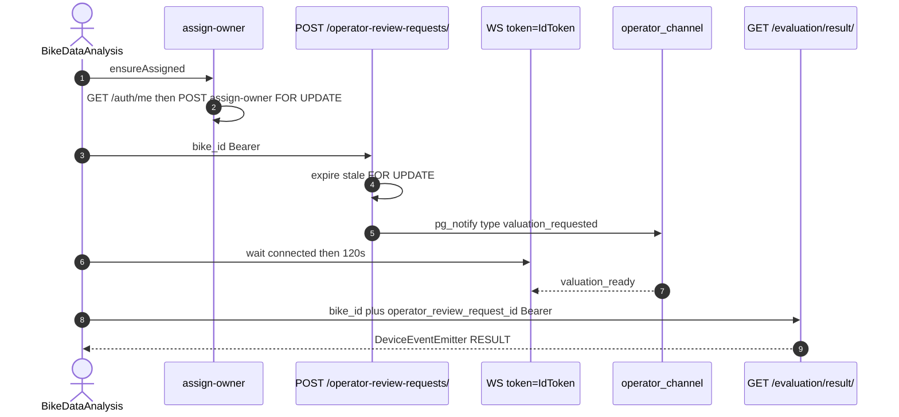

# 1. Overview and Business Intent

After AI evaluate, rider waits for OPS dual price. App opens WebSocket; OPS writes valuation; server emits `valuation_ready`; app **HTTP GETs** the result (WS payload is not the report). Bike must belong to JWT user before ORR create. Anonymous bikes use `device_id`; `bikeAssignOwnerService` claims them.

**Actors:** BikeDataAnalysis, realtimeOperatorReview.ts, bikeAssignOwner.ts, bikes/realtime\_views.py, evaluation/realtime\_views.py.

---

# 2. End-to-End Flow and Sequence Diagram



`start()` sets createRequestOnConnected false. ensureOperatorReviewRequestCreatedAndStart POSTs ORR before WS. Token wait 25 times 100ms for IdToken.

---

# 3. Detailed API Contracts

### POST `/api/v1/bikes/assign-owner/`

Body bike\_id, target\_user\_id. Client sends self from /me. select\_for\_update on Bike.

- Unowned: admin or target user self-claim
- Owned: current owner or admin
- Reassign to someone else: admin only REASSIGNMENT\_FORBIDDEN
- Same owner: already\_assigned 200

### POST `/api/v1/operator-review-requests/`

Authenticated. Bike must belong to JWT user. Expires now plus 15 minutes. Stale active expired in same transaction. Existing active → 200 idempotent. Create 201 \+ pg\_notify type valuation\_requested on commit.

### Cancel POST `/operator-review-requests/cancel/`

Backend enforces **exactly one of** bike\_id or operator\_review\_request\_id (AMBIGUOUS\_CANCEL\_BODY / MISSING\_CANCEL\_IDENTIFIER). May cancel COMPLETED in some paths; emits `valuation_cancelled` with key **`type`**.

### GET `/api/v1/evaluation/result/`

**IsAuthenticated** plus ownership resolve. Query bike\_id and operator\_review\_request\_id. Used after WS valuation\_ready. Client needs success and data.

WS: must see JSON type `connected` before considering open; then wait for `valuation_ready` (120000 ms).

| HTTP Code | Error | Trigger |
| --- | --- | --- |
| 400 | INVALID\_BIKE\_ID | assign or ORR |
| 403 | REQUEST\_BIKE\_USER\_MISMATCH | ORR |
| 403 | ASSIGNMENT\_FORBIDDEN / REASSIGNMENT\_FORBIDDEN | assign |
| 404 | BIKE\_NOT\_FOUND / TARGET\_USER\_NOT\_FOUND | assign |
| 200 | idempotent ORR | active exists |

Client job errors: missing\_id\_token, ws\_error, ws\_closed, ws\_timeout\_waiting\_valuation\_ready, result\_fetch\_error:STATUS, result\_not\_ready.

---

# 4. Database Schema and Locks

```sql
CREATE TABLE bikes_bike (
    bike_id UUID PRIMARY KEY,
    user_id UUID NULL REFERENCES users_customuser(user_id) ON DELETE SET NULL,
    device_id VARCHAR(255),
    type VARCHAR(20) NOT NULL DEFAULT 'old_bike',
    brand VARCHAR(100) NOT NULL,
    model VARCHAR(100) NOT NULL,
    year INTEGER NOT NULL,
    masked_bike_id VARCHAR(120) UNIQUE
);
```

Locks: Bike.select\_for\_update on assign; OperatorReviewRequest.select\_for\_update on ORR create.

NOTIFY keys that exist:

- ORR create: `type` = valuation\_requested
- ORR cancel: `type` = valuation\_cancelled
- Pickup create: `type` = pickup\_scheduled

**Pickup PATCH cancel does not pg\_notify.** Do not document a pickup `event_type` cancel key — it is not in code.

---

# 5. Frontend and UI Logic

ensureAssigned caches success in a process-lifetime Set. Failed assign aborts ORR. WS IdToken in query lands in load-balancer logs. createRequestOnConnected true is deprecated/skipped.

---

# 6. Edge Cases and Resilience

1. Assign cache Set survives until app restart even if ownership changed server-side.
2. GET result can fail after valuation\_ready → client error despite OPS done.
3. Unowned bikes (user\_id null) can be evaluated by anyone on AllowAny evaluate path.
4. BikeViewSet AllowAny list plus assign-owner is how device\_id bikes become owned.
5. Cross-link: bikes pickup page for AI evaluate async; this page for OPS dual price WS.

DeviceEventEmitter events: REALTIME\_OPERATOR\_REVIEW\_RESULT\_EVENT and REALTIME\_OPERATOR\_REVIEW\_ERROR\_EVENT. Screens should unsubscribe on unmount. Duplicate inflight jobs for the same bike\_id are coalesced inside the service so double navigation does not double-create ORR rows when an active request already exists.