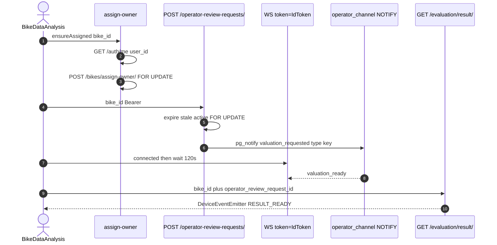
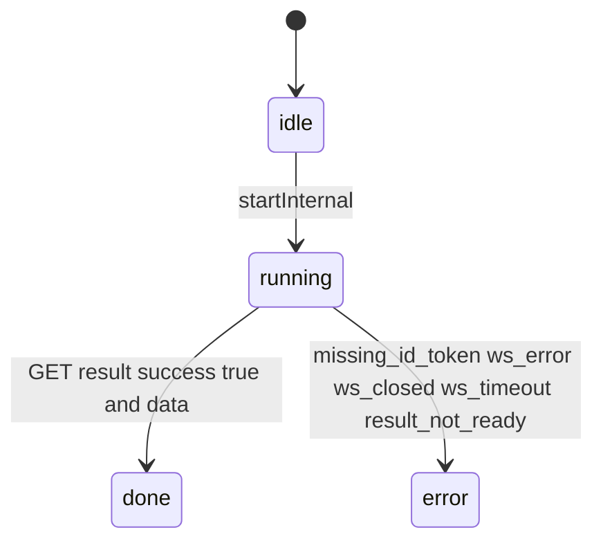

# 1. Overview and Business Intent

After AI evaluate, the rider waits for OPS dual price. The app opens a WebSocket, OPS writes valuation, server emits `valuation_ready`, the app **HTTP GETs** the result (the WS payload is not the report). Ownership must be a logged-in `CustomUser` before ORR create (`REQUEST_BIKE_USER_MISMATCH` if `bike.user_id` is not the JWT user). Anonymous bikes use `device_id`; `bikeAssignOwnerService` claims them.

**Actors:** `BikeDataAnalysis.tsx`, `realtimeOperatorReview.ts`, `bikeAssignOwner.ts`, `backend/apps/bikes/realtime_views.py`, evaluation result view.

**Target files:** those plus `backend/apps/bikes/models.py` (`Bike`, `OperatorReviewRequest` TTL 15 min).

---

# 2. End-to-End Flow and Sequence Diagram





`start()` sets `createRequestOnConnected: false`. `ensureOperatorReviewRequestCreatedAndStart` POSTs ORR **before** WS. Duplicate inflight per bike\_id is coalesced.

Token wait: 25 times 100ms for IdToken before assign. WS URL `getResolvedRealtimeWsUrl() + ?token=`.

---

# 3. Detailed API Contracts

### POST `/api/v1/bikes/assign-owner/`

Body `bike_id`, `target_user_id` UUIDs. Client always sends **self** from GET /me. `select_for_update` on Bike.

- Unowned: actor must be admin or target user (self-claim).
- Owned: actor must be current owner or admin.
- Reassign to someone else: **admin only** (`REASSIGNMENT_FORBIDDEN`).
- Same owner: `already_assigned`, still 200.

### POST `/api/v1/operator-review-requests/`

Authenticated. Bike must belong to JWT user. Expires now plus 15 minutes. Stale active rows (`expires_at` in the past) set EXPIRED `is_active=False` inside the same transaction. Existing active returns **200 idempotent** same payload. Create 201 plus pg\_notify on `operator_channel` with JSON key `type` equal to `valuation_requested` on commit. IntegrityError races return 200 of the active row.

Cancel: `POST /operator-review-requests/cancel/` body **only one of** bike\_id or operator\_review\_request\_id (FE comment).

### GET `/api/v1/evaluation/result/?bike_id=&operator_review_request_id=`

Used after WS `valuation_ready`. Client treats `success && data` as done; else `result_not_ready`.

WS message types: `connected` (required before considering open), `valuation_ready` (may carry operator\_review\_request\_id). Other types are logged as preview 300 chars.

| HTTP Code | Error | Trigger |
| --- | --- | --- |
| 400 | INVALID\_BIKE\_ID | assign or ORR |
| 403 | REQUEST\_BIKE\_USER\_MISMATCH | ORR bike not owned |
| 403 | ASSIGNMENT\_FORBIDDEN | assign |
| 403 | REASSIGNMENT\_FORBIDDEN | non-admin reassign |
| 404 | BIKE\_NOT\_FOUND / TARGET\_USER\_NOT\_FOUND | assign |
| 200 | idempotent ORR | active request exists |

Client job errors (not HTTP): `missing_id_token`, `ws_error`, `ws_closed`, `ws_timeout_waiting_valuation_ready` (120000 ms), `result_fetch_error:STATUS`.

Events: `REALTIME_OPERATOR_REVIEW_RESULT_EVENT`, `REALTIME_OPERATOR_REVIEW_ERROR_EVENT` on DeviceEventEmitter.

---

# 4. Database Schema and Locks

```sql
CREATE TABLE bikes_bike (
    bike_id UUID PRIMARY KEY,
    user_id UUID NULL REFERENCES users_customuser(user_id) ON DELETE SET NULL,
    device_id VARCHAR(255),
    type VARCHAR(20) NOT NULL DEFAULT 'old_bike',
    brand VARCHAR(100) NOT NULL,
    model VARCHAR(100) NOT NULL,
    year INTEGER NOT NULL,
    masked_bike_id VARCHAR(120) UNIQUE
);

-- OperatorReviewRequest TTL default 15 minutes. Partial unique active per bike in TMA migrations.
```

Locks: assign `Bike.select_for_update`. ORR `OperatorReviewRequest.select_for_update` on stale and active. Pickup create (other page) has no FOR UPDATE.

NOTIFY payload key is **`type`** (`valuation_requested`). Pickup scheduled also uses `type`; pickup cancelled uses `event_type` (documented on the pickup page).

---

# 5. Frontend and UI Logic

`ensureAssigned` caches success in a Set for the process lifetime (not disk). Failed assign returns null from ensure ORR (no WS). Known request id skips POST.

`start()` will not create ORR; comment says LoginedBackToAnalytics / dedicated flow owns creation so OPS is notified independent of AI timing.

WS IdToken in query string lands in load-balancer logs.

---

# 6. Edge Cases and Resilience

1. Assign cache Set means a bike assigned then stolen in another session still looks assigned until app restart.
2. GET result can fail after valuation\_ready; job goes error even if OPS finished.
3. Closing WS before finished emits `ws_closed`.
4. `createRequestOnConnected` true is deprecated and skipped with a warn.
5. BikeViewSet AllowAny list (pickup page) plus assign-owner is how anonymous `device_id` bikes become owned.
6. bikes/views.py pickup/evaluate/marketplace already have a Gold Standard page; this page covers assign-owner, ORR, and Bike.device\_id.