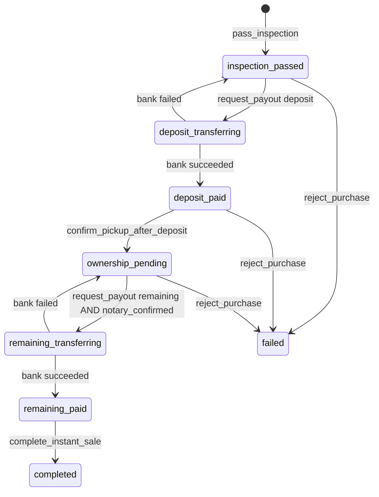

# 1. Overview & Business Intent

Instant Sell lets OPS buy a bike from a TMA seller after inspection. Payout is two legs: deposit = `purchase_price_vnd // 2`, remaining = `purchase_price_vnd - deposit`. Happy path **never writes status `picked_up`**. That status is the old listing/pickup path (`sale.ensure_sale_record_picked_up`).

**Actors:** OPS RN (`PickupSend.tsx`, `PurchaseProgress.tsx`), bank stub or HTTP payout API, HMAC webhook, TMA `push_sale_status`.

**Target files:**

- `timoto-internal-app/backend/bikes/instant_sell.py`
- `timoto-internal-app/backend/bikes/purchases_api.py`
- `timoto-internal-app/backend/bikes/payouts.py`
- `timoto-internal-app/backend/bikes/sale.py` (`SaleTransitionError`, `mark_sale_complete`)
- Routes: `backend/bikes/api_urls.py` under `/api/`
- Frontend: `apps/src/api/purchases.ts`, `apps/src/pages/Purchase.tsx`, `WaitingPickupDetail.tsx`, `PickupSend.tsx`, `PurchaseProgress.tsx`, `RejectPickupBike.tsx`

Constants:

```text
USER_DB_WRITE = 'user_db_write'
WAITING_PICKUP_STATUSES = ('scheduled', 'confirmed')
DEPOSIT_CONFIRM_KEYS = ('bike_matches_listing', 'deposit_paid_confirmed')
NOTARY_CONFIRM_KEYS = ('seller_signed', 'notary_confirmed_transfer')
COMPLETE_CONFIRM_KEYS = ('documents_received', 'remaining_paid_confirmed')
```

`has_bank_info(record)`: `bank_account_number` strip nonempty **and** (`bank_name` or `bank_bin`) strip nonempty.

---

# 2. End-to-End Flow & Sequence Diagram

```mermaid
sequenceDiagram
  autonumber
  actor Ops as PickupSend / PurchaseProgress
  participant API as purchases_api.py
  participant Eng as instant_sell.py
  participant DB as bike_sale_records / payouts
  participant Bank as payouts.initiate_payout
  participant TMA as push_sale_status

  Ops->>API: POST /api/purchases/{bike_id}/inspection/pass/
  API->>Eng: pass_inspection
  Eng->>DB: INSERT/UPDATE status=inspection_passed
  Eng->>TMA: _push_tma
  API-->>Ops: 200 full _purchase_detail_payload

  Ops->>API: POST /api/purchases/{bike_id}/deposit/pay/
  API->>Eng: request_payout kind=deposit
  Eng->>DB: status=deposit_transferring
  Eng->>Bank: initiate_payout idempotency_key=sale_id:deposit
  alt stub succeeded
    Eng->>DB: deposit_paid payout.succeeded
  else http pending
    Eng->>DB: stays deposit_transferring
    Bank-->>API: later POST /api/webhooks/bank/payout/
  else failed
    Eng->>DB: rollback inspection_passed
    API-->>Ops: 200 plus escalate_to Henry
  end

  Ops->>API: POST confirm-pickup {bike_matches_listing:true, deposit_paid_confirmed:true}
  Eng->>DB: ownership_pending
  Ops->>API: POST notary/confirm {seller_signed, notary_confirmed_transfer}
  Note over Eng: status UNCHANGED ownership_pending; checklist.notary_confirmed=true
  Ops->>API: POST remaining/pay
  Eng->>DB: remaining_paid or remaining_transferring
  Ops->>API: POST complete {documents_received, remaining_paid_confirmed}
  Eng->>DB: completed
```



Webhook `apply_payout_webhook` lookup by `provider_ref`, **no lock**. Allowed normalized values: `succeeded`, `failed`, `pending`. Invalid message: `'status must be succeeded or failed.'` (does not mention `pending`).

---

# 3. Detailed API Contracts

Auth on purchase views: `IsAuthenticated` then `_require_ops` (`OpsUser`). Envelope on `SaleTransitionError`: `('ok': false, 'error': ('code'  '<exc.code>', 'message'  '<exc.message>'))`. HTTP = `exc.status_code`.

| Method | Path | View |
| --- | --- | --- |
| GET | `/api/purchases/` | `PurchasesListView` |
| GET | `/api/purchases/<uuid:bike_id>/` | `PurchasesDetailView` |
| PATCH | `/api/purchases/<uuid:bike_id>/bank/` | `PurchaseBankView` |
| POST | `/api/purchases/<uuid:bike_id>/inspection/pass/` | `PurchaseInspectionPassView` |
| POST | `/api/purchases/<uuid:bike_id>/deposit/pay/` | `PurchaseDepositPayView` |
| POST | `/api/purchases/<uuid:bike_id>/confirm-pickup/` | `PurchaseConfirmPickupView` |
| POST | `/api/purchases/<uuid:bike_id>/notary/confirm/` | `PurchaseNotaryConfirmView` |
| POST | `/api/purchases/<uuid:bike_id>/remaining/pay/` | `PurchaseRemainingPayView` |
| POST | `/api/purchases/<uuid:bike_id>/complete/` | `PurchaseCompleteView` |
| POST | `/api/purchases/<uuid:bike_id>/reject/` | `PurchaseRejectView` |
| POST | `/api/webhooks/bank/payout/` | `BankPayoutWebhookView` |

List query: `view` = `day`|`week`|`month` (invalid → `day`); `date` ISO (invalid → `local_today()`); `scope` = `queue`|`history` (invalid → `queue`); `q` searches brand/model/`masked_bike_id`/`license_plate`/`user__full_name`/`user__phone_number`; `sale_channel` kept only if in `instant_sell`|`listing`. Universe: `PricingEntry.status == 'SUBMITTED'`. Queue = waiting pickups ∪ in-progress sales. History = completed/failed ∪ pickup completed/rejected.

Inspection pass body: `actual_odometer`, `inspection_notes`, `inspection_checklist` (must be object), `sale_channel` default `instant_sell`. RN sends `(odo_ok, interior_ok, exterior_ok, documents_ok)` and **no** `sale_channel`.

ZZCHUNKZZ