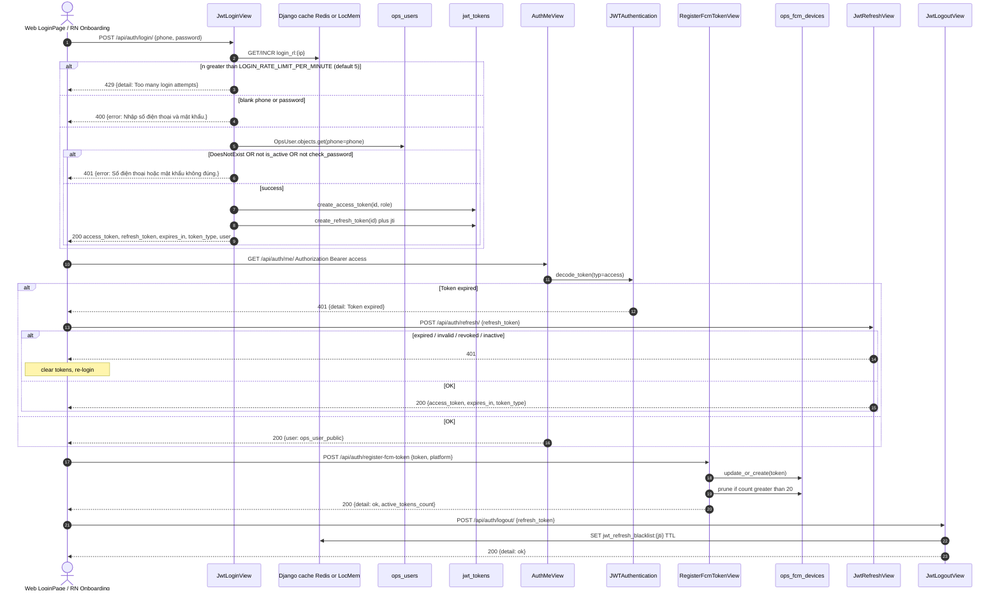
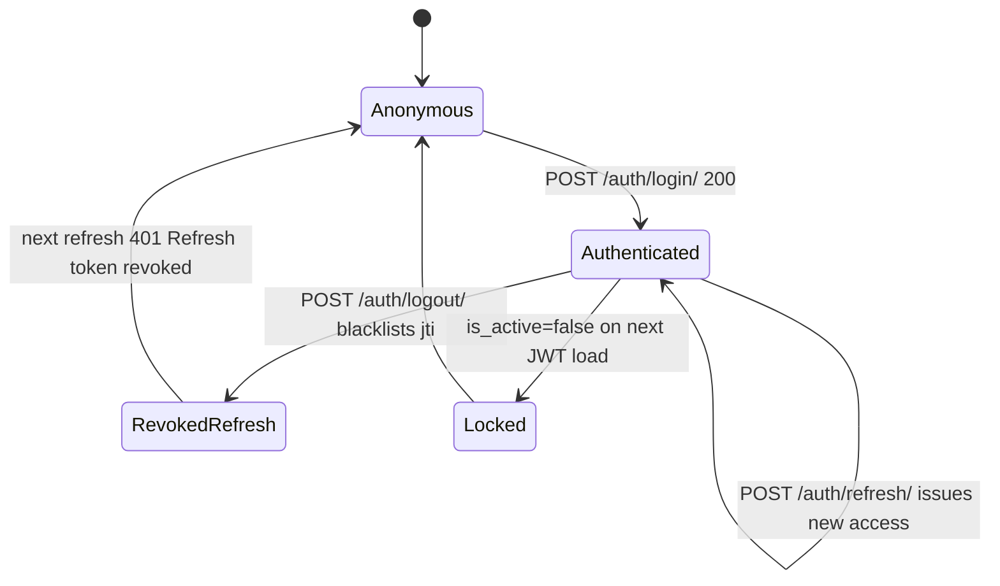

# 1. Overview & Business Intent

`backend/ops_auth/views.py` is Django boilerplate (`from django.shortcuts import render` plus the comment "Create your views here."). It is **not** in any `urlpatterns`. The live OPS staff auth surface is password-only JWT, not SMS OTP.

**Business role:** Internal operators (`role=OPS`) and admins (`role=ADMIN`) sign in to OPS web (`frontend_web_version`) and the RN internal app (`apps/`) using rows in `ops_users`. Access JWT lasts 8 hours. Refresh JWT lasts 30 days and can be revoked by blacklisting `jti`. FCM tokens are stored so push can fan out to many devices per user.

**Actors:** OPS field agent, OPS admin, RN Onboarding auto-login, Gunicorn workers, Redis (optional).

**Target files:**

| Role | Path |
| --- | --- |
| Empty stub | `timoto-internal-app/backend/ops_auth/views.py` |
| Login / refresh / logout | `backend/ops_auth/auth_views.py` (`JwtLoginView`, `JwtRefreshView`, `JwtLogoutView`) |
| FCM | `backend/ops_auth/fcm_views.py` (`RegisterFcmTokenView`) |
| Admin staff CRUD | `backend/ops_auth/admin_api.py` |
| JWT encode/decode | `backend/ops_auth/jwt_tokens.py` |
| DRF authenticator \+ blacklist | `backend/ops_auth/authentication.py` |
| `IsOpsAdmin` | `backend/ops_auth/permissions.py` |
| `GET /api/auth/me/` | `backend/bikes/ops_api.py` (`AuthMeView`) |
| Routes | `backend/bikes/api_urls.py` included from `backend/config/urls.py` as `path('api/', include('bikes.api_urls'))` |

There is **no** `ops_auth/serializers.py`. Bodies are `json.loads(request.body.decode() or 'empty object')`. JWT is a DRF authentication class, **not** Django middleware. `MIDDLEWARE` is Security, CORS, Common, CSRF, WhiteNoise only.

---

# 2. End-to-End Flow & Sequence Diagram

Signing key: `settings.JWT_SIGNING_KEY` (`os.environ.get('JWT_SIGNING_KEY')`) or `settings.SECRET_KEY`. Algorithm `HS256`.

Access payload: `sub` (user UUID string), `role` (`OPS`|`ADMIN`), `typ=access`, `exp`, `iat`. **No `jti` on access.** Refresh payload: `sub`, `typ=refresh`, `jti` (uuid4), `exp`, `iat`. **No `role` on refresh.** After login, `JWTAuthentication` reloads `OpsUser` from DB; `IsOpsAdmin` reads `u.role` from DB, not the JWT claim.





---

# 3. Detailed API Contracts

Prefix: `/api/` from `config/urls.py`. FCM is registered **twice** (with and without trailing slash) because RN `API_PATHS.AUTH_REGISTER_FCM_TOKEN` omits the slash.

There is **no** `error_code` field. Catalog uses the actual JSON key (`error` or `detail`).

### POST `/api/auth/login/`

- **View:** `JwtLoginView.post`
- **Auth:** `AllowAny`, `authentication_classes = []`
- **Rate limit:** cache key `login_rl::ip`, IP = first hop of `HTTP_X_FORWARDED_FOR` else `REMOTE_ADDR`. Limit `int(os.environ.get('LOGIN_RATE_LIMIT_PER_MINUTE', '5'))`. Counter increments on every POST including failures. 6th request in 60s → 429.

Request:

```json
{
  "phone": "+84901234567",
  "phone_number": "+84901234567",
  "password": "plain-text"
}
```

Resolved as `(body.get('phone') or body.get('phone_number') or '').strip()`. Lookup is **exact** `OpsUser.objects.get(phone=phone)` — no `+84`/`0` normalization.

200:

```json
{
  "access_token": "<hs256 jwt>",
  "refresh_token": "<hs256 jwt>",
  "expires_in": 28800,
  "token_type": "Bearer",
  "user": {
    "id": "<uuid>",
    "phone": "<ops_users.phone>",
    "name": "<ops_users.full_name>",
    "role": "OPS"
  }
}
```

`expires_in` is `int(os.environ.get('JWT_ACCESS_TTL_SECONDS', str(8 * 3600)))`.

### POST `/api/auth/refresh/`

Does **not** rotate refresh. Same refresh JWT can be reused until expiry or logout blacklist.

200:

```json
{
  "access_token": "<new access jwt>",
  "expires_in": 28800,
  "token_type": "Bearer"
}
```

### POST `/api/auth/logout/`

Always 200 `("detail"  "ok")` if the view runs. Empty body, invalid JSON, expired token, missing `jti` still return `ok`. Access JWT is **not** revoked. If `jti` present: `blacklist_refresh_jti(jti, ttl_seconds=max(60, int(exp - time.time())) if exp else 30 * 86400)`. Cache key `jwt_refresh_blacklist::jti`.

### POST `/api/auth/register-fcm-token` and `/api/auth/register-fcm-token/`

Requires `Authorization: Bearer <access>`. Token: `(body.get('token') or body.get('fcm_token') or '').strip()`. Platform must be exactly `ios` or `android` after `.strip().lower()`. Then `OpsFcmDevice.objects.update_or_create(token=token, defaults=('ops_user'  u, 'platform'  platform))`. Re-register of the same token **reassigns owner**. Cap `MAX_DEVICES_PER_USER = 20`; extras deleted by `-updated_at`.

200: `("detail"  "ok", "active_tokens_count"  2)`

### GET `/api/auth/me/`

200: `('user': ('id'  '<uuid>', 'phone'  '...', 'name'  '...', 'role'  'OPS'))` from `ops_user_public`. No `avatar_url`, `is_active`, `created_at`.

### Admin staff (ADMIN only)

- `GET /api/admin/staff/` → `( 'results': [ (id, phone, name, role, is_active, created_at) ] )` ordered `-created_at`
- `POST /api/admin/staff/` 201 `( "user"  ... )` — `password min length 8`, `role` OPS|ADMIN, `phone already registered`
- `PATCH /api/admin/staff/<uuid>/` — cannot deactivate or demote self
- `POST /api/admin/staff/<uuid>/reset-password/` — does **not** blacklist existing refresh/access

| HTTP Code | Error key / text | Trigger | UI mitigation |
| --- | --- | --- | --- |
| 429 | `detail`: `Too many login attempts` | `login_rl::ip` n greater than 5 per 60s | Wait 60s; do not spam |
| 400 | `error`: `Nhập số điện thoại và mật khẩu.` | empty phone or password | Keep form |
| 401 | `error`: `Số điện thoại hoặc mật khẩu không đúng.` | unknown phone, inactive, or wrong password | Same message for all three; do not reveal which |
| 400 | `detail`: `refresh_token required` | blank refresh | Clear tokens, login |
| 401 | `detail`: `Refresh token expired` | `jwt.ExpiredSignatureError` | Clear tokens |
| 401 | `detail`: `Invalid refresh token` | wrong typ (access JWT used as refresh) | Clear tokens |
| 401 | `detail`: `Refresh token revoked` | missing `jti` or blacklisted | Force login |
| 401 | `detail`: `User not found` / `User inactive` | staff deleted or locked | Force login |
| 400 | `detail`: `platform must be ios or android` | FCM platform not in set | RN always sends `Platform.OS` |
| 400 | `detail`: `token required` | empty FCM token | Skip POST |
| 409 | schema-outdated IntegrityError text | unique `ops_user_id` leftover or token race | Apply migration `0007_ops_fcm_devices_multi_device_schema` |
| 400 | `detail`: `Cannot deactivate yourself` | PATCH `is_active: false` on self | StaffPage shows `err` |
| 403 | DRF `You do not have permission...` | OPS hitting admin routes | Hide `/nhan-vien` unless ADMIN |

---

# 4. Database Schema & State Transitions

**`select_for_update`:** none in auth, FCM, or staff. No row locks.

**Router:** `InternalAppRouter` — `ops_auth` uses `default` (Aurora Postgres). Cache: Redis if `REDIS_URL` else `LocMemCache` `LOCATION='timoto-internal'` (per-process: rate limit and logout blacklist **do not** share across Gunicorn workers without Redis).

```sql
CREATE TABLE ops_users (
    id UUID PRIMARY KEY DEFAULT gen_random_uuid(),
    phone VARCHAR(20) NOT NULL UNIQUE,
    password_hash VARCHAR(128) NOT NULL,
    full_name VARCHAR(255) NOT NULL,
    role VARCHAR(20) NOT NULL DEFAULT 'OPS' CHECK (role IN ('OPS', 'ADMIN')),
    is_active BOOLEAN NOT NULL DEFAULT TRUE,
    created_at TIMESTAMPTZ NOT NULL DEFAULT CURRENT_TIMESTAMP,
    updated_at TIMESTAMPTZ NOT NULL DEFAULT CURRENT_TIMESTAMP
);

CREATE TABLE ops_fcm_devices (
    id UUID PRIMARY KEY DEFAULT gen_random_uuid(),
    ops_user_id UUID NOT NULL REFERENCES ops_users(id) ON DELETE CASCADE,
    token TEXT NOT NULL UNIQUE,
    platform VARCHAR(20) NOT NULL,
    created_at TIMESTAMPTZ NOT NULL DEFAULT CURRENT_TIMESTAMP,
    updated_at TIMESTAMPTZ NOT NULL DEFAULT CURRENT_TIMESTAMP
);
CREATE INDEX idx_ops_fcm_devices_ops_user_id ON ops_fcm_devices(ops_user_id);
```

History: migration `0004` OneToOne unique on `ops_user_id`; `0005` FK \+ unique `token`; `0007` Postgres `DROP CONSTRAINT ops_fcm_devices_ops_user_id_key` plus unique index `ops_fcm_devices_token_uniq`.

Cache keys (not SQL): `login_rl::ip`, `jwt_refresh_blacklist::jti`.

---

# 5. Frontend & UI Logic

**RN (`apps/`):** `apps/src/api/paths.ts` (`AUTH_LOGIN` `/auth/login/`, `AUTH_REFRESH`, `AUTH_ME`, `AUTH_REGISTER_FCM_TOKEN` **no trailing slash**). `postLogin` / `getAuthMe` / `postRegisterFcmToken` / `postRefreshToken` in `apps/src/api/auth.ts`. Onboarding `runBootstrap` then `registerPushWithBackend()`. Token keys: `timoto_internal_access`, `timoto_internal_refresh`, `timoto_internal_access_expires_at_ms`. RN **does not** call `/auth/logout/`. `ACCESS_EXPIRY_BUFFER_MS = 60000`. Dev auto-login body `DEV_LOGIN_BODY` `( phone  '+849012345678', password  '...' )`.

**Web (`frontend_web_version/`):** `LoginPage.tsx` POSTs `( phone, password )`. `Layout.tsx` GET `/auth/me/` on mount; fail → `/login`. Logout POSTs `( refresh_token )` then `clearTokens()`. `api.ts` `apiFetch` retries **once** on 401 via `/api/auth/refresh/` **except** paths starting `/auth/` — so a 401 on `/auth/me/` is a hard logout, unlike mobile bootstrap which refreshes first. Web does **not** register FCM. `StaffPage.tsx` is ADMIN-only at `/nhan-vien`.

---

# 6. Edge Cases & Resilience

1. **Access is not revocable.** Logout only blacklists refresh `jti`. Stolen access works until `exp`. Password reset does **not** kill existing access or refresh. Deactivate is immediate on next access (`User inactive`).
2. **Refresh is not rotated.** Steal refresh → mint access until logout or 30d. Login does not invalidate prior refresh tokens; multiple devices keep independent JWTs.
3. **Worker-local blacklist** if no `REDIS_URL`: logout on worker A, refresh on worker B still succeeds. Same for login rate limit.
4. **`X-Forwarded-For` first hop** is spoofable unless the proxy overwrites it.
5. **FCM steal:** same token, new user → `update_or_create` reassigns the device. Concurrent prune can briefly exceed 20 devices. IntegrityError always blamed on migration 0007, including unique-`token` races.
6. **Staff create TOCTOU:** `filter(phone=).exists()` then insert can 500 on unique violation.
7. **No OTP** in this app. Password only via `check_password` / `make_password`.
8. Invalid JSON is not a dedicated 400; empty body becomes `empty object` then field validation. Non-UTF-8 body → uncaught `UnicodeDecodeError` → 500.
9. `ops_bootstrap` `get_or_create(phone=)` then overwrites hash, name, role, sets `is_active=True` on existing rows.