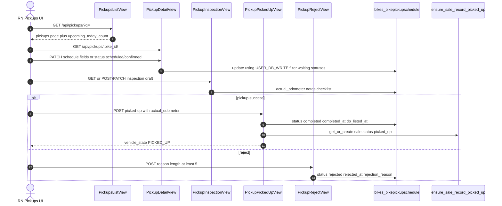
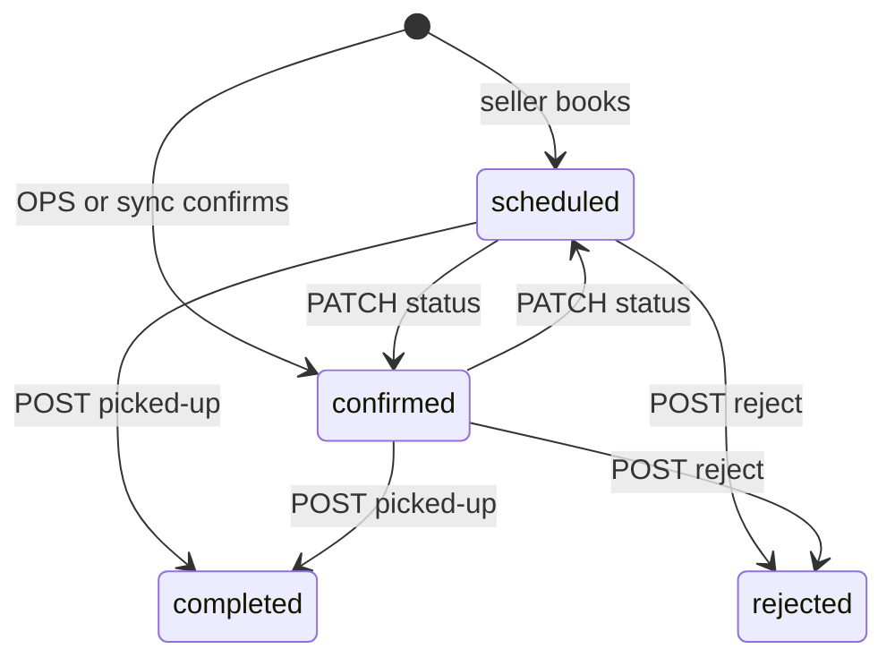

# 1. Overview & Business Intent

After OPS submits pricing and the seller accepts and books a visit, the bike enters the **pickup queue**. `pickups_api.py` lists only bikes that have:

1. `PricingEntry.status` equal to `SUBMITTED`
2. An active `BikePickupSchedule` whose status is in `WAITING_PICKUP_STATUSES` which is exactly `scheduled` and `confirmed`
3. `Bike.type` equal to `old_bike`
4. `is_waiting_pickup_bike` true (same SUBMITTED plus active waiting schedule checks)

OPS can patch address/slot, save inspection draft fields, mark the vehicle picked up (schedule → `completed`, sale → `picked_up` via `ensure_sale_record_picked_up`), or reject with a reason. Instant-sell deposit/notary flows live in `purchases_api.py` / `instant_sell.py` and are **not** this module.

**Actors:** OPS RN pickup screens, Django pickups API, shared user DB write alias `USER_DB_WRITE` equals `user_db_write`, sale record helper.

**Target files:**

- `timoto-internal-app/backend/bikes/pickups_api.py`
- `timoto-internal-app/backend/bikes/domain.py` — `WAITING_PICKUP_STATUSES`, `get_active_waiting_schedule`, `is_waiting_pickup_bike`, `sort_key_for_pickup_row`
- `timoto-internal-app/backend/bikes/models.py` — unmanaged `BikePickupSchedule` → table `bikes_bikepickupschedule`
- `timoto-internal-app/backend/bikes/sale.py` — `ensure_sale_record_picked_up`
- Routes in `api_urls.py`: `/api/pickups/...`
- RN client: `apps/src/api/pickups.ts`

There is **no** `SELECT FOR UPDATE`, **no** WebSocket fan-out from this API, and **no** `pickup_cancelled` Postgres `NOTIFY`. Reject only updates the schedule row and returns JSON.

---

# 2. End-to-End Flow & Sequence Diagram

List builds triples in memory: latest waiting schedule per submitted bike, then filters `is_waiting_pickup_bike`, sorts by `sort_key_for_pickup_row`, paginates page size 20 (query `page_size`, max 100). Detail/patch/inspection/picked-up/reject all start from `_get_waiting_pickup_or_404` — missing SUBMITTED pricing or no active waiting schedule yields HTTP 404.





`PickupCompleteView` is a legacy alias that delegates to `PickupPickedUpView.post` with identical behavior.

---

# 3. Detailed API Contracts

All views use `IsAuthenticated`. Mutating methods additionally require `OpsUser` or return 401 `Unauthorized`.

| Method | Path | View |
| --- | --- | --- |
| GET | `/api/pickups/` | `PickupsListView` |
| GET | `/api/pickups/:bike_id/` | `PickupDetailView.get` |
| PATCH | `/api/pickups/:bike_id/` | `PickupDetailView.patch` |
| GET | `/api/pickups/:bike_id/inspection/` | `PickupInspectionView.get` |
| POST | `/api/pickups/:bike_id/inspection/` | same `_save` |
| PATCH | `/api/pickups/:bike_id/inspection/` | same `_save` |
| POST | `/api/pickups/:bike_id/picked-up/` | `PickupPickedUpView` |
| POST | `/api/pickups/:bike_id/complete/` | `PickupCompleteView` alias |
| POST | `/api/pickups/:bike_id/reject/` | `PickupRejectView` |

**List response** wraps pagination: `success`, `user`, `total` (full triple count before page), `upcoming_today_count` (schedules whose `scheduled_date` equals `local_today` Asia/Ho\_Chi\_Minh), `pickups`, plus `count`/`next`/`previous`. Search `q` matches brand, model, masked\_bike\_id, license\_plate, user full\_name, user phone\_number.

**PATCH allowed keys** (`PICKUP_PATCH_KEYS`): `scheduled_date` (YYYY-MM-DD), `scheduled_time_slot` (non-empty, max 50), `province`, `ward`, `address`, `phone_number` (max 20), `notes`, `name`, `status` (must be `scheduled` or `confirmed` only). Unknown field → 422. Empty body → 422. Update runs `.using(USER_DB_WRITE).filter(schedule_id=..., status__in=WAITING_PICKUP_STATUSES).update(...)`; zero rows → 404 (race: another OPS completed/rejected first).

**Inspection keys**: `actual_odometer` (non-negative int or null), `inspection_notes`, `inspection_checklist` (object or null). At least one key required.

**Picked-up body**: `actual_odometer` required non-negative int; `inspection_notes` optional string; `inspection_checklist` optional object. Success payload includes `vehicle_state` `PICKED_UP`, `sale_status`, `pickup_schedule_status` `completed`, `pricing_status`, legacy top-level `status` `completed`, timestamps ISO for picked\_up and `dp_listed_at`.

**Reject**: `reason` strip length must be at least 5 characters else 422. Sets `rejected_at`, `rejected_by_ops_user_id`, `rejection_reason`.

Offer display: `_offer_price_vnd` prefers `pricing.offer_to_user`, else `schedule.valuation_price`. Detail also embeds `pricing_dict`, schedule detail, media counts, SLA seconds, sale context with `backfill=False`.

| HTTP | Trigger |
| --- | --- |
| 401 | Non-OpsUser mutate |
| 404 | Not waiting pickup; concurrent update zero rows |
| 422 | Unknown field; bad date/slot/odometer; short reject reason |

---

# 4. Database Schema & State Transitions

`BikePickupSchedule` is `managed = False` — schema owned by the shared/user DB. Relevant columns used by this API:

```sql
CREATE TABLE bikes_bikepickupschedule (
    schedule_id UUID PRIMARY KEY,
    bike_id UUID NOT NULL,
    user_id UUID NULL,
    phone_number VARCHAR(20) NULL,
    name VARCHAR(255) NULL,
    scheduled_date DATE NULL,
    scheduled_time_slot VARCHAR(50) NULL,
    province VARCHAR(100) NULL,
    ward VARCHAR(100) NULL,
    address VARCHAR(500) NULL,
    valuation_price NUMERIC(15,0) NULL,
    status VARCHAR(50) NULL,
    notes TEXT NULL,
    actual_odometer INTEGER NULL,
    inspection_notes TEXT NULL,
    inspection_checklist JSONB NULL,
    completed_at TIMESTAMPTZ NULL,
    completed_by_ops_user_id UUID NULL,
    rejected_at TIMESTAMPTZ NULL,
    rejected_by_ops_user_id UUID NULL,
    rejection_reason TEXT NULL,
    dp_listed_at TIMESTAMPTZ NULL,
    created_at TIMESTAMPTZ NULL,
    updated_at TIMESTAMPTZ NULL
);
```

Domain also names terminal statuses `completed`, `rejected`, `cancelled`, `rescheduled` in `TERMINAL_PICKUP_STATUSES`, but this API only **writes** `completed` (picked-up) or `rejected`. PATCH cannot set those terminal values — only waiting pair.

`ensure_sale_record_picked_up` `get_or_create`s `BikeSaleRecord` with default status `picked_up`. If a row already exists with a **different** status, it returns that record unchanged (does not force overwrite). If status already equals `picked_up`, it may update `schedule_id` / `picked_up_at` when missing.

Waiting membership for the queue never includes cancelled schedules; cancelled bikes simply drop out of `_collect_waiting_pickup_triples` because status filter is waiting-only.

---

# 5. Frontend & UI Logic

RN `pickups.ts` types list rows with `offer_price_vnd`, schedule fields, and `ui_status_*` from `get_bike_status` (sale-aware label, not raw schedule status alone). Detail screens use GET detail then either inspection \+ picked-up or reject flows. Instant-sell path may later call purchase APIs; classic listing pickup ends at `vehicle_state` `PICKED_UP`.

Dashboard badge count uses shared `count_waiting_pickups()` which reuses `_collect_waiting_pickup_triples()` — same rules as GET list, no separate SQL.

`safe_user_dict(bike, schedule=schedule)` prefers schedule `name` / `phone_number` over bike user when present (checkout contact).

Time slot display uses `format_time_slot_display`. Sort prefers earlier slots via `TIME_SLOT_ORDER` in domain (07:00-10:00 through 17:00-20:00).

---

# 6. Edge Cases & Resilience

1. **Optimistic concurrency without locks.** Filter-by-waiting-status update: if another worker completed the schedule, update count is 0 → Http404, not a typed conflict code.
2. **No cancel endpoint here.** Cancelled schedules are outside the waiting filter; this module does not emit cancel notifications.
3. **Complete alias.** Clients calling `/complete/` get identical picked-up semantics including required odometer.
4. **Sale already in another status.** `ensure_sale_record_picked_up` will not demote an in-progress instant-sell status back to `picked_up`.
5. **Multiple schedules.** List and detail use latest waiting schedule by `created_at`; older waiting rows for the same bike are ignored once a newer one exists in the map.
6. **Search after collect.** Search filters bikes queryset; triples without pricing still skipped.
7. **Inspection draft optional.** OPS can POST picked-up with odometer without prior inspection GET; notes/checklist may be empty.
8. **Reject does not touch PricingEntry** — pricing stays SUBMITTED; schedule alone is rejected.
9. **Writes go to `user_db_write`.** Reads use default DB routing; stale replica reads are possible if replicas lag (code does not add extra consistency guards).