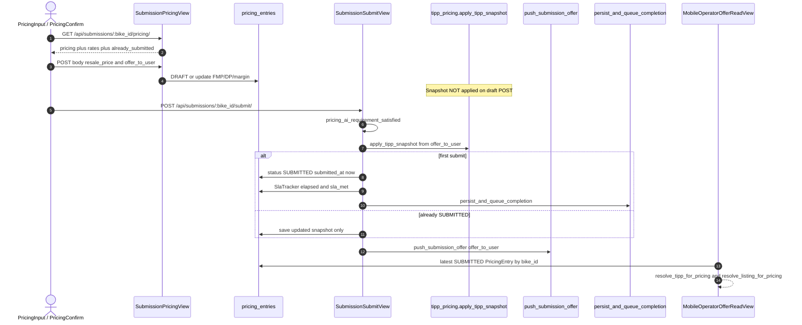
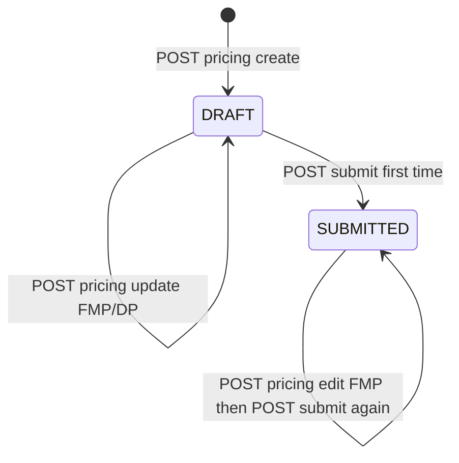

# 1. Overview & Business Intent

OPS prices a seller bike once in the internal app. The editable number is **FMP** (Fair Market Price), stored as `offer_to_user`. Dealer price is `resale_price` (DP). Margin equals FMP minus DP. At submit time — not on every draft save — `apply_tipp_snapshot` writes two seller-facing options derived from FMP:

- **Giá đăng TMA/DP** → `listing_price_vnd` equals FMP times market multiplier times TiMoto fee rate
- **TIPP** (TiMoto mua ngay) → `instant_price_vnd` equals FMP times tipp discount rate

Mobile never trusts client-computed TIPP. Mobile backend calls internal `GET /api/v1/mobile/operator-offer/` with HMAC, then surfaces `offer_to_user`, `listing_price_vnd`, and `instant_price_vnd` to the seller app.

**Actors:** OPS RN (`PricingInput.tsx`, `PricingConfirm.tsx`), Django submissions API, `PricingEntry` row, TMA offer push, completion outbox bridge, mobile S2S client (`internal_operator_offer.py`).

**Target files:**

- `timoto-internal-app/backend/bikes/submissions_api.py` — `SubmissionPricingView`, `SubmissionSubmitView`, AI gate views
- `timoto-internal-app/backend/bikes/tipp_pricing.py` — rates, round half-up VND, snapshot helpers
- `timoto-internal-app/backend/bikes/api_helpers.py` — `pricing_dict`, `pricing_ai_requirement_satisfied`
- `timoto-internal-app/backend/bikes/mobile_operator_offer_views.py` — HMAC read for mobile
- `timoto-internal-app/backend/ops_auth/models.py` — `PricingEntry`, `SlaTracker`
- Routes under `backend/bikes/api_urls.py` → mounted at `/api/`

Defaults when env unset: `TIPP_DISCOUNT_RATE` 0.75, `MARKET_MULTIPLIER_RATE` 0.95, `TIMOTO_FEE_RATE` 0.90. Rates must be greater than 0 and less than or equal to 1 or getters raise `ValueError`. Rounding uses `Decimal` `ROUND_HALF_UP` to integer VND.

There is **no** OTP on this path, **no** `SELECT FOR UPDATE`, and **no** Postgres `NOTIFY` when pricing is submitted.

---

# 2. End-to-End Flow & Sequence Diagram

Draft save accepts only `resale_price` and `offer_to_user`. Client may preview listing and TIPP locally using `rates` from GET, but submit recalculates from server env and persists snapshots. Re-submit on an already `SUBMITTED` row re-applies the snapshot and saves; SLA completion and completion outbox run only on the first transition from `DRAFT` to `SUBMITTED`.



Example with FMP 25\_000\_000 and defaults: listing equals 21\_375\_000; TIPP equals 18\_750\_000.

---

# 3. Detailed API Contracts

Auth on submission mutate views: `IsAuthenticated`, then `isinstance(request.user, OpsUser)` else 401 `Unauthorized`. Bodies are parsed with `json.loads` on `request.body` (empty body becomes an empty object).

| Method | Path | View | Notes |
| --- | --- | --- | --- |
| GET | `/api/submissions/` | `SubmissionsListView` | Queue filters by draft vs submitted pricing |
| GET | `/api/submissions/:bike_id/` | `SubmissionDetailView` | May set `ai_viewed_at` when AI tab opened |
| GET | `/api/submissions/:bike_id/pricing/` | `SubmissionPricingView.get` | Includes `rates` via `current_rates_dict` |
| POST | `/api/submissions/:bike_id/pricing/` | `_save(draft_only=False)` | Create DRAFT or update FMP/DP |
| PUT | `/api/submissions/:bike_id/pricing/` | `_save(draft_only=True)` | 404 if no existing row |
| POST | `/api/submissions/:bike_id/ai-review-choice/` | `SubmissionAiReviewChoiceView` | Requires `skip_ai_review` is JSON true |
| GET | `/api/submissions/:bike_id/ai-report/` | `SubmissionAiReportView` | Sets `ai_viewed_at` when missing |
| POST | `/api/submissions/:bike_id/submit/` | `SubmissionSubmitView` | Applies TIPP snapshot |
| GET | `/api/submissions/:bike_id/success/` | `SubmissionSuccessView` | Requires status SUBMITTED |
| GET | `/api/v1/mobile/operator-offer/` | `MobileOperatorOfferReadView` | HMAC S2S; AllowAny |

**Draft POST validation**

- Strip thousand separators from price strings (remove `.` and `,`) then parse `Decimal`
- Invalid number → 422 `Giá không hợp lệ. Vui lòng nhập số.`
- FMP must be positive and equal to its integral value → else 422 FMP message
- If `resale_price` is greater than `offer_to_user` → 422 DP must be less than or equal to FMP
- `margin` equals offer minus resale

**Submit gates**

- Missing pricing or status not in DRAFT or SUBMITTED → 422 no draft message
- First submit requires `pricing_ai_requirement_satisfied`: no AI report, or `ai_viewed_at` set, or `ai_review_waived` true
- Response includes `offer_price` (int FMP), `sla_elapsed_seconds`, `sla_met`, `tma_offer_push_ok`, `completion_event_id` (null on re-submit)

**Operator-offer GET**

Query: `bike_id`, `operator_review_request_id` (UUIDs). Header `X-Timoto-Signature: sha256=` plus hex HMAC-SHA256 over UTF-8 lowercase `bike_id` newline `operator_review_request_id`. Secret order: `OPERATOR_OFFER_INTERNAL_HMAC_SECRET`, then `TMA_WEBHOOK_SECRET`, then `WEBHOOK_HMAC_SECRET`. Empty secret → 503. Bad signature → 401. Missing mirror pair or no SUBMITTED pricing → 404. Payload sets both `offer_to_user` and `fair_market_price_vnd` to the same int FMP, plus listing and instant fields from resolve helpers (legacy rows recompute from current rates when snapshot columns are null).

| HTTP | Trigger |
| --- | --- |
| 401 | Non-OpsUser on mutate |
| 404 | PUT with no draft; success without SUBMITTED; operator-offer unknown pair |
| 422 | Bad FMP/DP; AI gate; no draft on submit |
| 503 | Operator-offer secret missing |

---

# 4. Database Schema & State Transitions

Table name `pricing_entries` (`PricingEntry`). Status choices are only `DRAFT` and `SUBMITTED`. Dual-price columns are nullable until first successful `apply_tipp_snapshot`.

```sql
CREATE TABLE pricing_entries (
    id UUID PRIMARY KEY,
    bike_id UUID NOT NULL,
    ops_user_id UUID NULL,
    resale_price NUMERIC(15,0) NOT NULL,
    offer_to_user NUMERIC(15,0) NOT NULL,
    margin NUMERIC(15,0) NOT NULL,
    ai_suggested_price NUMERIC(15,0) NULL,
    feedback_text TEXT NULL,
    ai_viewed_at TIMESTAMPTZ NULL,
    ai_review_waived BOOLEAN NOT NULL DEFAULT FALSE,
    instant_price_vnd NUMERIC(15,0) NULL,
    instant_purchase_discount_rate NUMERIC(4,2) NULL,
    listing_price_vnd NUMERIC(15,0) NULL,
    market_multiplier_rate NUMERIC(4,2) NULL,
    timoto_fee_rate NUMERIC(4,2) NULL,
    status VARCHAR(20) NOT NULL DEFAULT 'DRAFT',
    created_at TIMESTAMPTZ NOT NULL,
    submitted_at TIMESTAMPTZ NULL
);

CREATE TABLE sla_trackers (
    id UUID PRIMARY KEY,
    bike_id UUID NOT NULL UNIQUE,
    started_at TIMESTAMPTZ NOT NULL,
    completed_at TIMESTAMPTZ NULL,
    elapsed_seconds INTEGER NULL,
    sla_met BOOLEAN NULL,
    reminder_count INTEGER NOT NULL DEFAULT 0
);
```



On first submit, `SlaTracker.elapsed_seconds` is total seconds from `started_at` to `completed_at`; `sla_met` is true when elapsed is strictly less than 300. Tracker is created with `get_or_create` when the first DRAFT pricing row is inserted.

`pricing_dict` returns snapshot fields as strings only when the DB columns are non-null — draft responses often omit listing and TIPP until submit.

---

# 5. Frontend & UI Logic

Internal RN uses `apps/src/api/submissions.ts`:

- `getSubmissionPricing` → GET pricing
- `postSubmissionPricing` → POST `resale_price` and `offer_to_user`
- `postSubmissionSubmit` → POST submit from `PricingConfirm.tsx`

`PricingInput.tsx` edits dealer and FMP money fields then posts draft. Confirm screen shows FMP and dealer amounts from route params and calls submit; it does not send listing or TIPP in the submit body. Type `SubmissionPricingRecord` documents core string fields; dual-price keys are allowed via index signature because older backends omit them.

Ops must treat GET `rates` as preview configuration only. Changing env rates after submit does not rewrite historical snapshots unless OPS re-submits (which re-runs `apply_tipp_snapshot` against **current** rates and the stored FMP).

AI gate UX: open AI report tab (sets `ai_viewed_at`) or POST ai-review-choice with skip flag when a report exists; otherwise first submit returns 422 Vietnamese AI gate detail.

---

# 6. Edge Cases & Resilience

1. **Draft does not snapshot.** POST/PUT pricing never calls `apply_tipp_snapshot`. TIPP and listing appear in `pricing_dict` only after submit (or legacy resolve on operator-offer).
2. **Client listing/TIPP ignored.** Submit body has no listing or instant fields; only FMP on the row drives math.
3. **Re-submit updates snapshot, skips outbox.** `already_submitted` true still pushes TMA offer and saves pricing; `persist_and_queue_completion` is skipped; SLA tracker is not recomputed.
4. **Completion bridge failure is swallowed.** Exception is logged; submit still returns 200 with `completion_event_id` null.
5. **Operator-offer legacy rows.** If snapshot columns are null, resolvers recompute from live rates and current `offer_to_user` — different from the original submit-time rates if env changed.
6. **HMAC UUID case.** Signing uses lowercase UUID strings; query params should match.
7. **No row lock.** Concurrent OPS drafts can last-write-win on the single `PricingEntry` per bike (lookup by `bike_id` without unique constraint enforcement in the model Meta beyond ordering).
8. **DP greater than FMP rejected**; equal DP and FMP is allowed (margin zero).
9. **Mobile app must not hold the HMAC secret** — only mobile Django calls internal; documented in `mobile_operator_offer_views.py` module docstring.