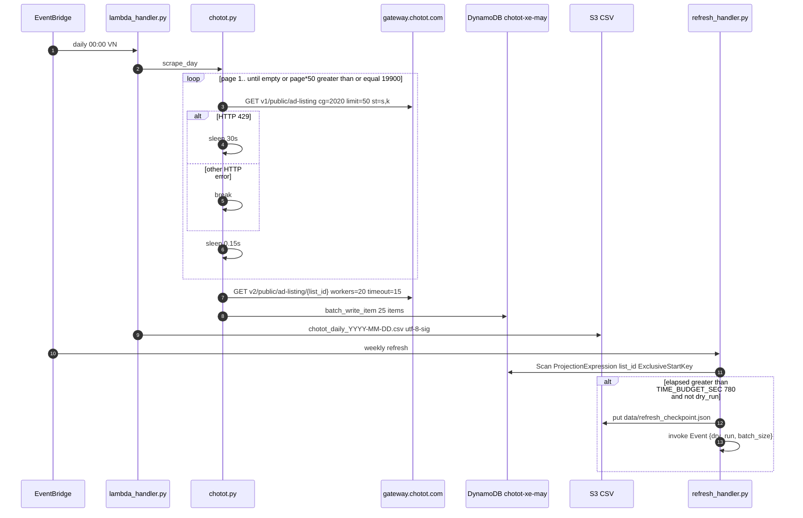

# 1. Overview & Business Intent

`chototcaodulieu` is an isolated scrape → DynamoDB → S3 CSV pipeline. It does **not** write TiMoto Aurora. Daily Lambda scrapes Chotot category `cg=2020` (motorcycles), upserts DynamoDB `chotot-xe-may`, and optionally exports UTF-8-BOM CSV. Weekly refresh re-fetches details for existing `list_id` keys with a 780-second time budget and async self-invoke.

**Actors:** EventBridge cron, Lambda `lambda_handler.py`, Lambda `chotot-weekly-refresh`, quality CLI `export_quality_bikes.py`.

**Target files:** `/Users/toannguyen/chototcaodulieu/chotot.py`, `lambda_handler.py`, `refresh_handler.py`, `export_quality_bikes.py`.

---

# 2. End-to-End Flow & Sequence Diagram



---

# 3. Detailed API / Interface Contracts

**Listing:** `GET https://gateway.chotot.com/v1/public/ad-listing` timeout 20s. Params: `cg=2020`, `limit=50`, `o=(page-1)*50`, `page=:page`, `st=s,k`.

**Detail:** `GET https://gateway.chotot.com/v2/public/ad-listing/:list_id` timeout 15s. 404 → `(list_id, None)` without raise.

**Headers** (`chotot.py:30–35`):

| Header | Value |
| --- | --- |
| `User-Agent` | `Mozilla/5.0 (Macintosh; Intel Mac OS X 10_15_7) AppleWebKit/537.36` |
| `Accept` | `application/json, text/plain, */*` |
| `Origin` | `https://xe.chotot.com` |
| `Referer` | `https://xe.chotot.com/mua-ban-xe-may` |

**Retry** (`_make_session`): `Retry(total=3, backoff_factor=0.5, status_forcelist=[429, 500, 502, 503])`, `HTTPAdapter(pool_connections=30, pool_maxsize=30)`, mount `https://` only.

**CSV public URL field:** `https://xe.chotot.com/mua-ban-xe-may/:list_id` or `""`.

**Refresh self-invoke:** `lambda_client.invoke(FunctionName=LAMBDA_NAME, InvocationType="Event", Payload=json.dumps(event))` where chained event is exactly `("dry_run"  <bool>, "batch_size"  <int>)`. `reset` is **not** included. Function name env `REFRESH_LAMBDA_NAME` default `chotot-weekly-refresh`.

| HTTP / outcome | Reason | Trigger |
| --- | --- | --- |
| 429 then sleep 30s | listing loop | `HTTPError.status_code == 429` |
| break | listing loop | other HTTP errors |
| sleep 3s continue | listing loop | generic Exception |
| detail None | detail fetch | 404 or any exception |
| DDB log error | batch write | `batch_write_item` exception; batch dropped |

---

# 4. Database Schema & Ingestion

| Env | Default | File |
| --- | --- | --- |
| `CHOTOT_DDB_TABLE` | `chotot-xe-may` | `chotot.py:27`, `refresh_handler.py:23` |
| `AWS_DEFAULT_REGION` | `ap-southeast-1` | both |
| `CHOTOT_EXPORT_S3_BUCKET` | `""` in lambda\_handler; `chotot-dashboard-404850807717` in refresh\_handler | mismatch |
| `CHOTOT_EXPORT_S3_PREFIX` | `data/daily` | lambda\_handler |
| `REFRESH_CHECKPOINT_KEY` | `data/refresh_checkpoint.json` | refresh\_handler:26 |
| `REFRESH_BATCH_SIZE` | `2500` |  |
| `REFRESH_WORKERS` | `20` |  |
| `REFRESH_TIME_BUDGET_SEC` | `780` |  |

Partition key: `list_id` serialized as **int**. Dots in attribute names replaced with `_`. Skip None / `""` / `[]` / `empty object`. Extra: `date_added` (`YYYY-MM-DD` Asia/Ho\_Chi\_Minh from `list_time` ms), `_raw_json` full record. Batch size **25**. Scan projection `"list_id"` only.

Checkpoint JSON keys on reset: `run_id`, `started_at`, `processed` 0, `refreshed` 0, `errors` 0, `last_evaluated_key` None, `status` `"running"`. Later `finished_at`. `run_id` format `"%Y%m%dT%H%M%SZ"` UTC. `NoSuchKey` → `empty object`.

```sql
-- Logical DynamoDB item shaped as SQL for the quality gate. Not Postgres.
CREATE TABLE chotot_xe_may (
    list_id INTEGER PRIMARY KEY,
    date_added VARCHAR(32),
    _raw_json TEXT,
    subject TEXT,
    price BIGINT,
    motorbikebrand VARCHAR(128),
    motorbikemodel VARCHAR(128),
    region_name VARCHAR(128),
    list_time BIGINT,
    account_name VARCHAR(256),
    thumbnail_image TEXT
);
```

**24 flatten columns** (`_flatten_row` order = CSV headers): `list_id`, `ad_id`, `subject`, `price`, `price_string`, `motorbikebrand`, `motorbikemodel`, `motorbiketype`, `regdate`, `mileage_v2`, `condition_ad_name`, `region_name` (`region_name_v3` or `region_name`), `area_name`, `ward_name`, `list_time`, `date`, `account_name`, `account_oid`, `thumbnail_image`, `webp_image`, `image`, `images_count`, `images` (pipe-joined strings), `url`.

S3 key: `:S3_PREFIX/chotot_daily_:day_str.csv`. Encoding `utf-8-sig`. ContentType `text/csv; charset=utf-8`. Quality export does **not** flatten (`"format": "raw Chotot API response per bike (khong flatten)"`).

---

# 5. Frontend & Hook Integration

No product UI. Consumers are S3 CSV for FMP research and DynamoDB for liveness refresh. Quality CLI `--limit` default 500, `--buffer` default 2.5, hardcoded second-pass buffer `3.0`. `PAGE_DELAY = 0.12`. Quality `WORKERS = 25` vs scrape/refresh **20**. Quality page cap uses literal `page * 50 >= 19_900` not `LIMIT`.

---

# 6. Edge Cases & Resilience

`is_alive`: `status == "active"` AND `state == "accepted"`.

| Reason | Condition |
| --- | --- |
| `not_active` | not alive |
| `bad_price` | `int(price)` TypeError/ValueError; `price = ad.get("price") or 0` first |
| `price_out_of_range` | `< 1_000_000` or `> 500_000_000` |
| `short_subject` | strip length less than 8 |
| `no_image` | empty images list AND no thumbnail/image/webp |
| `no_region` | neither `region_name_v3` nor `region_name` |
| `no_seller` | no `account_name` |
| `no_list_time` | no `list_time` |
| `no_list_id` | no `list_id` |
| `ok` | all pass |

Missing detail counted `stats["detail_404"]` and never reaches `is_quality`. Docstring omits `list_id`; code still rejects `no_list_id`.

Chain only when time budget exceeded **and** `not dry_run`. Completeness early-return 200 does not self-invoke. Manual docstring example `("dry_run"  false, "batch_size"  3000)` is **not** the chained payload (chain uses the live `batch_size` int, default 2500).