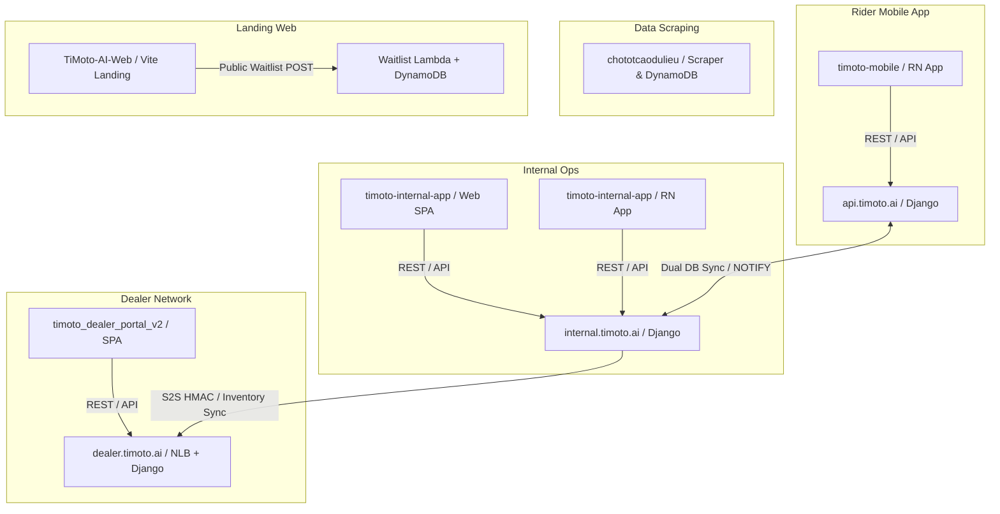

## 1. Six-Repo Topology Map

## 2. Repo Ownership Matrix

| # | Repo | Host / Domain | Tech Stack | Production Data Ownership |
| --- | --- | --- | --- | --- |
| 1 | `timoto-mobile` | `api.timoto.ai` | React Native (iOS/Android), Django 4.x, Postgres | Rider auth, vehicle valuation requests, rider pickup appointments, listing selections. |
| 2 | `timoto-internal-app` | `internal.timoto.ai` | React Web, React Native, Django 4.x, Postgres | Operator reviews, Fair Market Price (FMP) valuations, `pricing_entries`, 8-step Instant Sell purchase lifecycle. |
| 3 | `timoto-dealer-portal` | `dealer.timoto.ai` | AWS Fargate (NLB), Django, Postgres | Dealer auth (Cognito \+ Zalo), combo inventory catalog, shared checkouts, VietQR payments. |
| 4 | `timoto_dealer_portal_v2` | `dealer.timoto.ai` | React SPA (Vite/Tailwind) | Dealer Hub frontend UI, catalog browser, order manager, QR checkout UI. |
| 5 | `TiMoto-AI-Web` | `timoto.ai` | React Vite, Serverless Lambda, DynamoDB | Public marketing waitlist signups only (isolated from core DB). |
| 6 | `chototcaodulieu` | N/A (Cron / Lambda) | Python 3.12, AWS Lambda, DynamoDB, S3 | Chotot market price scraping dataset (isolated data lake). |

## 3. Database Boundaries

- **Rider & Internal DB (`Postgres`)**: `timoto-mobile` and `timoto-internal-app` share or synchronize core Postgres tables (`bikes_bike`, `bikes_bikepickupschedule`, `ops_auth_pricingentry`, `bike_sale_records`). Sync occurs via DB triggers and Postgres `NOTIFY` events (`ops_events.py`).
- **Dealer Portal DB (`Postgres`)**: Dedicated Aurora database for `timoto-dealer-portal` storing combos, dealer accounts, orders, and shared checkouts. Inventory changes (e.g. bike sold in mobile) sync via S2S REST `POST /api/v1/internal/inventory/bike-unavailable/`.
- **Scraper DB (`DynamoDB - chotot-xe-may`)**: Scraping data lives strictly inside DynamoDB and S3 CSV exports. No direct queries from rider or dealer apps.
- **Landing Waitlist DB (`DynamoDB - Waitlist`)**: Isolated DynamoDB table written directly by AWS Lambda handler.