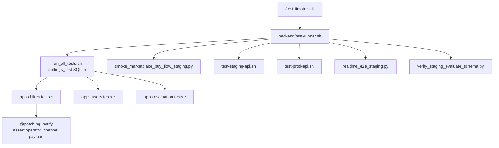

## Summary

Automated testing for **timoto-mobile** is centered on the Django backend. Entry point is `backend/test-runner.sh`. Unit/API tests run with `config.settings_test` (in-memory SQLite). Staging/production smoke scripts hit live APIs.

<Check>
Backend unit suite: **293+** targeted tests via `./backend/test-runner.sh backend-unit`. Cancel / OPS NOTIFY paths assert `pg_notify` payload types.
</Check>

## Entry points

| Layer | Path | Role |
|-------|------|------|
| Cursor skill | `.cursor/skills/test-timoto/SKILL.md` | `/test-timoto` maps natural language → target |
| Master CLI | `backend/test-runner.sh` | Single entry for all suites |
| Unit suite | `backend/run_all_tests.sh` | Targeted Django modules with `settings_test` |
| CI | `.github/workflows/backend-ci.yml` | `manage.py test --settings=config.settings_test apps` |

### Commands

```bash
./backend/test-runner.sh backend-unit   # all unit/API tests
./backend/test-runner.sh buy-flow       # staging VietQR / purchase-order smoke
./backend/test-runner.sh staging-api    # staging HTTP smoke
./backend/test-runner.sh prod-api       # production HTTP smoke
./backend/test-runner.sh realtime-ws    # realtime WS E2E
./backend/test-runner.sh eval-flow      # evaluate schema smoke (1 iteration)
./backend/test-runner.sh mkt-filters    # marketplace filters unit tests
./backend/test-runner.sh all            # unit + buy-flow smoke
```

## Architecture



## Cancel / OPS NOTIFY unit tests

Sell-tab cancel must emit Postgres NOTIFY for the internal OPS app. Tests mock `pg_notify` and assert channel + `type`.

| Seller action | API | Expected `type` | Test file |
|---------------|-----|-----------------|-----------|
| Hủy định giá (chờ OPS) | `POST /operator-review-requests/cancel/` | `valuation_cancelled` | `apps/bikes/tests/test_operator_review_cancel.py` |
| Hủy bán xe / chờ lấy xe | `POST /bikes/sale-history/{id}/cancel/` | `pickup_cancelled` | `apps/bikes/tests/test_sale_history_api.py` |
| PATCH hủy lịch | `PATCH /bikes/pickup-schedule/{id}/` `status=cancelled` | `pickup_cancelled` | `apps/bikes/tests/test_pickup_schedule_patch.py` |
| Đặt lịch lấy xe | `POST /bikes/pickup-schedule/` | `pickup_scheduled` | `apps/bikes/tests/test_pickup_schedule_ops_notify.py` |

### Pattern

```python
@patch('apps.bikes.ops_events.pg_notify')  # or realtime_views.pg_notify
def test_cancel_emits_notify(self, mock_notify):
    ...
    mock_notify.assert_called_once()
    channel, payload = mock_notify.call_args[0]
    self.assertEqual(channel, 'operator_channel')
    self.assertEqual(payload['type'], 'pickup_cancelled')  # or valuation_cancelled
```

### Run cancel/notify subset only

```bash
cd backend && python manage.py test \
  apps.bikes.tests.test_operator_review_cancel \
  apps.bikes.tests.test_sale_history_api \
  apps.bikes.tests.test_pickup_schedule_patch \
  apps.bikes.tests.test_pickup_schedule_ops_notify \
  --settings=config.settings_test
```

## Unit suite modules (`run_all_tests.sh`)

Targeted modules include:

- **Users:** OTP login, Zalo/Apple native, profile `me/`, soft-delete / reactivate
- **Bikes:** pickup create/patch/notify, sale history, operator-review cancel, marketplace + filters, purchase orders
- **Evaluation:** `output_jsons` evaluate flow, TIPP, operator-offer HMAC, seller listing
- **OCR / feedback / options:** cavet OCR, feedback, FMP price range

<Note>
Internal FCM handlers (`VALUATION_CANCELLED`, `PICKUP_CANCELLED`) live in **timoto-internal-app**. Mobile-backend tests stop at: API → DB → `pg_notify` payload. See `/docs/api/PROMPT_INTERNAL_APP_SELL_TAB_CANCEL_NOTIFY.md` in the mobile repo for the internal handoff.
</Note>

## Staging / E2E scripts

| Script | What it hits |
|--------|----------------|
| `backend/scripts/smoke_marketplace_buy_flow_staging.py` | Create purchase order + VietQR on staging |
| `backend/scripts/cancel_operator_review_e2e_staging.py` | Real cancel ORR E2E (OTP) |
| `backend/scripts/realtime_e2e_staging.py` | Realtime WS |
| `backend/test-prod-api.sh` / `test-staging-api.sh` | HTTP smoke |

## Related system page

Overview of the mobile system (including a short Tests section): [System: timoto-mobile](/systems/timoto-mobile).
